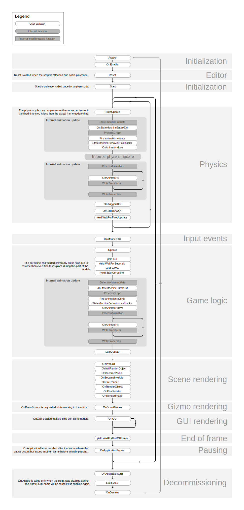

# Unity定时回调系统

## 1. Unity基础

### 1.1 游戏物体生命周期



先上官方文档的图。

脚本中的重点常用事件函数：

- `Awake`：游戏物体实例化之后并处于激活状态时调用，即使脚本**没有被激活**也会调用，且总是在`Start`之前调用。
- `OnEnable`：在游戏物体处于激活状态，且脚本组件激活时调用，会被重复调用。
- `Start`：在游戏物体处于激活状态，且脚本组件处于激活状态时调用，且总是在`Update`之前调用，只会被调用一次。
- `Update`：每帧调用一次，帧率不固定。
- `FixedUpdate`：根据设定的帧率调用，主要用于物理运算。（帧率相同不代表时间间隔相同）
- `LateUpdate`：每帧调用一次，在`Update`之后调用。
- `OnDisable`：在脚本组件处于激活状态时，禁用物体或脚本组件时被调用。
- `OnDestroy`：当游戏物体被销毁时调用。

`FixedUpdate`的运行帧率设置图如下所示：


最大允许时间步进（**Maximum Allowed Timestep**）的设置可以避免deltaTime值过大带来的不良影响。当某一帧花费的时间非常长时，最大允许时间步进将会把deltaTime限制在设置的值，就好像一旦某一帧时间过长，那么引擎就会把整个世界（指的是物理系统和FixedUpdate）暂停并让帧处理（Update）赶上进度。

### 1.2 脚本执行顺序

当我们需要对脚本执行的顺序进行更改时，我们可以通过项目设置中的脚本执行顺序设置脚本执行的顺序（搁这搁这呢）。


后面的数值越小，脚本执行越早。

但是对于同一个脚本挂载到不同物体上时，脚本执行的顺序将不可控。视频中老师提出的方法是，不让Unity自动执行Awake进行初始化，而是通过一个脚本获取其他脚本组件，并按照我们所希望的执行顺序调用其他脚本的初始化方法进行初始化。

### 1.3 Unity主线程设计思想

所有的脚本代码都是串行运行，都运行在一个线程里，也就是Unity的主线程。（`FixedUpdate`的驱动机制不同，所以可能会出现一个主循环帧多次执行`FixedUpdate`的情况）。

我们以某一个物体为基准，在她第一次执行`Update`为起始时间，第二次执行`Update`前为终止时间，这一时间段就是一个主循环帧，通常我们把游戏的大部分逻辑处理放置`Update`中，所以一个主循环帧也会被叫做逻辑帧。

Unity中是可以使用多线程的，但是为了数据安全，一些关键数据无法在多线程中获取，比如`transform`。Unity底层通过线程池，实现了一些可以用多线程处理的任务，所以效率仍然很高，我们只需要调用一些方法，就可以实现高效的多线程操作（读取资源等）。

```c#
using System.Threading;
using UnityEngine;

public class GameRoot : MonoBehaviour
{
    private void Start()
    {
        ThreadStart threadStart = new ThreadStart(ThreadMain);
        Thread thread = new Thread(threadStart);
        thread.Start();
        Debug.Log("UnityMain线程ID:" + Thread.CurrentThread.ManagedThreadId.ToString());
    }

    void ThreadMain()
    {
        Debug.Log("New线程ID:" + Thread.CurrentThread.ManagedThreadId.ToString());
        // 会报错
        // Debug.Log(transform.position.ToString());
    }
}
```

### 1.4 协程的常规使用

协程：协同程序。开启协程后，主线程将会在每一帧检测她是否满足完成的条件，如果满足条件则执行之前设定好的相关操作。下面写一个简单的协程：

```c#
using System.Collections;
using UnityEngine;

public class GameRoot : MonoBehaviour
{
    private void Start()
    {
        StartCoroutine(FuncA());
        // StartCoroutine("FuncA");
    }

    IEnumerator FuncA()
    {
        Debug.Log("FuncA 1");
        yield return new WaitForSeconds(2.0f);
        Debug.Log("FuncA 2");
    }
}
```

使用协程需要添加`using System.Collections`。

上面的代码在协程开启输出FuncA 1后，使用yield关键字挂起，然后主线程会每帧检测是否满足了等待2秒的条件（`WaitForSeconds(2.0f)`）,当满足条件后，协程会继续运行，输出FuncA 2。

启动协程的方式有三种：

- `StartCoroutine(IEnumerator routine)`
- `StartCoroutine(string routine)`
- `StartCoroutine(string routine, object value)`

第三个方法实际上是第二个方法的重载。后两种通过函数名字符串启动协程的开销更大，且只能传递一个参数。

## A. 参考资料

[siki学院定时回调系统技术专题](http://www.sikiedu.com/my/course/370)

[全栈游戏开发](https://www.zhihu.com/column/c_1358764773279170560)