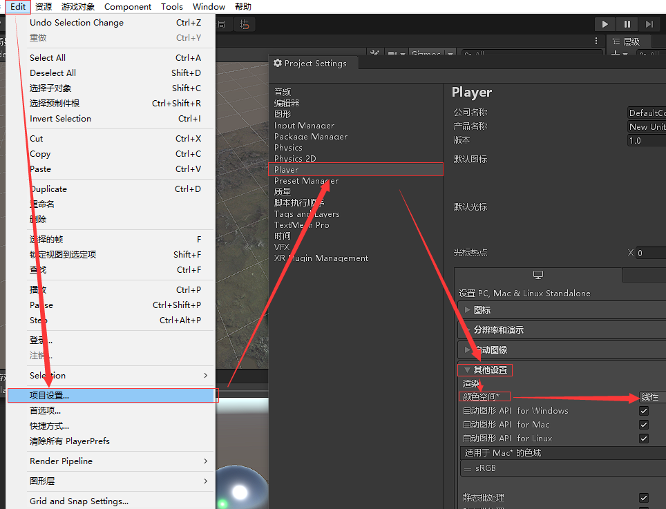

# 小任务

学习Bloom、HDR和Tone Mapping，翻译成中文就是泛光，高动态范围（光照）和色调映射。

## pre. 前置

### pre 1. 降采样

降采样的意思是，降低采样频率。原本对一张图片采样，将会逐个像素获取其颜色。降采样是间隔一定像素取出一个像素，最后把这些取出的像素合并成一张新的图片。

### pre 2. 高斯模糊

高斯模糊的本质是使用一个像素邻域内的像素的加权平均灰度值去代替这个像素。

高斯核一般是5x5或7x7的，标准方差为1的高斯核可以被拆成两个一维的权重，并且是对称的，所以实际上在计算时可以只存3个或5个权重来节省空间。

通过降采样使处理的像素减为原先的$\frac{1}{N}$，可以节省时间。由于模糊消除了图像的细节，降采样同样消除了图像细节，两者可以比较好的结合在一起，不过如果降采样的跨度太大，图像就会变得像素化。

```c#
using System.Collections;
using System.Collections.Generic;
using UnityEngine;
[ExecuteInEditMode]
public class GaussianBlur : MonoBehaviour
{
    public Material gaussianBlurMaterial;

    [Range(0, 4)]
    public int iterations = 3;
    [Range(0.2f, 3.0f)]
    public float blurSpeed = 0.6f;
    [Range(1, 8)]
    public int downSample = 2;

    private void OnRenderImage(RenderTexture src, RenderTexture dest) {
        if (gaussianBlurMaterial != null)
        {
            // 降采样提高效率
            int rtW = src.width / downSample;
            int rtH = src.height / downSample;
            // 高斯模糊需要调用两个Pass 所以需要一块中间缓冲来存储第一个Pass执行后的结果
            RenderTexture buffer = RenderTexture.GetTemporary(rtW, rtH, 0);
            // 双线性过滤
            buffer.filterMode = FilterMode.Bilinear;
            Graphics.Blit(src, buffer);

            // 迭代
            for (int i = 0; i < iterations; i++)
            {
                gaussianBlurMaterial.SetFloat("_BlurSize", 1.0f + i * blurSpeed);

                RenderTexture bufferTemp = RenderTexture.GetTemporary(rtW, rtH, 0);
                
                Graphics.Blit(buffer, bufferTemp, gaussianBlurMaterial, 0);

                RenderTexture.ReleaseTemporary(buffer);
                buffer = bufferTemp;
                bufferTemp = RenderTexture.GetTemporary(rtW, rtH, 0);

                Graphics.Blit(buffer, bufferTemp, gaussianBlurMaterial, 1);

                RenderTexture.ReleaseTemporary(buffer);
                buffer = bufferTemp;
            }

            Graphics.Blit(buffer, dest);
            RenderTexture.ReleaseTemporary(buffer);
        }
        else
        {
            Graphics.Blit(src, dest);
        }
    }
}
```

```c
Shader "Custom/GaussianBlur"
{
    Properties
    {
        _MainTex ("Base", 2D) = "white" {}
        _BlurSize ("Blur Size", Float) = 1.0
    }

    SubShader
    {
        CGINCLUDE
        #include "UnityCG.cginc"
        sampler2D _MainTex;
        half4 _MainTex_TexelSize;
        float _BlurSize;

        struct v2f
        {
            float4 pos : SV_POSITION;
            half2 uv[5] : TEXCOORD0;
        };

        v2f vertVertical(appdata_img v)
        {
            v2f o;
            o.pos = UnityObjectToClipPos(v.vertex);

            half2 uv = v.texcoord;

            o.uv[0] = uv;
            o.uv[1] = uv + float2(0.0, _MainTex_TexelSize.y * 1.0) * _BlurSize;
            o.uv[2] = uv - float2(0.0, _MainTex_TexelSize.y * 1.0) * _BlurSize;
            o.uv[3] = uv + float2(0.0, _MainTex_TexelSize.y * 2.0) * _BlurSize;
            o.uv[4] = uv - float2(0.0, _MainTex_TexelSize.y * 2.0) * _BlurSize;

            return o;
        }
        
        v2f vertHorizontal(appdata_img v)
        {
            v2f o;
            o.pos = UnityObjectToClipPos(v.vertex);

            half2 uv = v.texcoord;

            o.uv[0] = uv;
            o.uv[1] = uv + float2(_MainTex_TexelSize.x * 1.0, 0.0) * _BlurSize;
            o.uv[2] = uv - float2(_MainTex_TexelSize.x * 1.0, 0.0) * _BlurSize;
            o.uv[3] = uv + float2(_MainTex_TexelSize.x * 2.0, 0.0) * _BlurSize;
            o.uv[4] = uv - float2(_MainTex_TexelSize.x * 2.0, 0.0) * _BlurSize;

            return o;
        }

        fixed4 frag(v2f i) : SV_TARGET
        {
            // 权重
            float weight[3] = {0.4026, 0.2442, 0.0545};
            fixed3 sum = tex2D(_MainTex, i.uv[0]).rgb * weight[0];

            for (int it = 1; it < 3; it++)
            {
                sum += tex2D(_MainTex, i.uv[it * 2 - 1]).rgb * weight[it];
                sum += tex2D(_MainTex, i.uv[2 * it]).rgb * weight[it];
            }
            return fixed4(sum, 1.0);
        }
        ENDCG

        pass
        {
            // 定义Pass名称可以再其他Shader中直接使用名称来调用该Pass
            NAME "GAUSSIAN_BLUR_VERTICAL"

            CGPROGRAM
            #pragma vertex vertVertical
            #pragma fragment frag
            ENDCG
        }
        pass
        {
            NAME "GAUSSIAN_BLUR_HORIZONTAL"
            CGPROGRAM
            #pragma vertex vertHorizontal
            #pragma fragment frag
            ENDCG
        }
    }
    Fallback Off
}
```

## 1. HDR

本节参考LearnOpenGLCN。

我们一般用[0, 1]范围内的浮点数表示颜色，而亮度的计算公式（源自UnityShader入门精要）：

$$0.2125R+0.7154G+0.0721B$$

如果在场景中的一块区域内，有多个光源叠加，导致其中某些像素的真实的亮度超过1，但是由于范围只能在1以内，所以这些像素会被约束在1，从而导致场景混合成一片，细节部分将难以分辨。真实世界下这种情况非常常见，太阳就是一个超亮的光源。


HDR原本只是用于摄影上，摄影师对同一场景拍摄不同曝光度的照片，捕捉更大范围的色彩值，然后将这些照片合成为HDR图片，使得细节可见。

由于屏幕只能显示[0, 1]范围内的色彩值，这也导致我们需要将HDR值转换为[0, 1]内的值，也就是LDR（低动态范围）的值，这一过程就是Tone Mapping。

在Unity2019中，默认是开启了HDR的，我把摄像机的HDR开启和关闭时的Bloom效果对比放在下面：


（上图为开启HDR，下图为关闭HDR）

最明显的一点就是，开启HDR后，光晕要比关闭HDR的大。造成这种差异的原因是精度不同。

精度指的是这张图像用于表示颜色的变量的精度（LDR下每个通道8位，HDR下每个通道超过8位，通常为16位），精度越高自然表达的信息越多。

## 2. Tone Mapping

### 2.1 线性映射

最简单但是并不算真正的色调映射，因为她的效果和实际相差的太多了。

在一个整体偏暗，但存在一个高亮光源，线性映射的效果就会把最亮的部分映射到1，把原本偏暗的地方映射到很靠近0的位置。看图比较明显：


### 2.2 不知道算不算实现

我觉得不算，因为我连全局亮度的对数都没得到，只能自己手动调。

```c
Shader "Hidden/HDRTest"
{
    Properties
    {
        [HideInInspector]_MainTex ("Texture", 2D) = "white" {}

        _A ("A", Float) = 1.0
        _Gamma ("伽马", Float) = 1.0
        _Exposure ("曝光度", Float) = 1.0
    }
    SubShader
    {
        // No culling or depth
        Cull Off ZWrite Off ZTest Always

        CGINCLUDE

        sampler2D _MainTex;

        struct appdata
        {
            float4 vertex : POSITION;
            float2 uv : TEXCOORD0;
        };

        struct v2f
        {
            float2 uv : TEXCOORD0;
            float4 vertex : SV_POSITION;
        };

        v2f vert (appdata v)
        {
            v2f o;
            o.vertex = UnityObjectToClipPos(v.vertex);
            o.uv = v.uv;
            return o;
        }

        float luminance(float3 color)
        {
            return 0.2125 * color.r + 0.7154 * color.g + 0.0721 * color.b;
        }
        ENDCG

        Pass // 源自LOGL Reinhard
        {
            CGPROGRAM
            #pragma vertex vert
            #pragma fragment frag

            #include "UnityCG.cginc"

            half _Exposure;

            fixed4 frag (v2f i) : SV_Target
            {
                float3 hdrColor = tex2D(_MainTex, i.uv).rgb;
                float3 mapped = hdrColor / (hdrColor + 1.0);
                return fixed4(mapped, 1.0);
            }
            ENDCG
        }

        Pass // 源自LOGL 曝光参数的应用
        {
            CGPROGRAM
            #pragma vertex vert
            #pragma fragment frag

            #include "UnityCG.cginc"

            half _Exposure;

            fixed4 frag (v2f i) : SV_Target
            {
                float3 hdrColor = tex2D(_MainTex, i.uv).rgb;
                float3 mapped = float3(1, 1, 1) - exp(-_Exposure * hdrColor);
                return fixed4(mapped, 1.0);
            }
            ENDCG
        }

        Pass // 源自wiki 伽马矫正
        {
            CGPROGRAM
            #include "UnityCG.cginc"
            #pragma vertex vert
            #pragma fragment frag

            half _A;
            half _Gamma;

            fixed4 frag (v2f i) : SV_Target
            {
                // 输入的纹理是1.0的 如果这里直接输出就是要过屏幕的2.2
                // 理论上应该要手动做一次0.45的矫正 但是过0.45整个画面就变白了很多
                float3 hdrColor = tex2D(_MainTex, i.uv).rgb;
                return fixed4(pow(hdrColor, _Gamma) * _A, 1.0);
            }
            ENDCG
        }

        Pass // 源自进化论 Filmic Tone Mapping
        {
            CGPROGRAM
            #include "UnityCG.cginc"
            #pragma vertex vert
            #pragma fragment frag

            half _Exposure;

            float3 filmic(float3 color)
            {
                const fixed A = 0.22f;
                const fixed B = 0.30f;
                const fixed C = 0.10f;
                const fixed D = 0.20f;
                const fixed E = 0.01f;
                const fixed F = 0.30f;

                return ((color * (A * color + B * C) + D * E) / (color * (A * color + B) + D * F)) - E / F;
            }

            fixed4 frag (v2f i) : SV_Target
            {
                const half WHITE = 11.2f;
                float3 hdrColor = tex2D(_MainTex, i.uv).rgb;
                return fixed4(filmic(1.6f * _Exposure * hdrColor) / filmic(WHITE), 1.0);

            }

            ENDCG
        }

        Pass // 源自进化论 ACES
        {
            CGPROGRAM
            #include "UnityCG.cginc"
            #pragma vertex vert
            #pragma fragment frag

            half _Exposure;
            half _Gamma;

            fixed4 frag (v2f i) : SV_Target
            {
                const half A = 2.51f;
                const half B = 0.03f;
                const half C = 2.43f;
                const half D = 0.59f;
                const half E = 0.14f;

                float3 hdrColor = tex2D(_MainTex, i.uv).rgb;
                hdrColor *= _Exposure;
                float3 color = (hdrColor * (A * hdrColor + B)) / (hdrColor * (C * hdrColor + D) + E);

                return fixed4(pow(color, _Gamma), 1.0);
            }
            ENDCG
        }
    }
}
```


## 3. 线性空间和伽马矫正

在物理世界中，如果光的强度增加一倍，那么亮度也会增加一倍，这是线性关系。

线性空间对数字化的颜色和光照强度进行加减乘除运算后的结果仍然与真实结果保持一致，而在非线性空间中就不具备这种性质。

伽马一词来源于伽马曲线，伽马曲线的起源是以前人们使用伽马曲线对拍摄的图像进行伽马编码。

以前拍照的时候，采集到的亮度和图像的像素是一一对应的，如果我们只用8bit存储像素的每个通道的话，[0, 1]区间内可以对应256种亮度值。

后来人们发现人眼对光的敏感度在不同亮度下是不一样的，正常情况下，人眼对暗处的亮度变化更敏感，于是我们可以分配更多的空间来存储较暗的区域，避免空间的浪费。

我们假设存在两个像素，一个像素的亮度为0.240，另一个像素为0.243。如果我们将其直接映射到[0, 255]：
$$
value_1=0.240*255=61.2\\
value_2=0.243*255=61.965
$$
由于存储的值是整数，因此二者向下取整，表现出来的都是61这个亮度。

如果我们进行一次伽马矫正：
$$
value_1=0.240^{0.45}*255=133.3\\
value_1=0.243^{0.45}*255=134.1
$$
这样二者存储的值变成了133和134，于是二者之间实际显示的效果就被区分开了。上面说过，人眼对暗处变化比较敏感，对亮处变化不太敏感，经过伽马矫正后，我们可以用更大的范围存储较暗的部分，舍弃一些较亮部分的细节。

拍照的时候一般使用0.45（这个数被称为编码伽马）来对图像进行伽马编码，因此像素为0.5时，实际亮度约为0.22：
$$
0.5\approx0.22^{0.45}
$$
在实际输出到屏幕上时，就需要对图像再进行一次解码操作，使输出的亮度和捕捉的亮度符合线性关系。解码的伽马为2.2，因为$2.2*0.45\approx1$，可以抵消编码。现实中绝大部分的图片都是被0.45编码过的，因此解码操作几乎是默认要做的事情。

~~在以前还是阴极射线管屏幕的时候，由于物理性质导致的对图像自动进行2.2的伽马矫正，在之后的LCD屏也因为兼容性而继承了这个2.2的伽马矫正。~~

>现在的液晶显示器依然保留了2.2方的解码gamma校正。但这并不是什么历史遗留问题，也不是因为CRT的物理特性，而是现代数据编码上实实在在的需求——对物理线性的颜色编码做0.45次方的gamma校正，目的是为了让颜色编码的亮度分级与人眼主观亮度感受线性对应。这样，在相同的数据位数下，图像数据可以保留更多人眼敏感的信息。以8位色为例：由于人眼对暗色调更加敏感，那就对物理线性的颜色做0.45次方的处理，也就是编码gamma。校正完成后，相当于使用了0~128的范围来表达原来与物理强度保持线性时0~55的亮度变化。因此，显示器做解码gamma的目的是为了让便于保存和传输的颜色编码变回物理线性的形式，以便人眼观察显示器时能得到与观察现实世界时相近的感受。

~~综上，线性空间渲染时需要先进行一次2.2的矫正，将图像颜色转回线性空间进行操作，之后再用0.45编码，以抵消屏幕的2.2矫正。~~

Unity默认使用伽马空间，调整方式如下图所示：



在某些不支持线性空间的平台，也可以在着色器内部进行一些操作来实现：对采样的颜色做2.2次幂，然后在返回颜色值前对颜色做0.45次幂。由于计算次幂开销比较大，所以不能滥用。

[Gamma、Linear、sRGB 和Unity Color Space，你真懂了吗？](https://zhuanlan.zhihu.com/p/66558476)

## 4. Bloom

效果就是把亮的地方模糊化，模拟真实摄像机的效果。

为了实现Bloom效果，我们需要先提取出屏幕中的较亮区域，然后使用高斯模糊对提取出来高亮区域进行模糊处理，再与原图像进行混合。

代码如下：

```c#
using UnityEngine;
[ExecuteInEditMode]
public class Bloom : MonoBehaviour
{
    public Material bloomMaterial;

    [Range(0, 4)]
    public int iterations = 3;

    [Range(0.2f, 3.0f)]
    public float blurSpread = 0.6f;

    [Range(1, 8)]
    public int downSample = 2;

    [Range(0, 4.0f)]
    public float luminanceThreshold = 0.6f;

    private void OnRenderImage(RenderTexture src, RenderTexture dest) {
        if (bloomMaterial != null)
        {
            bloomMaterial.SetFloat("_LuminanceThreshold", luminanceThreshold);
            // 降采样提高效率
            int rtW = src.width / downSample;
            int rtH = src.height / downSample;

            RenderTexture buffer = RenderTexture.GetTemporary(rtW, rtH, 0);
            // 双线性过滤
            buffer.filterMode = FilterMode.Bilinear;
            // 提取较亮区域
            Graphics.Blit(src, buffer, bloomMaterial, 0);

            // 迭代
            for (int i = 0; i < iterations; i++)
            {
                bloomMaterial.SetFloat("_BlurSize", 1.0f + i * blurSpread);

                RenderTexture bufferTemp = RenderTexture.GetTemporary(rtW, rtH, 0);
                
                Graphics.Blit(buffer, bufferTemp, bloomMaterial, 1);

                RenderTexture.ReleaseTemporary(buffer);
                buffer = bufferTemp;
                bufferTemp = RenderTexture.GetTemporary(rtW, rtH, 0);

                Graphics.Blit(buffer, bufferTemp, bloomMaterial, 2);

                RenderTexture.ReleaseTemporary(buffer);
                buffer = bufferTemp;
            }
            // 将处理后的较量区域与源图像混合
            bloomMaterial.SetTexture("_Bloom", buffer);
            Graphics.Blit(src, dest, bloomMaterial, 3);

            RenderTexture.ReleaseTemporary(buffer);
        }
        else
        {
            Graphics.Blit(src, dest);
        }
    }
}
```

```c
Shader "Custom/Bloom"
{
    Properties
    {
        _MainTex ("Base", 2D) = "white" {}
        _Bloom ("Bloom", 2D) = "black" {}
        _LuminanceThreshold ("LuminanceThreshold", Float) = 0.5
        _BlurSize ("Blur Size", Float) = 1.0
    }

    SubShader
    {
        // 使用CGINCLUDE组织代码 类似与头文件一样的东西 里面的可以这个Shader中使用
        CGINCLUDE
        #include "UnityCG.cginc"
        sampler2D _MainTex;
        half4 _MainTex_TexelSize;
        sampler2D _Bloom;
        float _LuminanceThreshold;
        float _BlurSize;

        struct v2f
        {
            float4 pos : SV_POSITION;
            half2 uv : TEXCOORD0;
        };


        fixed luminance(fixed4 color)
        {
            return 0.2125 * color.r + 0.7154 * color.g + 0.0721 * color.b;
        }

        v2f vertExractBright(appdata_img v)
        {
            v2f o;
            o.pos = UnityObjectToClipPos(v.vertex);
            o.uv = v.texcoord;

            return o;
        }

        fixed4 fragExractBright(v2f i) : SV_TARGET
        {
            fixed4 color = tex2D(_MainTex, i.uv);
            fixed val = clamp(luminance(color) - _LuminanceThreshold, 0.0, 1.0);

            return color * val;
        }
        
        struct v2fBloom
        {
            float4 pos : SV_POSITION;
            half4 uv : TEXCOORD0;
        };

        v2fBloom vertBloom(appdata_img v)
        {
            v2fBloom o;
            o.pos = UnityObjectToClipPos(v.vertex);

            o.uv.xy = v.texcoord;
            o.uv.zw = v.texcoord;

#if UNITY_UV_STARTS_AT_TOP
            if (_MainTex_TexelSize.y < 0.0)
            {
                o.uv.w = 1.0 - o.uv.w;
            }
#endif
            return o;
        }

        fixed4 fragBloom(v2fBloom i) : SV_TARGET
        {
            return tex2D(_MainTex, i.uv.xy) + tex2D(_Bloom, i.uv.zw);
        }
        ENDCG
        ZTest Always
        Cull Off
        ZWrite Off
        pass
        {
            CGPROGRAM
            #pragma vertex vertExractBright
            #pragma fragment fragExractBright
            ENDCG
        }

        UsePass "Custom/GaussianBlur/GAUSSIAN_BLUR_VERTICAL"
        UsePass "Custom/GaussianBlur/GAUSSIAN_BLUR_HORIZONTAL"

        pass
        {
            CGPROGRAM
            #pragma vertex vertBloom
            #pragma fragment fragBloom
            ENDCG
        }
    }
    Fallback Off
}
```

人眼看到的图像，如果传到电脑中通过屏幕显示出来，就会经过2.2编码，导致图像整体变暗。

