# 现代计算机图形学入门

## 1. 线性代数

### 1.1 向量（矢量）

向量两个最重要的属性：方向和长度。图形学里默认向量是列向量：$\left[\begin{matrix}x\\y\\z\end{matrix}\right]$

长度为1的向量是单位向量，计算单位向量的方法：$\widehat{a}=\frac{\vec{a}}{\|\vec{a}\|}$

向量运算：

- 加法：向量首尾相连，整体的首和尾相连就是新向量。数学上就是各个分量相加。

- 减法：将向量移动到同一起点，结果为后指前（减号后的向量的终点指向减号前的向量终点）。

- 点乘：

    $\vec{a}\cdot\vec{b}=\lvert\vec{a}\rvert\lvert\vec{b}\rvert\cos{\theta}$，通常用于计算夹角。点乘满足交换律、分配律和结合律。

    $\vec{a}\cdot\vec{b}=x_ax_b+y_ay_b$（二维向量下的计算，以此类推）。

    已知夹角也可以计算投影长度：$\vert\vec{b}_\perp\vert=\lvert\vec{b}\rvert\cos\theta$，投影可以将向量分解两个向量，其中一个向量就是$\vec{b}_\perp$，另一个向量为$\vec{b}-\vec{b}_\perp$。

    向量点乘可以判断两个向量相对于一个向量的正反向，由于$\cos\theta$在$[\frac{\pi}{2}, \pi]$是负数，点乘结果是负数，说明夹角大于90°。

    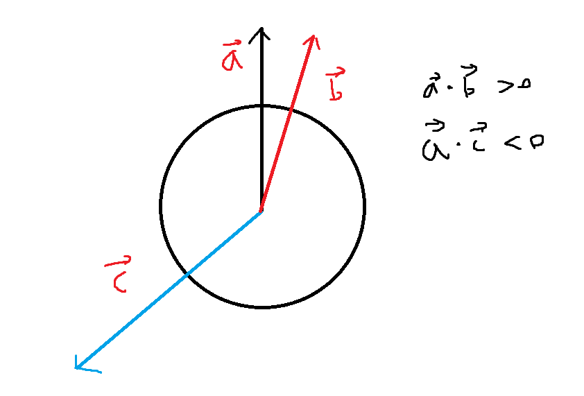

- 叉乘：

    结果为既垂直于a向量又垂直于b向量的向量。$\vec{a}\times\vec{b}=\left[\matrix{y_az_b-y_bz_a\\z_ax_b-z_bx_a\\x_ay_b-x_by_a}\right]$
    
    也可以把a向量写成矩阵形式与b向量进行叉乘，结果相同：$\vec{a}\times\vec{b}=\left[\matrix{0 & -z_a & y_a\\z_a & 0 & -x_a\\-y_a & x_a & 0}\right]\left[\matrix{x_b\\y_b\\z_b}\right]$
    
    
    相同向量叉乘结果为零向量，零向量是长度为0的向量。
    
    叉乘不满足交换律，$\vec{a}\times\vec{b}$的结果与$\vec{b}\times\vec{a}$的结果正好方向相反，所以需要加上一个负号才能使二者等价。
    
    叉乘满足分配律和结合律。
    
    可以用叉乘定义坐标系，若$\vec{x}\times\vec{y}=+\vec{z}$，则表示这个坐标系是右手坐标系，相反则为左手坐标系。
    
    叉乘可以判断两个向量（平面）的相对方向，$\vec{a}\times\vec{b}$的结果如果指向z轴正方向（右手坐标系下），则b向量在a向量的左边，若指向z轴反方向，则b向量在a向量的右边。
    
    通过相对方向我们可以判断处一个点是否在一个面内，假设一个三角面ABC，ABC三点逆时针排列，若有一点P在三角形内部，则对于$\vec{AB}$、$\vec{BC}$、$\vec{CA}$来说，$\vec{AP}$、$\vec{BP}$、$\vec{CP}$必然在其左侧。若有任意一边不满足条件，则该点P不在三角面内。如图：
    
    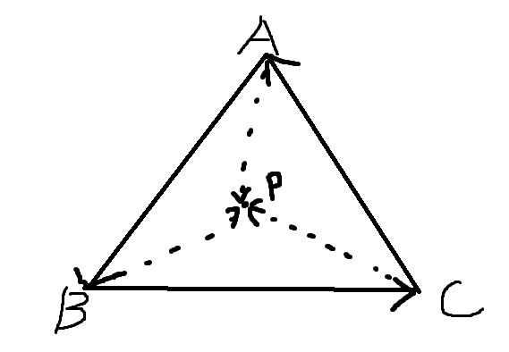
    
    对于一个由三个相互垂直的单位向量$\vec{u}$,$\vec{v}$,$\vec{w}$组成的坐标系，可以将一个向量p表示到该坐标系下：$\vec{p}=(\vec{p}\cdot\vec{u})\vec{u}+(\vec{p}\cdot\vec{v})\vec{v}+(\vec{p}\cdot\vec{w})\vec{w}$

### 1.2 矩阵

M行xN列的一堆数字。

第一个矩阵列数和第二个矩阵行数必须相同二者才能进行矩阵乘法。(Mx **N** )( **N** xP)=(MxP)

乘法运算方式我觉着UnityShader入门精要里面那张图很好用：

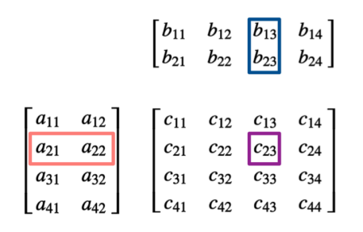

矩阵乘法一般不满足交换律，满足分配律和结合律。

矩阵和向量乘，一般把向量作为列向量放在运算的右边与矩阵进行运算。

矩阵在图形学里最大的用途是顶点变换。

- 矩阵转置就是把行列互换，第一行变成第一列，以此类推，A的转置为$A^T$。有个现象：$(AB)^T=B^TA^T$，和通常理解的不一样。

- 单位矩阵就是一个方块矩阵（行列数相同），且只有主对角线（左上到右下）上为1，其他元素为0。通常用I表示，下标单位矩阵的大小：$I_{3x3}$表示3x3大小的单位矩阵。$AI=A$

- 逆矩阵的前提是原矩阵必须是方块矩阵，逆矩阵与原矩阵相乘得单位矩阵。原矩阵乘逆矩阵一定等于单位矩阵$AA^{-1}=A^{-1}A=I$，和转置矩阵一样，$(AB)^{-1}=B^{-1}A^{-1}$。并不是所有矩阵都有逆矩阵，比如全0的矩阵。

## 2. 变换

学习变换的根本目的在于，把三维世界中的物体投影到一个二维面上。

### 2.1 二维变换

#### 2.1.1 缩放

将原本坐标按一定比例映射到新的坐标。如下图所示，以0.5为缩放比例进行缩放，对原坐标$(x, y)$变换，得到新的坐标$(x^\prime, y^\prime)$，下图$\left[\matrix{s&0\\0&s}\right]$即为缩放矩阵。s可以根据x方向上或y方向上的缩放比例进行改变，可以是不均匀缩放。

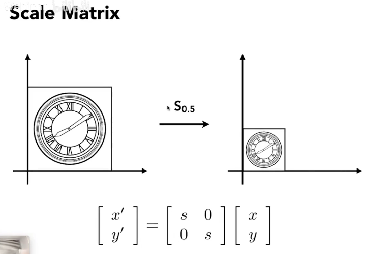

#### 2.1.2 反射（反转）

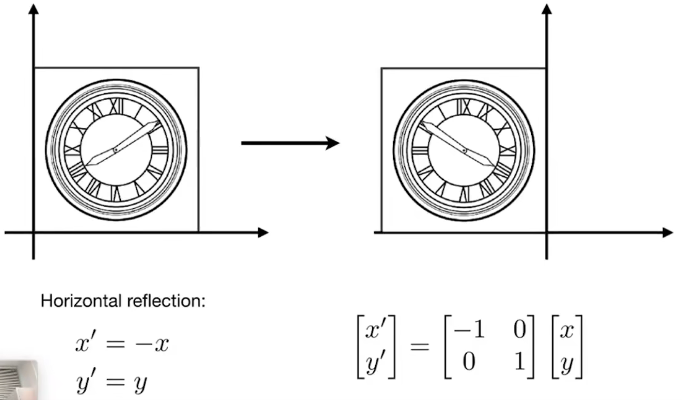

#### 2.1.3 切变

例子中其x坐标偏移量与y正相关，y坐标不变。即$x^\prime=x+ay,\space y^\prime=y$。

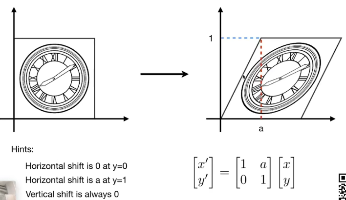

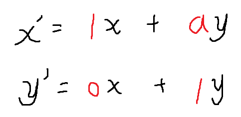

#### 2.1.4 旋转

教学视频中默认绕原点旋转，以逆时针旋转为正方向。

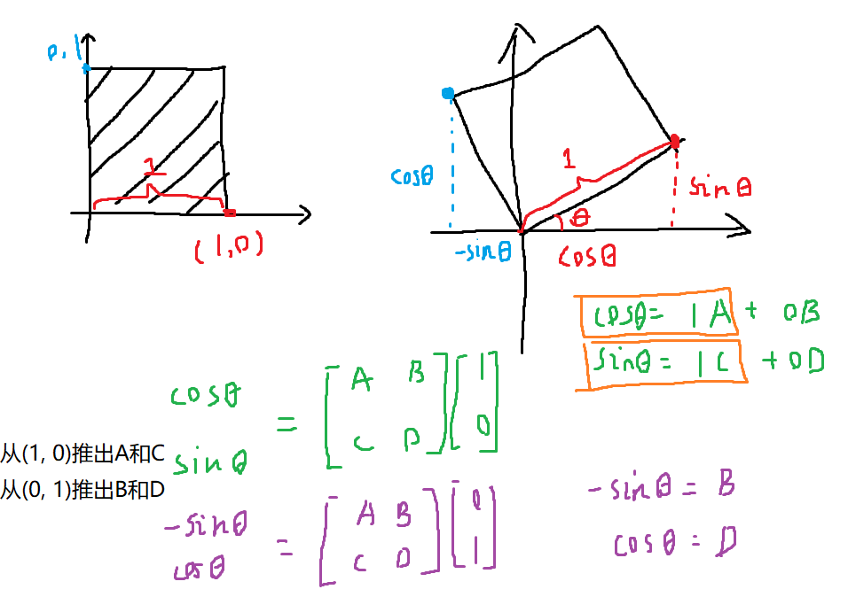

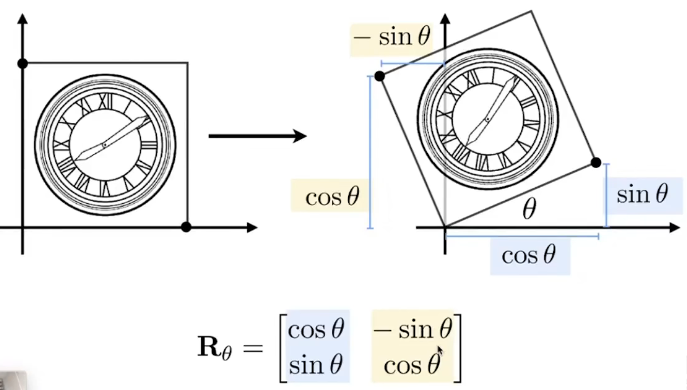

补充，如果我们此时希望顺时针旋转，那么旋转矩阵表示如下：
$$
R_{-\theta}=\left[\matrix{\cos\theta&\sin\theta\\-\sin\theta&\cos\theta}\right]=R_\theta^T
$$
反方向旋转其实就是原旋转矩阵的转置矩阵，同时又因为$R_\theta R_{-\theta}=I$，所以$R_{-\theta}=R_\theta^T=R_\theta^{-1}$。

**重点，旋转矩阵的逆矩阵和转置矩阵是相同的。**

#### 2.1.A 线性变换

以上所有变换都可以写成如下形式：
$$
x^\prime=ax+by\\
y^\prime=cx+dy
$$
矩阵形式如下：
$$
\left[\matrix{x^\prime\\y^\prime}\right]=\left[\matrix{a&b\\c&d}\right]\left[\matrix{x\\y}\right]
$$
新坐标可以通过原坐标乘一些数得出，符合这种形式的变换被称为线性变化。

#### 2.1.5 平移变换

平移很好写出来：
$$
x^\prime=x+t_x\\
y^\prime=y+t_y
$$
但是没办法用之前的线性变换直接表示，因为线性变换始终是类似ax+by这种形式。为了表示平移，我们只能通过在线性变换后加上一个向量矩阵：
$$
\left[\matrix{x^\prime\\y^\prime}\right]=\left[\matrix{a&b\\c&d}\right]\left[\matrix{x\\y}\right]+\left[\matrix{t_x\\t_y}\right]
$$
我们不希望把平移当作一个特殊的情况去处理，于是这里引入齐次坐标，可以统一所有变换。

如果(x, y)表示一个点，那么将她扩展为(x, y, 1)。如果(x, y)表示一个向量，那么将她扩展为(x, y, 0)，至于为什么会在后面描述。

下面以平移来举例，将一个单位变换矩阵扩展成下面这样：
$$
\left[\matrix{1&0&t_x\\0&1&t_y\\0&0&1}\right]
$$
与点相乘：
$$
\left[\matrix{1&0&t_x\\0&1&t_y\\0&0&1}\right]\left[\matrix{x\\y\\1}\right]=\left[\matrix{x+t_x\\y+t_y\\1}\right]
$$
可以看到，得出的结果的前两个分量就是我们希望得到的平移的结果，$\left[\matrix{x\\y\\1}\right]$最下面的1就会让结果x加上$t_x$，y加上$t_y$。

现在回答一下为什么表示向量的矩阵最后一个分量是0。向量具有平移不变性，不管你对向量做任何的平移操作，向量仍然应该保持原样。当表示向量的矩阵最后一个分量为0时，上面的矩阵乘法就不会把$t_x$和$t_y$加上去。

#### 2.1.B 齐次坐标

上面的平移变换中引入了齐次坐标，齐次坐标还有一些额外的……怎么说呢，奇妙的运算？

首先，向量尾巴是0，点尾巴是1，于是就有下面的运算：

- 向量+向量=向量（0+0=0）
- 点-点=向量（1-1=0，正好是向量）
- 点+向量=点（1+0=1，相当于平移）
- 点+点=中点（1+1=2，将各个分量相加后同除2就是中点，同时尾巴也变回了1）

#### 2.1.C 仿射变换

使用齐次坐标将所有变换统一之后，这种变换就被称为仿射变换，表示形式如下矩阵运算：
$$
\left[\matrix{x^\prime\\y^\prime\\1}\right]=\left[\matrix{a&b&t_x\\c&d&t_y\\0&0&1}\right]\left[\matrix{x\\y\\1}\right]
$$
**在表示二维情况下的仿射变换的齐次坐标矩阵最下面一行才是001。**

这种变换表示先进行线性变换后进行平移变换。

#### 2.1.D 逆变换

就是一个图形通过仿射变换矩阵M变换后，可以通过M的逆矩阵变换回原来的样子。

#### 2.1.E 组合变换

由于旋转时是绕原点旋转，这就导致了先旋转后平移和先平移后旋转的结果是不同的。这和矩阵乘法很像，不满足交换律，不同顺序会导致不同结果。

### 2.2 三维变换

类比二维变换中的齐次坐标，三维变换中(x, y, z)将扩展成(x, y, z, 0)向量或(x, y, z, 1)点。

三维下的仿射变换，也和二维相差不大：
$$
\left[\matrix{x^\prime\\y^\prime\\z^\prime\\1}\right]=\left[\matrix{a&b&c&t_x\\d&e&f&t_y\\g&h&i&t_z\\0&0&0&1}\right]\left[\matrix{x\\y\\z\\1}\right]
$$

#### 2.2.1 旋转

我们从简单的旋转开始，仅绕三个轴的方向进行旋转。

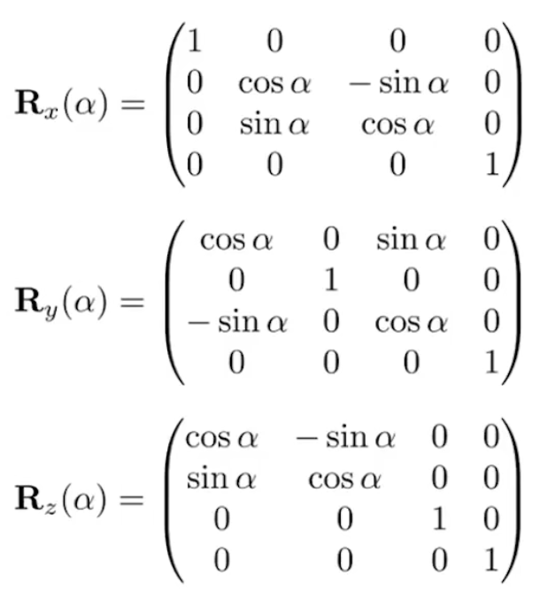

绕x轴旋转，x轴上的点自然是不会变的，所以第一个矩阵左上角是1，以此类推。

然后会发现，绕x轴和z轴旋转的矩阵，她的排布是和之前相同的右上是$-\sin\theta$，左下是$\sin\theta$，但是绕y轴旋转的矩阵是之前的转置矩阵。

之前我们在二维坐标下旋转时，我们绕原点旋转且逆时针是正方向。把原点想象成朝屏幕外指的z轴，旋转就变成绕z轴正向旋转，是从x往y轴旋转的。

三维下绕z轴旋转和上面讲的是一样的，绕x轴旋转是y往z轴旋转。到了绕y轴旋转时，变成从z往x轴旋转，这时的顺序是反的，所以绕y轴旋转的矩阵是转置矩阵。

虽然但是我觉得上面我写的不清不楚的，还是直接推一遍吧：

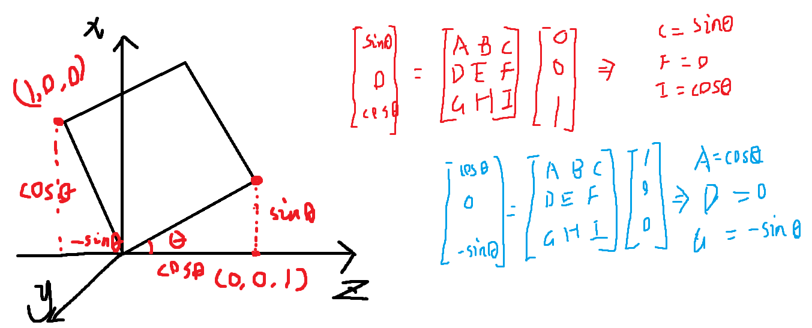

接下来就是复杂的旋转，由三轴旋转组合，可以表达任意旋转：
$$
R_{xyz}(\alpha,\beta,\gamma)=R_x(\alpha)R_y(\beta)R_z(\gamma)
$$
α、β、γ三个角被称为欧拉角。死锁和四元数不在教学中讲解，那我也不记了。

绕任意过原点的单位向量轴进行旋转的公式如下：

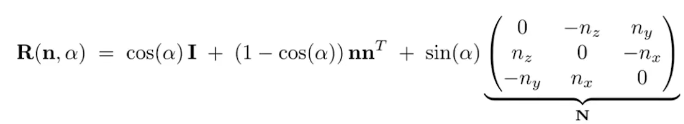

#### 2.2.2 视图/相机变换（View/Camera Transformation）

想象一下在现实中我们是如何拍毕业合照的：

1. 搭好台子，让人们排好，摆个pose。（Model Transformation）
2. 找一个好的角度，固定好相机位置。（View Transformation）
3. 拍照。（Projection Transformation）

以上经过了模型-视图-投影变换，简称MVP变换。

--------

定义一个相机需要三个属性：

1. 位置
2. 朝向
3. 向上的方向（旋转）

----

当相机和物体同时移动时，只要相机和物体之间相对位置不变，且相机和物体不再另外旋转，那么就拍出来的图像就是一样的，物理上叫做相对运动。

知道了这个相对运动之后，我们可以让相机永远在一个位置上。图形学默认相机永远在原点，永远向-z方向看，上方向永远是y，这个位置叫做标准位置。

那如何将相机转换到标准位置呢？很简单，先平移相机到原点，然后将相机朝向旋转到-z方向，把上方向与y轴对齐。

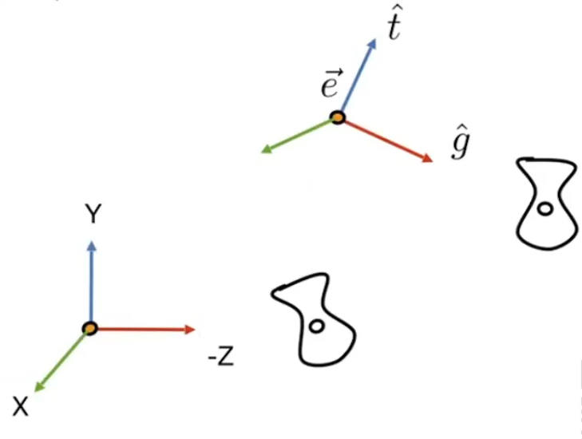

相机位置$\vec{e}$，朝向$\widehat{g}$，上$\widehat{t}$。

我们设使摄像机转换到标准位置的矩阵为$M_{view}=R_{view}T_{view}$，首先通过T矩阵进行平移，再通过R矩阵进行旋转。

平移矩阵比较简单，减去e向量即可：
$$
T_{view}=\left[\matrix{1&0&0&-x_e\\0&1&0&-y_e\\0&0&1&-z_e\\0&0&0&1}\right]
$$
如果我们要把g移动到-z，其实是很难写出矩阵的（大佬另说），但是从z轴旋转到-g是很容易写的，其他轴也一样，于是有旋转矩阵的逆矩阵如下：
$$
R_{view}^{-1}=\left[\matrix{x_{\widehat{g}\times\widehat{t}}&x_t&x_{-g}&0\\y_{\widehat{g}\times\widehat{t}}&y_t&y_{-g}&0\\z_{\widehat{g}\times\widehat{t}}&z_t&z_{-g}&0\\0&0&0&1}\right]
$$
又因为旋转矩阵的逆矩阵等于旋转矩阵的转置矩阵，所以将得出的逆矩阵再转置一次就可以得出我们需要的旋转矩阵：
$$
R_{view}=\left[\matrix{x_{\widehat{g}\times\widehat{t}}&y_{\widehat{g}\times\widehat{t}}&z_{\widehat{g}\times\widehat{t}}&0\\x_t&y_t&z_t&0\\x_{-g}&y_{-g}&z_{-g}&0\\0&0&0&1}\right]
$$
两个矩阵都得到之后，就可以对相机进行变换，同时场景内所有物体也需要同时进行这个变换，保证相对位置前后一致，因此这个变换也被称作模型视图变换（ModelView Transformation）

#### 2.2.3 投影

