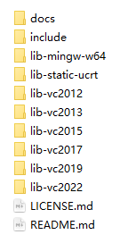
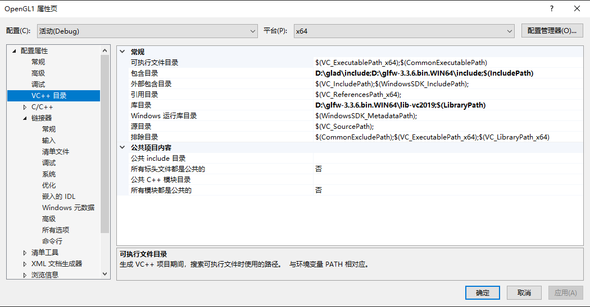
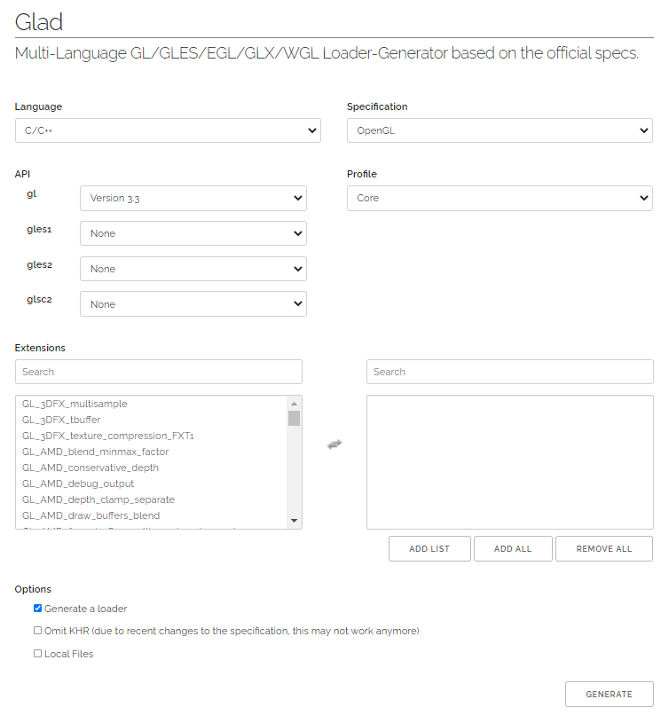
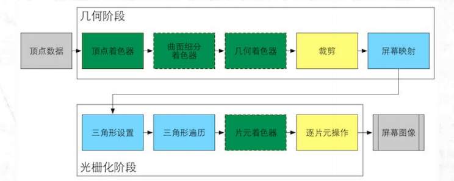
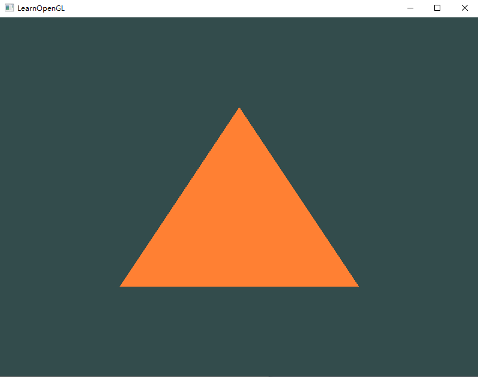

# OpenGL

基于OpenGL编程指南第九版、LearnOpenGL-CN和OpenGL3.3核心模式。

## 1. OpenGL概述

一般认为OpenGL是一个API，包含了一系列可以操作图形和图像的函数，然而OpenGL本身并不是一个API，而是Khronos组织指定并维护的规范。

规范严格规定了每个函数应该如何执行，以及她们的输出值，函数内部的实现由OpenGL库开发者自由决定。通常来说，OpenGL库的开发者是显卡厂商，也有爱好者自己开发的版本，所以出bug有时候可以通过升级显卡驱动来修复，因为这些驱动包含你的显卡能支持的最新版本的OpenGL。

OpenGL自身是一个巨大的状态机，有一系列变量描述OpenGL此刻应当如何运行，OpenGL的状态通常被称为OpenGL上下文，我们可以通过设置选项、操作缓冲来改变OpenGL上下文。

### 1.1 配置

[GLFW](https://www.glfw.org/)下载预编译的win64版本，解压后得到如下文件夹：



打开VS2019，新建一个cpp的空项目，在项目的属性里的VC++目录一栏中的包含目录里，添加一个新目录，这个新目录就是刚才解压出来的include目录，然后在同一界面下的库目录添加lib-vc2019（我使用VS2019）。之后同样在项目的属性里，找到链接器里的输入一栏中的附加依赖项，将glfw3.lib添加进去（直接输入这几个字母），然后可以试一下`#include <GLFW/glfw3.h>`，如果没有报错，那就成功了。



到这里还没有结束，由于OpenGL只是一个规范，具体实现是由驱动开发商针对特定显卡实现，又由于OpenGL驱动版本众多，她大多数的函数位置无法在编译时确定，需要运行时查询。这就意味着我们需要手动将运行函数地址保存在一个指针里供之后调用，取址方法因平台而异，在Windows上会像这样：

```cpp
// 定义函数原型
typedef void (*GL_GENBUFFERS)GLsizei, GLuint*);
// 找到正确的函数并赋值给函数指针 GL_GENBUFFERS
glGenBuffers =(GL_GENBUFFERS)wglGetProcAddress("glGenBuffers");
// 现在函数可以被正常调用了 GLuint buffer;
glGenBuffers(1, &buffer);
```

对于我们使用的每个函数，我们都可能需要执行如上操作来获取函数指针，很繁琐。不过我们可以通过GLAD库解决这个问题。

我们通过[GLAD](https://glad.dav1d.de/)的在线服务获取对应OpenGL版本的库，界面如下：



我们使用c++进行开发，所以语言选择C/C++，API的gl选择需要的版本，这里按照LearnOpenGL选3.3，Profile选择Core。选好之后点击下方的GENERATE，就会跳转到另一个界面，页面上有一个可供下载的压缩包，里面包含一个include文件夹和src文件夹，重复之前添加GLFW的include文件夹的操作，将glad的文件夹也添加进去，再将src中的glad.c复制到项目里。使用`#include <glad/glad.h>`验证是否成功。

### 1.2 第一个窗口

代码的解释看注释吧，这里不重复了。如果没有问题的话，运行出来就是一个控制台窗口加上一个黑绿色（黑板色？）的窗口，按下ESC键可以退出。或者可以看[这里](https://learnopengl.com/code_viewer_gh.php?code=src/1.getting_started/1.1.hello_window/hello_window.cpp)看一下LearnOpenGL提供的源码。

```cpp
#include <glad/glad.h>
#include <GLFW/glfw3.h>

#include <iostream>

void framebuffer_size_callback(GLFWwindow* window, int width, int height);
void processInput(GLFWwindow* window);

int main()
{
	// 初始化glfw
	glfwInit();
	// 配置glfw
	// 主版本号 3
	glfwWindowHint(GLFW_CONTEXT_VERSION_MAJOR, 3);
	// 次版本号 3
	glfwWindowHint(GLFW_CONTEXT_VERSION_MINOR, 3);
	// 使用OpenGL的Core模式
	glfwWindowHint(GLFW_OPENGL_PROFILE, GLFW_OPENGL_CORE_PROFILE);
	// Mac OS 需要添加
	// 
	// glfwWindowHint(GLFW_OPENGL_FORWARD_COMPAT, GL_TRUE);

	// 创建一个窗口对象
	GLFWwindow* window = glfwCreateWindow(800, 600, "LearnOpenGL", NULL, NULL);
	if (window == NULL)
	{
		std::cout << "创建GLFW窗口失败" << std::endl;
		glfwTerminate();
		return -1;
	}

	glfwMakeContextCurrent(window);
	
	// glad是用来管理OpenGL的函数指针的
	// 所以调用任何OpenGL的函数之前 要初始化glad
	// glad通过glfw提供的函数定义加载函数指针
	if (!gladLoadGLLoader((GLADloadproc)glfwGetProcAddress))
	{
		std::cout << "初始化glad失败" << std::endl;
		return -1;
	}
	// 在开始渲染前 我们必须告诉OpenGL渲染窗口的尺寸大小，即视口
	// 前两个参数表示视口左下角的位置
	// 后两个参数表示视口的宽度和高度
	// glViewport(0, 0, 800, 600);

	// 但是，当用户改变窗口大小时，视口也应该被调整
	// 所以可以对窗口注册一个回调函数，用于调整视口大小
	glfwSetFramebufferSizeCallback(window, framebuffer_size_callback);

	// 准备就绪 开始我们的渲染主循环
	// 检查glfw窗口是否被退出
	while (!glfwWindowShouldClose(window))
	{
		// 处理案件输入
		processInput(window);

		// 我们通常希望在新的一次输出之前清空屏幕
		// 设置清空屏幕的颜色（这是一个状态设置函数）
		glClearColor(0.2f, 0.3f, 0.3f, 1.0f);
		// 清空颜色缓冲（这是一个状态使用函数） 其他的可选项还有深度缓冲和模板缓冲 之后学到再说
		glClear(GL_COLOR_BUFFER_BIT);

		// 交换颜色缓冲，绘制到屏幕上
		glfwSwapBuffers(window);
		// 检查有没有触发什么事件（键盘输入、鼠标移动等）、更新窗口状态并调用对应的回调函数
		glfwPollEvents();
	}

	// 关闭窗口
	glfwTerminate();
	return 0;
}

void framebuffer_size_callback(GLFWwindow* window, int width, int height)
{
	glViewport(0, 0, width, height);
}

void processInput(GLFWwindow* window)
{
	if (glfwGetKey(window, GLFW_KEY_ESCAPE) == GLFW_PRESS)
	{
		glfwSetWindowShouldClose(window, true);
	}
}
```

### 1.3 第一个三角形

> 在学习此节之前，建议将这三个单词先记下来：
>
> - 顶点数组对象：Vertex Array Object，VAO
> - 顶点缓冲对象：Vertex Buffer Object，VBO
> - 索引缓冲对象：Element Buffer Object，EBO或Index Buffer Object，IBO
>
> 当指代这三个东西的时候，可能使用的是全称，也可能用的是英文缩写，翻译的时候和原文保持的一致。由于没有英文那样的分词间隔，中文全称的部分可能不太容易注意。但请记住，缩写和中文全称指代的是一个东西。

上面是译者注，留意一下。

这一节回顾一下渲染管线（OpenGL），先放一张之前在UnityShader的学习中出现过的GPU渲染流水线图，再放一下LOGL（LearnOpenGL，以后就简称LOGL了）上的图：




LOGL上这一节对渲染流水线的描述挺简略的：

> 第一部分，把3D坐标转换为2D坐标。
>
> 第二部分，把2D坐标转变为实际有颜色的像素。

和工厂的流水线一样，渲染流水线的每个阶段是高度专门化的，每个阶段都有特定的函数，而且很容易执行。GPU上有非常多的小处理核心，能够并行执行这些小程序，从而快速处理数据。这些小程序就是Shader，着色器。然后用绘制一个三角形来简单描述一下渲染流水线的工作方式：

> 首先，我们以数组的形式传递3个3D坐标作为图形渲染管线的输入，用来表示一个三角形，这个数组叫做顶点数据(Vertex Data)；顶点数据是一系列顶点的集合。一个顶点(Vertex)是一个3D坐标的数据的集合。而顶点数据是用顶点属性(Vertex Attribute)表示的，它可以包含任何我们想用的数据，但是简单起见，我们还是假定每个顶点只由一个3D位置和一些颜色值组成的吧。
>
> 图形渲染管线的第一个部分是顶点着色器(Vertex Shader)，它把一个单独的顶点作为输入。顶点着色器主要的目的是把3D坐标转为另一种3D坐标（后面会解释），同时顶点着色器允许我们对顶点属性进行一些基本处理。
>
> 图元装配(Primitive Assembly)阶段将顶点着色器输出的所有顶点作为输入（如果是GL_POINTS，那么就是一个顶点），并所有的点装配成指定图元的形状；本节例子中是一个三角形。
>
> 图元装配阶段的输出会传递给几何着色器(Geometry Shader)。几何着色器把图元形式的一系列顶点的集合作为输入，它可以通过产生新顶点构造出新的（或是其它的）图元来生成其他形状。例子中，它生成了另一个三角形。
>
> 几何着色器的输出会被传入光栅化阶段(Rasterization Stage)，这里它会把图元映射为最终屏幕上相应的像素，生成供片段着色器(Fragment Shader)使用的片段(Fragment)。在片段着色器运行之前会执行裁切(Clipping)。裁切会丢弃超出你的视图以外的所有像素，用来提升执行效率。
>
> 片段着色器的主要目的是计算一个像素的最终颜色，这也是所有OpenGL高级效果产生的地方。通常，片段着色器包含3D场景的数据（比如光照、阴影、光的颜色等等），这些数据可以被用来计算最终像素的颜色。
>
> 在所有对应颜色值确定以后，最终的对象将会被传到最后一个阶段，我们叫做Alpha测试和混合(Blending)阶段。这个阶段检测片段的对应的深度（和模板(Stencil)）值（后面会讲），用它们来判断这个像素是其它物体的前面还是后面，决定是否应该丢弃。这个阶段也会检查alpha值（alpha值定义了一个物体的透明度）并对物体进行混合(Blend)。所以，即使在片段着色器中计算出来了一个像素输出的颜色，在渲染多个三角形的时候最后的像素颜色也可能完全不同。

好像UnityShader中的GPU渲染流水线没有说到图元装配这个阶段，是因为Unity中的Mesh默认都是三角网格吗？

#### 1.3.1 顶点输入

开始绘制图形前，我们必须给OpenGL输入一些顶点数据。OpenGL的坐标是3D坐标，且仅当顶点三个坐标分量都在[-1, 1]的范围内（也就是标准化设备坐标，NDC）才会处理她。

定义顶点数据之后，我们会把她作为输入发送给顶点着色器。顶点着色器会在GPU上创建内存空间用于存储顶点数据，同时配置OpenGL如何解释这些内存（点、线、三角等），并且指定其如何发送给显卡。我们通过**顶点缓冲对象（Vertex Buffer Objects）**管理这些内存空间。这个OpenGL对象可以一次性发送大量顶点到显卡去，提高效率。（由于CPU传递数据给GPU比较慢，所以需要尽可能一次性发送尽量多的数据）

事先声明，drawTriangle函数是不能直接用的，因为有一部分是放在渲染主循环外完成的，而且按照笔记的顺序来写也是错的，这里只是为了省点字数，也好看一点。

```cpp
void drawTriangle()
{
	// 顶点数据
	float vertices[] = {
		-0.5f, -0.5f, 0.0f,
		 0.5f, -0.5f, 0.0f,
		 0.0f,  0.5f, 0.0f
	};
	// 存放缓冲ID
	GLuint VBO;
	// 生成顶点缓冲对象ID
	glGenBuffers(1, &VBO);
	// 设置缓冲区类型 VBO是GL_ARRAY_BUFFER
	glBindBuffer(GL_ARRAY_BUFFER, VBO);
	// 于是乎从上一句执行完开始 我们所有对GL_ARRAY_BUFFER的操作都会用来配置VBO
	// 那么这个绑定函数是不是就是状态设置函数

	// 复制数据到缓冲区
	// 第一个参数是要操作的缓冲区 第二个参数对应着数据的大小（以字节为单位） 第三个参数是实际数据
	// 第四个参数指定显卡如何管理给的数据 有STATIC、DYNAMIC和STREAM三种形式
	// 按照顶点是否会频繁移动来进行设定 这里是因为我们给的是不变的顶点 所以设置为静态
	glBufferData(GL_ARRAY_BUFFER, sizeof(vertices), vertices, GL_STATIC_DRAW);
    // ......
}
```

#### 1.3.2 顶点着色器

因为是GLSL，和之前学的ShaderLab有一些不一样。（Typora有GLSL的支持但没有HLSL的支持，偏心）

```GLSL
#version 330 core
	layout (location = 0) in vec3 aPos;

void main()
{
    gl_Position = vec4(aPos.x, aPos.y, aPos.z, 1.0);
}
```

第1行，在OpenGL3.3及其更高版本中，GLSL版本好和OpenGL版本号是匹配的，330对应3.3，420对应4.2，同时我们明确表示使用核心模式。

第2行，创建一个三维向量`aPos`，使用`in`关键字表示这是用于存放输入顶点的变量，通过`layout (location = 0)`设定输入变量的位置值（跟链接顶点属性有关）。

第6行，为了设置顶点着色器的输出，我们必须把坐标数据给预定义`gl_Position`变量，w分量......

这就是最简单的顶点着色器了，啥都没有处理就输出出去了。

#### 1.3.3 片元着色器

我还是觉着片元（fragment）这个名词更好，LOGL翻译成片段总是会觉着怪怪的，所以之后在这个笔记中我还是把LOGL片段称为片元。

```glsl
#version 330 core
    out vec4 FragColor;

void main()
{
	FragColor = vec4(1.0f, 0.5f, 0.2f, 1.0f);
}
```

第2行，片元着色器最终只需要一个输出的颜色，用out关键字声明。

#### 1.3.4 着色器程序

着色器程序对象是多个着色器合并后并最终链接完成的版本，为了使用前面写的两个着色器，我们就必须把她们链接起来，然后在渲染这个对象时激活着色器程序。

在前面的两个着色器编写好之后，将她们先硬编码到源码上，然后创建着色器并绑定源码：

```cpp
// 还真是第一次见到这种字符串换行的方式
// 将顶点着色器硬编码
const char* vertexShaderSource = "#version 330 core\n"
"layout(location = 0) in vec3 aPos;\n"
"void main()\n"
"{\n"
"	gl_Position = vec4(aPos.x, aPos.y, aPos.z, 1.0);\n"
"}\0";
// 还有片元着色器的源码 为了节省空间就不写了
void drawTriangle()
{
    // ......
	// 为了让OpenGL使用 我们必须运行时动态编译顶点着色器的源码
	GLuint vertexShader;
	// 创建着色器
	vertexShader = glCreateShader(GL_VERTEX_SHADER);
	// 将着色器源码附在着色器上
	glShaderSource(vertexShader, 1, &vertexShaderSource, NULL);
	// 编译着色器
	glCompileShader(vertexShader);

	// 创建片元着色器
	GLuint fragmentShader;
	fragmentShader = glCreateShader(GL_FRAGMENT_SHADER);
	glShaderSource(fragmentShader, 1, &fragmentShaderSource, NULL);
	glCompileShader(fragmentShader);
	// ......
}
```

之后呢，就要合并这两个着色器成为一个着色器程序对象，并按照正确的顺序链接：

```cpp
void drawTriangle()
{
    // ......
	// 按照顺序链接两个着色器
	// 她会把前一个着色器的输出当作后一个着色器的输入 所以顺序必须正确
	glAttachShader(shaderProgram, vertexShader);
	glAttachShader(shaderProgram, fragmentShader);
	// 链接
	glLinkProgram(shaderProgram);
	// 激活着色器程序
	glUseProgram(shaderProgram);

	// 唔 我们不再需要那两个着色器了
	glDeleteShader(vertexShader);
	glDeleteShader(fragmentShader);
    // ......
}
```

#### 1.3.5 链接顶点属性

到目前为止，我们已经把输入的顶点数据传给了GPU，并且给了GPU顶点和片元着色器，让GPU知道怎么处理她们。但是还没有结束，OpenGL还不知道她要怎么解释内存里的顶点数据，以及该如何把数据链接到顶点着色器的属性上。

顶点着色器允许我们以任何以顶点属性为形式的输入，这有很强的灵活性没错，不过我们必须指定输入数据的哪一部分对应顶点着色器的哪一个顶点属性。

还记得我们输入的顶点数据是啥吗，复制下来好看一点：

```cpp
// 顶点数据
float vertices[] = {
    -0.5f, -0.5f, 0.0f,
    0.5f, -0.5f, 0.0f,
    0.0f,  0.5f, 0.0f
};
```

我们把上面这个表示顶点的数组存进了顶点缓冲区，我们的顶点缓冲数据会被解析成下面这个样子（LOGL上的我也不知道对不对）：


可以得出一些信息：

- 位置数据被储存为32位（4字节）浮点值。
- 每个位置包含3个这样的值。
- 在这3个值之间没有空隙（或其他值）。这几个值在数组中紧密排列(Tightly Packed)。
- 数据中第一个值在缓冲开始的位置。

我们使用`glVertexAttribPointer`函数告诉OpenGL如何解析数据：

```cpp
void drawTriangle()
{
    // ......
    // 告诉OpenGL如何解析顶点数据
	// 第一个参数指定我们要配置的顶点属性
	// 还记得顶点着色器里有一句 layout(location = 0) 吗
	// 就用在这里了
	// 第二个参数指定顶点属性的大小 aPos是一个vec3类型 由三个值构成 所以这里填3
	// 第三个参数指定输入数据的类型 我们用的是float类型的 填GL_FLOAT（vec类型都是由浮点数构成的）
	// 第四个参数指定是否希望输入数据标准化 映射到[0, 1]（或[-1, 1] 看是否是有符号类型的数据）
	// 这个不是很懂 她是按照什么标准进行标准化的呢 难道是变量的最小和最大值吗
	// 第五个参数叫做步长 她表示连续的顶点数据组之间的间隔 我们定为3个浮点数的字节大小
	// 第六个参数表示位置数据在缓冲中起始位置的偏移量 由于位置数据在数组的开头 所以这里填0 后面会详细解释这个参数
	glVertexAttribPointer(0, 3, GL_FLOAT, GL_FALSE, 3 * sizeof(float), (void*)0);
	// 以顶点属性位置值为参数 启用顶点属性
	glEnableVertexAttribArray(0);
    // ......
}
```

到目前为止，我们绘制物体的步骤大概如下：

1. 复制顶点数组到缓冲区中
2. 设置输入顶点属性
3. 使用着色器程序
4. 绘制物体

每当我们要绘制一个物体时都必须重复此过程，一旦物体数量增多，这种方式就变得毫无效率。

#### 1.3.6 顶点数组对象

顶点数组对象可以像顶点缓冲对象一样被绑定，绑定之后的所有属性调用都会存储在这个VAO中。这么做的好处是，当配置输入顶点数据属性时，只需要配置一次，之后绘制物体时只需要绑定VAO一次就可以了。

**OpenGL的核心模式要求我们使用VAO，否则她不会绘制任何东西。**

一个顶点数组对象包含以下内容：

- glEnableVertexAttribArray和glDiableVertexAttribArray的调用
- 通过glVertexAttribPointer设置的顶点属性配置
- 通过glVertexAttribPointer调用与顶点属性关联的顶点缓冲对象VBO

```cpp
void drawTriangle()
{
    // ......
	// 创建顶点数组对象
	GLuint VAO;
	glGenVertexArrays(1, &VAO);
	// 绑定VAO
	glBindVertexArray(VAO);
	// 绑定VBO
	glBindBuffer(GL_ARRAY_BUFFER, VBO);
	// 复制顶点数据
	glBufferData(GL_ARRAY_BUFFER, sizeof(vertices), vertices, GL_STATIC_DRAW);
	// 配置输入
	glVertexAttribPointer(0, 3, GL_FLOAT, GL_FALSE, 3 * sizeof(float), (void*)0);
	glEnableVertexAttribArray(0);
	
    // ......
	// 渲染主循环中
	glUseProgram(shaderProgram);
	glBindVertexArray(VAO);
	// 绘制
    // ......
}
```

总算完成了，还真有点小多，逻辑要清晰才能顺下来。

真正能运行的完整代码如下，省略了基础的注释。还是放上LOGL上的[源码](https://learnopengl.com/code_viewer_gh.php?code=src/1.getting_started/2.1.hello_triangle/hello_triangle.cpp)以供以后参考：

```cpp
#include <glad/glad.h>
#include <GLFW/glfw3.h>

#include <iostream>

void framebufferSizeCallback(GLFWwindow* window, GLint width, GLint height);
void processInput(GLFWwindow* window);

const GLuint SCREEN_WIDTH = 800;
const GLuint SCREEN_HEIGHT = 600;

const char* vertexShaderSource = "#version 330 core\n"
"layout(location = 0) in vec3 aPos;\n"
"void main()\n"
"{\n"
"	gl_Position = vec4(aPos.x, aPos.y, aPos.z, 1.0);\n"
"}\0";

const char* fragmentShaderSource = "#version 330 core\n"
"out vec4 FragColor;\n"
"void main()\n"
"{\n"
"	FragColor = vec4(1.0f, 0.5f, 0.2f, 1.0f);\n"
"}\0";

int main()
{
	glfwInit();
	glfwWindowHint(GLFW_CONTEXT_VERSION_MAJOR, 3);
	glfwWindowHint(GLFW_CONTEXT_VERSION_MINOR, 3);
	glfwWindowHint(GLFW_OPENGL_PROFILE, GLFW_OPENGL_CORE_PROFILE);

	GLFWwindow* window = glfwCreateWindow(SCREEN_WIDTH, SCREEN_HEIGHT, "LearnOpenGL", NULL, NULL);
	if (window == NULL)
	{
		std::cout << "创建窗口失败" << std::endl;
		glfwTerminate();
		return -1;
	}

	glfwMakeContextCurrent(window);

	if (!gladLoadGLLoader((GLADloadproc)glfwGetProcAddress))
	{
		std::cout << "初始化GLAD失败" << std::endl;
		glfwTerminate();
		return -1;
	}

	glfwSetFramebufferSizeCallback(window, framebufferSizeCallback);

	// 开始
	// 先把Shader编译好
	GLuint vertexShader = glCreateShader(GL_VERTEX_SHADER);
	glShaderSource(vertexShader, 1, &vertexShaderSource, NULL);
	glCompileShader(vertexShader);

	GLuint fragmentShader = glCreateShader(GL_FRAGMENT_SHADER);
	glShaderSource(fragmentShader, 1, &fragmentShaderSource, NULL);
	glCompileShader(fragmentShader);
	int success;
	char infoLog[512];

	GLuint shaderProgram = glCreateProgram();
	glAttachShader(shaderProgram, vertexShader);
	glAttachShader(shaderProgram, fragmentShader);
	glLinkProgram(shaderProgram);

	glDeleteShader(vertexShader);
	glDeleteShader(fragmentShader);

	// 顶点数据
	float vertices[] = {
		-0.5f, -0.5f, 0.0f,
		 0.5f, -0.5f, 0.0f,
		 0.0f,  0.5f, 0.0f
	};
	// 创建顶点缓冲对象和顶点数组对象
	GLuint VBO, VAO;
	glGenBuffers(1, &VBO);
	glGenVertexArrays(1, &VAO);
	// 绑定顶点数组对象
	glBindVertexArray(VAO);
	// 绑定顶点缓冲对象
	glBindBuffer(GL_ARRAY_BUFFER, VBO);
	// 复制数据
	glBufferData(GL_ARRAY_BUFFER, sizeof(vertices), vertices, GL_STATIC_DRAW);
	// 配置顶点数据
	glVertexAttribPointer(0, 3, GL_FLOAT, GL_FALSE, 3 * sizeof(float), (void*)0);
	glEnableVertexAttribArray(0);
	// 解绑
	glBindBuffer(GL_ARRAY_BUFFER, 0);
	glBindVertexArray(0);


	while (!glfwWindowShouldClose(window))
	{
		processInput(window);

		glClearColor(0.2f, 0.3f, 0.3f, 1.0f);
		glClear(GL_COLOR_BUFFER_BIT);
		// 开始画画
		glUseProgram(shaderProgram);
		glBindVertexArray(VAO);
		glDrawArrays(GL_TRIANGLES, 0, 3);

		glfwSwapBuffers(window);
		glfwPollEvents();
	}

	// 可选的
	glDeleteVertexArrays(1, &VAO);
	glDeleteBuffers(1, &VBO);
	glDeleteProgram(shaderProgram);

	glfwDestroyWindow(window);
	glfwTerminate();
	return 0;
}

void framebufferSizeCallback(GLFWwindow* window, GLint width, GLint height)
{
	glViewport(0, 0, width, height);
}

void processInput(GLFWwindow* window)
{
	if (glfwGetKey(window, GLFW_KEY_ESCAPE) == GLFW_PRESS)
	{
		glfwSetWindowShouldClose(window, true);
	}
}
```



#### 1.3.7 索引缓冲对象

