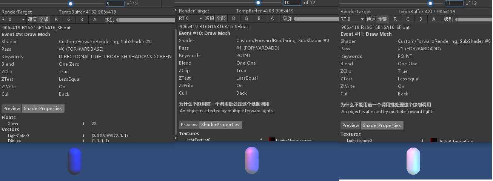

# UnityShader

## 1. 基础

### 1.1 渲染流水线

渲染流水线的工作任务在于，由一个三维场景出发，生成（或者说渲染）一张二维图像。

渲染流程分为3个阶段：

1. 应用阶段
2. 几何阶段
3. 光栅化阶段

其中每个阶段本身也是一个流水线系统。

#### 1.1.1 应用阶段

应用阶段开发者主要有三个任务：

1. 准备好场景数据（摄像机位置、视锥体、模型、光源等）
2. 进行粗粒度剔除（剔除不可见物体）
3. 设置每个模型的渲染状态（材质、纹理、使用的Shader等）

这一阶段最重要的就是输出渲染所需要的几何信息，即渲染图元（rendering primitives）。

#### 1.1.2 几何阶段

几何阶段用于处理所有和我们要绘制的几何相关的事情。例如决定要绘制的图元是什么（点、线、三角面等），怎样绘制她们，在哪里绘制她们。这一阶段通常在GPU上执行。

几何阶段负责和每个渲染图元打交道，进行逐顶点、逐多边形的操作。这个阶段的一个重要任务就是把顶点左边转换到屏幕空间中，再交给光栅器处理。

这一阶段的输出是顶点在屏幕空间的二位坐标、每个顶点的深度值、着色等相关信息。

#### 1.1.3 光栅化阶段

通过上一阶段产生的数据来生成屏幕上的像素，渲染出最终的图像。

这一阶段决定每个渲染图元中的哪些像素应该被绘制，她需要对上一阶段产生的逐顶点数据进行插值（纹理坐标、顶点颜色等），然后进行逐像素处理。

### 1.2 GPU流水线

试一下mermaid画流程图：

````mermaid
graph LR;
顶点数据-->顶点着色器;
subgraph 几何阶段;
顶点着色器-->曲面细分着色器;
曲面细分着色器-->几何着色器;
几何着色器-->裁剪;
裁剪-->屏幕映射;
end
````

````mermaid
graph LR
屏幕映射-->三角形设置;
subgraph 光栅化阶段
三角形设置-->三角形遍历;
三角形遍历-->片元着色器;
片元着色器-->逐片元操作;
end
逐片元操作-->屏幕图像
````

书上的截图：


上图中绿色表示完全可编程控制，黄色表示可配置不可编程，蓝色表示由GPU固定实现。实线框表示必须由开发人员编程实现，虚线框表示可选的。

#### 1.2.1 顶点着色器

顶点着色器是流水线的第一个阶段，她的输入来自CPU。顶点着色器的处理单位是顶点，也就是说输入的每个顶点都会调用一次顶点着色器。顶点着色器本身无法创建或销毁任何顶点，也不知道顶点与顶点之间的关系，正因如此GPU可以利用不相关性进行并行处理，这一阶段的处理速度会很快。

顶点着色器需要完成的工作有：

- 顶点坐标变换（代码中表现为`UnityObjectToClipPos(v.vertex)`）
- 逐顶点光照

#### 1.2.2 裁剪

由于游戏场景非常大，摄像机的视野范围很可能不会覆盖所有物体，所以那些不在摄像机视野范围内的物体不需要被处理，裁剪阶段因此被提出。

一个图元与摄像机视野的关系有三种：

1. 完全在视野内
2. 部分在视野内
3. 完全在视野外

部分在视野内的图元将会被裁剪，在视野内外交界处形成新的顶点来代替旧的顶点。

顶点着色器将顶点坐标转换到了裁剪坐标，再由硬件做透视除法后得到归一化的设备坐标（NDC），Unity使用的NDC的z轴范围为[-1, 1]。

由NDC坐标可以确定该顶点是否在一个小立方体内，设备只需要将图元裁剪到立方体内即可。

#### 1.2.3 屏幕映射

NDC坐标仍然是三维的坐标，屏幕映射的作用就是将图元的xy分量转换到屏幕坐标下。

屏幕映射不会对输入的z分量做任何处理，而是将屏幕空间下的坐标和z分量一起传递到光栅化阶段，屏幕空间坐标和z坐标组成的坐标系叫做窗口坐标系。

#### 1.2.4 三角形设置

从此进入光栅化阶段。该阶段的输入是上阶段输出的窗口坐标信息、法线方向、视角方向等。光栅化有两个最重要的目标：计算每个图元覆盖了哪些像素，以及为这些像素计算她们的颜色。

这一阶段将上一阶段输出的三角顶点转换为三角边的表示方式，为下一阶段做准备。

#### 1.2.5 三角形遍历

这个阶段会检查每个像素是否被一个三角网格覆盖，如果被覆盖则生成一个**片元**。找到哪些像素被三角网格覆盖的过程就叫做三角形遍历，也被称为扫描变换。

该阶段获取上一阶段传递的边界信息，对三角形覆盖区域做插值计算，输出片元序列。

片元并不是真正意义上的像素，而是包含了计算像素颜色的各种信息，如深度信息、法线、纹理坐标等。

#### 1.2.6 片元着色器

片元着色器是另一个非常重要的可编程着色器阶段。

之前的光栅化阶段并不会影响屏幕上每个像素的颜色值，而是会产生一系列数据信息，用来表述一个三角网格是如何覆盖每个像素的。而每个片元就负责存储这一系列的数据。

片元着色器的输入是上一阶段对顶点信息进行插值的结果，她的输出是一个或多个颜色值。

该阶段可以完成很多重要的渲染技术，如纹理采样等，之后再展开。

#### 1.2.7 逐片元操作

这是GPU流水线的最后一个阶段。

该阶段的主要任务：

- 测试片元的可见性（深度测试、模板测试等）
- 如果一个片元通过了所有测试，则把这个片元的颜色值和已经存储在颜色缓冲区中的颜色进行混合。

#### 1.2.A 其他的参考资料

- [GPU Rendering Pipeline——GPU渲染流水线简介](https://zhuanlan.zhihu.com/p/61949898)

### 1.3 坐标空间

- 模型空间

  以该模型自身中心为原点的坐标系，比如一个prefab点进去，显示的坐标系就是模型空间。

  

- 世界空间

  绝对坐标系。

- 观察空间

  其实就是摄像机空间，以摄像机作为原点，但是是右手坐标系，z轴正方向指向屏幕外。

- 裁剪空间

  摄像机有两种投影方式，透视和正交，其视锥体不同。通过投影矩阵可以将观察空间内的点转换到方块形状的裁剪空间。

- 屏幕空间

### 1.4 基基础

#### 1.4.1 什么是网格（Mesh）

> 三角网格是多边形网格的一种，多边形网格又被称为“Mesh”，是计算机图形学中用于为各种不规则物体建立模型的一种数据结构。现实世界中的物体表面直观上看都是由曲面构成的；而在计算机世界中，由于只能用离散的结构去模拟现实中连续的事物。所以现实世界中的曲面实际上在计算机里是由无数个小的多边形面片去组成的。比如下图的这些模型，在计算机渲染后由肉眼看是十分平滑的曲面，而实际上，计算机内部使用了大量的小三角形片去组成了这样的形状。这样的小面片的集合就被称作Mesh。Mesh既可以由三角形组成，也可以由其他平面形状如四边形，五边形等组成；由于平面多边形实际上也能再细分成三角形。所以，使用全由三角形组成的三角网格（Triangle Mesh）来表示物体表面也是具有一般性的。


## 2. UnityShader 基础使用

### 2.1 基础

```c
#pragma vertex vert
#pragma fragment frag
```

这两行编译指令指定了哪个函数包含顶点着色器的代码，哪个函数包含了片元着色器的代码。更加通用的编译指令如下：

```c
#pragma vertex name
#pragma fragment name
```

其中 `name` 为自定义的函数名。

```c
float4 vert(float4 v : POSITION) : SV_POSITION
{
    return mul(UNITY_MATRIX_MVP, v);
    // 在Unity3D 2019中被替换为
    // return UnityObjectToClipPos(v);
    // 函数名很直观 模型到裁剪
}
```

顶点着色器代码，她是逐顶点执行的。函数的输入v是这个顶点的位置，这是通过 `POSITION` 语义指定的。她的返回值是一个在裁剪空间中的位置，这是由 `SV_POSITION` 语义指定的。

`POSITION` 和 `SV_POSITION` 都是 `CG/HLSL` 中的语义，大概就是指定这个值是什么。

```c
float4 frag() : SV_TARGET
{
    return fixed4(1.0, 1.0, 1.0, 1.0);
}
```

片元着色器代码，无输入，返回值指定为 `SV_TARGET`，她告诉渲染器把用户输出的颜色存储到一个渲染目标中？，这里输出到默认的帧缓存中。

本例中返回的是一个表示白色的 `fixed4` 类型的变量。

### 2.2 顶点着色器多属性输入

```c
// 使用结构体定义顶点着色器的输入
struct a2v
{
    // POSITION语义告诉Unity，用模型空间的顶点坐标填充vertex变量
    float4 vertex : POSITION;
    // 用模型空间的法线方向填充normal变量
    float3 normal : NORMAL;
    // 用模型的第一套纹理坐标填充texcoord变量
    float4 texcoord : TEXCOORD0;
};


float4 vert(a2v v) : SV_POSITION
{
    return UnityObjectToClipPos(v.vertex);
}
```

如果想要获取更多的模型数据，那么就需要定义一个结构体作为顶点着色器的参数。

定义结构体时，语义是必须的，因此结构体格式将如下所示：

```c
struct StructName
{
    Type Name : Semantic;
    Type Name : Semantic;
    ......
};
```

### 2.3 顶点着色器与片元着色器之间传递信息

```c
// 使用结构体定义顶点着色器的输入
struct a2v
{
    // POSITION语义告诉Unity，用模型空间的顶点坐标填充vertex变量
    float4 vertex : POSITION;
    // 用模型空间的法线方向填充normal变量
    float3 normal : NORMAL;
    // 用模型的第一套纹理坐标填充texcoord变量
    float4 texcoord : TEXCOORD0;
};

// 使用结构体定义顶点着色器的输出
struct a2f
{
    // SV_POSITION表示pos变量内为裁剪空间中的位置
    float4 pos : SV_POSITION;
    // COLOR0表示color可以用于存储颜色
    fixed3 color : COLOR0;
};

a2f vert(a2v v)
{
    // 声明输出结构
    a2f o;
    o.pos = UnityObjectToClipPos(v.vertex);
    // v.normal包含顶点的法线方向 将其范围从[-1, 1]映射到[0, 1]
    // 存储到o.color以传递给片元着色器
    o.color = v.normal * 0.5 + fixed3(0.5, 0.5, 0.5);

    return o;
}

float4 frag(a2f i) : SV_TARGET
{
    return fixed4(i.color, 1.0);
}
```

如上所示，定义了一个新结构体`a2f`用于顶点着色器与片元着色器之间传递信息，其中用于传递信息的结构体中必须含有`SV_POSITION`语义指定的变量，否则片元着色器无法获得裁剪空间中的顶点坐标，也就无法将顶点渲染到屏幕上。

顶点着色器是逐顶点调用的，而片元着色器是逐片元调用的，因此片元着色器中的输入实际上是把顶点着色器的输出进行插值后得到的结果？

### 2.4 使用属性（Properties块）

通过属性，我们可以随时调整材质的效果，参数需要写在Properties语义块中。

```c
Properties
{
    // 声明一个Color类型的属性
    _Color ("Color Hint", Color) = (1.0, 1.0, 1.0, 1.0)
}
```

同时，我们需要在CG代码块中添加与其相匹配的变量（同名且同类型），匹配关系见该节[附表](#ShaderLab中属性的类型和CG中变量之间的匹配关系)

````c
// 在Properties中声明的属性也需要在CG代码块中定义一个名称和类型都相同的变量
fixed4 _Color;
````

为了显示效果，修改片元着色器代码：

```c
float4 frag(a2f i) : SV_TARGET
{
    fixed3 c = i.color;
    c *= _Color.rgb;

    return fixed4(c, 1.0);
}
```

### 2.5 UnityShader 内置文件

Unity中存在一些有用的类似头文件的文件，其后缀名为`.cginc`

常用的文件：

- UnityCG.cginc，包含经常使用的函数、宏和结构体等。
- UnityShaderVariables.cginc，包含很多内置的全局变量，如UNITY_MATRIX_MVP等。
- Lighting.cginc，包含了各种内置的光照模型，如果Shader文件是Surface Shader的话会自动包含。
- HLSLSupport.cginc，自动包含，用于跨平台编译。

### 2.6 Unity CG/HLSL语义

语义实际上就是一个赋给Shader输入和输出的字符串，这个字符串表达了这个参数的含义。

个人理解就是，这个变量本身存储了什么Shader流水线是不关心的，我们可以通过语义自行决定这个变量的用途。

而Unity为了方便模型数据的传输，对一些语义进行了特殊的规定。

比如`TEXCOORD0`作为顶点着色器的参数语义输入时，Unity会把模型的第一组纹理坐标填充进去。

但比如当`TEXCOORD0`作为顶点着色器的输出时则没有了特殊含义。

在Dx10之后，有一种新的语义类型出现，即系统数值语义（`system-value semantics`，以下简称SV语义），对，`SV_`开头的`SV_POSITION`就是系统数值语义。

SV语义在渲染流水线中是有特殊含义的，被这些语义修饰的变量不可以被随意修改，因为流水线需要使用这些变量来完成特定的目的。

在某些平台上，必须使用SV语义才能让Shader正常工作，所以我们应该尽量使用SV语义对变量进行修饰，让Shader有更好的跨平台性。

### 2.A 附表

<span id="常见矩阵及其用法">常见矩阵及其用法如下表（可能会被`UnityShader`自动升级为其他的函数实现）：</span>

|        变量名        | 描述                                                         |
| :------------------: | :----------------------------------------------------------- |
|  `UNITY_MATRIX_MVP`  | 当前的模型·观察·投影矩阵，用于将顶点/矢量从模型空间变换到裁剪空间 |
|  `UNITY_MATRIX_MV`   | 当前的模型·观察矩阵，用于将顶点/矢量从模型空间变换到观察空间 |
|   `UNITY_MATRIX_V`   | 当前的观察矩阵，用于将顶点/矢量从世界空间变换到观察空间      |
|   `UNITY_MATRIX_P`   | 当前的投影矩阵，用于将顶点/矢量从观察空间变换到裁剪空间      |
|  `UNITY_MATRIX_VP`   | 当前的观察·投影矩阵，用于将顶点/矢量从世界空间变换到裁剪空间 |
| `UNITY_MATRIX_T_MV`  | `UNITY_MATRIX_MV`的转置矩阵                                  |
| `UNITY_MATRIX_IT_MV` | `UNITY_MATRIX_MV`的逆转置矩阵，用于将法线从模型空间变换到观察空间 |
|   `_Object2World`    | 当前的模型矩阵，用于将顶点/矢量从模型空间变换到世界空间      |
|   `_World2Object`    | `_Object2World`的逆矩阵，用于将顶点/矢量从世界空间变换到模型空间 |

<span id="ShaderLab中属性的类型和CG中变量之间的匹配关系">ShaderLab中属性的类型和CG中变量之间的匹配关系：</span>

| ShaderLab属性类型 | CG变量类型            |
| ----------------- | --------------------- |
| Color, Vector     | float4, half4, fixed4 |
| Range, Float      | float, half, fixed    |
| 2D                | sampler2D             |
| Cube              | samplerCube           |
| 3D                | sampler3D             |

<span id="UnityCG.cginc中常用的结构体">UnityCG.cginc中常用的结构体：</span>

| 名称           | 描述           | 包含的变量                                       |
| -------------- | -------------- | ------------------------------------------------ |
| `appdata_base` | 顶点着色器输入 | 顶点位置，顶点法线，第一组纹理坐标               |
| `appdata_tan`  | 顶点着色器输入 | 顶点位置，顶点切线，顶点法线，第一组纹理坐标     |
| `appdata_full` | 顶点着色器输入 | 顶点位置，顶点切线，顶点法线，四组或更多纹理坐标 |
| `appdata_img`  | 顶点着色器输入 | 顶点位置，第一组纹理坐标                         |
| `v2f_img`      | 顶点着色器输出 | 裁剪空间中的位置，纹理坐标                       |

应用阶段传递给顶点着色器时Unity支持的常用语义：

| 语义        | 描述                                                         |
| ----------- | ------------------------------------------------------------ |
| `POSITION`  | 模型空间中的顶点位置，通常是float4类型                       |
| `NORMAL`    | 顶点法线，通常是float3类型                                   |
| `TANGENT`   | 顶点切线，通常是float4类型                                   |
| `TEXCOORDn` | TEXCOORD0表示第一组纹理坐标，以此类推，通常是float2或float4类型 |
| `COLOR`     | 顶点颜色，通常是fixed4或float4类型                           |

从顶点着色器传递到片元着色器时Unity支持的常用语义：

| 语义          | 描述                                                         |
| ------------- | ------------------------------------------------------------ |
| `SV_POSITION` | 裁剪空间中的顶点坐标，结构体中必须包含一个使用该语义修饰的变量。等同于Dx9中的POSITION，但最好还是用这个 |
| `COLOR0`      | 通常用于输出第一组顶点颜色                                   |
| `COLOR1`      | 通常用于输出第二组顶点颜色                                   |
| `TEXCOORDn`   | 通常用于输出纹理坐标                                         |

片元着色器输出时Unity支持的常用语义：

- `SV_TARGET`，输出值将会存储到渲染目标中（render target）

## 3. Unity基础光照

### 3.1 标准光照模型

标准光照模型把进入到摄像机内的光线分为四个部分：

1. 自发光（emissive），当给定一个方向时，一个表面本身会向该方向发射多少辐射量。
2. 高光反射（specular），当光线从光源照射到模型表面时，该表面会在完全镜面反射方向散射多少辐射量。
3. 漫反射（diffuse），当光线从光源照射到模型表面时，该表面会在每个方向散射多少辐射量。
4. 环境光（ambient），用于描述所有其他间接光照。间接光照指的是，在进入摄像机之前，光经过了不止一次的物体反射。

### 3.2 Unity中的环境光和自发光

在Shader中，只需要使用Unity的内置变量`UNITY_LIGHTMODEL_AMBIENT`就可以获取环境光，而大多数物体是没有自发光的，如果要计算自发光也很简单，只要在片元着色器输出最后的颜色之前，将自发光颜色添加上去即可。


### 3.A 附表

<span id="UnityGC.cginc中常用函数">UnityGC.cginc中常用函数：</span>

| 函数名                                         | 描述                                                         |
| ---------------------------------------------- | ------------------------------------------------------------ |
| `float3 WorldSpaceViewDir(float4 v)`           | 输入一个模型空间中的顶点位置，返回世界空间中从该点到摄像机的观察方向 |
| `float3 UnityWorldSpaceViewDir(float4 v)`      | 输入一个世界空间中的顶点位置，返回世界空间中从该点到摄像机的观察方向 |
| `float3 ObjSpaceViewDir(float4 v)`             | 输入一个模型空间中的顶点位置，返回模型空间中从该点到摄像机的观察方向 |
| `float3 WorldSpaceLightDir(float4 v)`          | **仅用于前向渲染**。输入一个模型空间中的顶点位置，返回世界空间中从该点到光源的观察方向，没有被归一化 |
| `float3 UnityWorldSpaceLightDir(float4 v)`     | **仅用于前向渲染**。输入一个世界空间中的顶点位置，返回世界空间中从该点到光源的观察方向，没有被归一化 |
| `float3 ObjSpaceLightDir(float4 v)`            | **仅用于前向渲染**。输入一个模型空间中的顶点位置，返回模型空间中从该点到光源的观察方向，没有被归一化 |
| `float3 Shader4PointLights(...)`               | **仅用于前向渲染**。计算四个点光源的光照，她的参数是已经打包进矢量的光照数据，通常如`unity_4LightPosX0`等，见高级光照[附表](#前向渲染可以使用的内置光照变量)。前向渲染通常会使用这个函数计算逐顶点光照 |
| `float3 UnityObjectToWorldNormal(float3 norm)` | 把法线方向从模型空间转换到世界空间中                         |
| `float3 UnityObjectToWorldDir(in float3 dir)`  | 把方向矢量从模型空间转换到世界空间中                         |
| `float3 UnityWorldToObjectDir(float3 dir)`     | 把方向矢量从世界空间转换到模型空间中                         |

## 4. 基础纹理

### 4.1 基础

纹理的最初目的就是使用一张图片来控制模型的外观。使用纹理映射技术就可以把一张图黏在模型表面，逐纹素（其实就是像素啦）地控制模型的颜色。

建模时会利用纹理展开技术把纹理映射坐标存储在每个顶点上，纹理映射坐标定义了该顶点在纹理中对应的2D坐标，通常该坐标使用一个二维变量表示(u, v)。其中u表示横向，v表示纵向，因此纹理映射坐标也被称为UV坐标。

尽管纹理的大小可以是多样的，但最终通常被归一化到[0, 1]范围内。但需要注意的是，纹理采样坐标不一定在[0, 1]范围内，采样的效果取决于纹理的平铺模式。比如重复或者是钳制等。

在Unity中，UV坐标符合OpenGL标准，即原点在左下角。

### 4.2 在Shader中使用纹理时需要注意的点

首先在Properties块中声明纹理属性，类型为2D，默认值为Unity内置白色图片：

```c
Properties
{
    ......
    _MainTex ("Main Tex", 2D) = "white" {}
    ......
}
```

在CG代码块中，除了定义一个与纹理匹配的变量外，还需要定义一个变量，该变量名必须为`[纹理名]_ST`：

```c
sampler2D _MainTex;
float4 _MainTex_ST;
```

这个变量用于存储纹理的缩放和平移值，ST分别为缩放和平移的首字母，其中xy分量存储缩放值，zw分量存储平移值。

### 4.3 纹理的属性

在Unity中导入一张纹理资源后，可以在Inspector面板上调整属性。


需要关注的是拼接模式和过滤模式，拼接模式决定了当纹理采样坐标超过[0, 1]范围后如何进行采样，过滤模式决定当纹理被拉伸时使用的滤波方式，其中有点、双线性和三线性三种，越靠后滤波效果越好。

当我们需要纹理缩小时，最常使用的方法就是mipmapping技术，她将原纹理提前用滤波处理得到很多更小的图像，形成了一个图像金字塔，每一层都是对上一层图像降采样的结果，这样可以在游戏中快速获取结果像素，缺点是会多占用内存空间，通常比原本多33%。

导入纹理时，纹理的长宽应该是2的次幂，否则会占用更多内存且GPU读取该纹理的速度也会下降？

### 4.4 纹理的作用

显而易见的，直接贴在模型表面是一种用途，这里主要介绍别的

- 凹凸映射

  凹凸映射的目的是使用一张纹理来修改模型表面的法线，以为模型提供更多的细节，这种方法可以让模型**看起来**凹凸不平。

  有两种方式可以用来进行凹凸映射：

  1. 高度映射。使用一张高度纹理来模拟表面位移，获得修改后的法线值。
  2. 法线映射。使用一张法线纹理直接存储表面法线。法线方向分量范围[-1, 1]，通常会将法线方向映射到像素分量[0, 1]上，才能将法线信息存储在纹理上。

  方向是相对于坐标空间来说的，因此法线方向也有不同坐标空间下的纹理。

  一种是模型空间的法线纹理，一种是切线空间的法线纹理。通常使用切线空间的法线纹理。

  切线空间的法线纹理具有一些模型空间的法线纹理没有的优点：

  1. 自由度高。模型空间下记录的是绝对法线信息，仅用于创建她时的那个模型，不能用于其他模型。
  2. 可以进行UV动画。原因同上，切线空间下允许凹凸移动的效果。
  3. 可重用。一个砖块六个面仅需要一张切线空间下纹理即可。
  4. 可压缩。切线空间下法线纹理法线方向的Z方向总是正方向，因此可以仅存储XY分量，通过XY分量计算Z分量，所以可以压缩。

- 渐变纹理

  嗯哼，可以自由控制模型的漫反射光照。

- 遮罩纹理

  遮罩纹理可以让我们保护某些区域免于某些修改。

  采样获得遮罩纹理的纹素值，然后使用其中某个（或某几个）通道的值来与某种表面属性相乘，这样当该通道的值为0时，可以保护表面不受该属性的影响。

  比如说，有一个红砖块的纹理，我希望让砖块之间的沟槽不反射高光，我就可以使用砖块纹理的灰度图（因为正好沟槽部分在灰度图里比较黑）当作遮罩，从而避免沟槽的部分受到高光反射的影响。

### 4.A 一些疑问

为什么纹理长宽要是2的次幂，引用一下知乎@文礼的回答：

> 作者：文礼
> 链接：https://www.zhihu.com/question/376921536/answer/1063272336
> 来源：知乎
> 著作权归作者所有。商业转载请联系作者获得授权，非商业转载请注明出处。
>
> 这个问题其实与GPU的寻址方式（地址对齐要求）有关，并非是图形API层面的限制。
>
> GPU作为一种专用的绘图硬件（当然现在也在逐渐泛用化），其高速运作的能力来自于对于特殊目的定制的特殊硬件模块。其中，实现贴图参照的模块就是这么一种特殊的硬件模块。
>
> 在CPU当中，当要参照一张贴图的时候，你需要在程序当中给出计算地址的公式。比如，当你要访问一张宽度为w高度为h的以行优先顺序存储的贴图当中的坐标为（x，y）的贴图的时候，就需要用y*w+x来计算这个地址。这个计算公式是以代码的形式给出的，对于CPU来说，它只是将这张贴图作为一个连续的内存空间处理而已。
>
> 但是GPU不同。GPU当中完成对贴图访问（寻址以及获取数据）的模块是以硬件形式存在的。它是不可编程的，你只能从它所提供的几种方式当中选一种。这是第一个因素。
>
> 其次，GPU当中进行的是大量的并行计算。这就意味着GPU经常会需要对贴图的不同位置进行同时参照。而且，这种参照往往是需要截取贴图当中一小块面积的内容，也就是是一种2D甚至是3D形状的参照，按CPU那种1D线性的方式保存贴图的话，会使得要参照的那一小部分地址不连续，从而影响高速缓存的命中率，降低速度。
>
> 所以，贴图在GPU的内存（显存）当中，一般都不是以行优先或者列优先方式存储的，而是以“块”为单位存储的。就好像一块一块马赛克组成的墙面那样，每个马赛克对应的像素在内存上是连续存储的。这是第二个因素。
>
> 此外，为了尽可能节约内存开销和传输带宽，贴图一般都会以一种合适的压缩格式存储。而常用的压缩格式，如BC或者DXT，都是将贴图分块进行压缩。这同样隐含了贴图必须是这些“块”的整数倍这样一个条件。这是第三个因素。
>
> 上述几个因素（硬件寻址+贴图在内存上的特殊排布方式+压缩算法要求）决定了一款GPU在设计的时候就会将这个“块”的最小尺寸固定下来。有的GPU是2x2像素，有的是4x4像素，还有的是8x8像素。所以当贴图的尺寸不是这些“块”的整数倍的时候，当贴图被传送到GPU内存（显存）的时候，就会被拉伸或者在四周（一般是右侧和下侧）填充无用数据，使其成为这些“块”的整数倍。（称为pitch）
>
> 这个情况是GPU硬件的要求，与使用何种图形API无关。但是诸如OpenGL这种抽象等级较高的图形API在易用性和可控性之间选择了易用性，也就是尽力隐藏这些细节，在其内部为你完成必要的拉伸或者pitch的操作，从而使得你觉得好像它支持非二次幂的纹理。

## 5. 高级光照

### 5.1 渲染路径

渲染路径是什么？我理解为，我给Unity一个信息，让Unity将一些特定光源的信息存储到内置属性里，我才能正确的调用。如果不指定渲染路径，有可能我们的计算结果就是错误的（因为用到的属性是错误的）。LightMode标签用于设置渲染路径，具体见[附表](#LightMode标签支持的渲染路径设置选项)。

在Unity3D 2019里已经找不到书上对应的渲染路径设置了，官方文档说的`Edit -> Project Settings -> Graphics`中我也没看到渲染路径，摄像机上的设置倒是还有，等之后再查一查。

#### 5.1.1 前向渲染路径

最常用。

每进行一次完整的前向渲染，我们需要渲染该对象的渲染图元，并计算两个缓冲区的信息：颜色缓冲区和深度缓冲区。我们利用深度缓冲区来决定一个片元是否可见，如果可见就更新颜色缓冲区中的颜色值。

以下伪代码描述了前向渲染路径的大致过程：

```c
Pass
{
    for (each promitive in this model)
    {
        for (each fragment covered by this primitive)
        {
            if (failed in depth test)
            {
                // 未通过深度测试则该片元不可见 不做更新
                discard;
            }
            else
            {
                // 若该片元可见 则进行光照计算
                float4 color = Shading(materialInfo, pos, normal, lightDir, viewDir);
                // 并更新帧缓冲
                writeFrameBuffer(fragment, color);
            }
        }
    }
}
```

对于每个逐像素光源，都需要进行上述的一次完整渲染，所以当一个物体在多个逐像素光源的影响范围内，那么这个物体就需要执行多个Pass，并混合多个Pass执行的结果颜色。如果场景中有N个物体，每个物体受M个光源影响，那么就需要计算N*M个Pass，计算量比较大，所以渲染引擎一般会限制每个物体受逐像素光源影响的数目。

在Unity中，前向渲染路径有三种处理光照的方式：

1. 逐顶点处理
2. 逐像素处理
3. 球谐函数（SH）处理

决定一个光源使用哪种处理模式取决于光源的类型和渲染模式。类型指的是平行光或者其他类型的光源，渲染模式指的是她是否是重要的，重要的光源将会被当作逐像素光源处理，如图所示：


在前向渲染中，当我们渲染一个物体时，Unity会根据场景中各个光源的设置以及这些光源对物体的影响程度对这些光源进行一个重要度排序，其中一定数目的光源会被当做逐像素光源处理，最多有4个光源被逐顶点处理，剩下的按SH方式处理。Unity对光源的判断规则如下：

- 场景中最亮的平行光总是按逐像素处理
- 渲染模式被设为不重要，会按逐顶点或SH方式处理
- 渲染模式被设为重要，会按逐像素处理
- 根据以上规则设置的逐像素光源数量如果小于质量设置中的逐像素光源数量，则会有更多的光源被当作逐像素处理（根据排序结果）

前向渲染的两种Pass的设置和**通常的**光照计算如图所示：


需要注意的是除了设置标签以外，还需要添加相应的编译指令`#pragma multi_compile_fwdbase`等。

在Additional Pass的渲染设置中，我们还开启和设置了混合模式，这是因为通常我们希望每个Additional Pass执行的光照结果可以和上一次的结果叠加从而形成多光源影响的效果，通常选择的是`Blend One One`。

对于前向渲染来说，通常UnityShader会定义一个Base Pass和一个Additional Pass。Base Pass仅会执行一次，Additional Pass则会根据该物体的其他逐像素光源的数目被多次调用。

前向渲染可以使用的内置光照变量见[附表](#前向渲染可以使用的内置光照变量)，同时还可以回头看一下基础光照那一节的[附表](#UnityGC.cginc中常用函数)仅用于前向渲染的函数。

#### 5.1.2 顶点照明渲染路径

顶点照明渲染路径是对硬件配置要求最低，性能最高，相应的效果最差的渲染路径，她不支持那些逐像素才能得到的效果，比如阴影、法线映射、高精度的高光反射等。

她实际上是前向渲染的一个子集，但如果使用这种渲染路径，那么Unity将不会自动填充那些逐像素光照变量。在当前Unity版本，这个渲染路径已经被作为一个遗留的渲染路径，在之后与之相关的设定可能会被移除。

顶点照明渲染路径我估计不会去使用了，其中可以使用的内置变量和内置函数就不列出来了，在这里截个图：


#### 5.1.3 延迟渲染路径

古老但仍有用武之地。

前向渲染路径的最大问题就是当场景内包含大量的实时光源时，渲染性能会急速下降，因为我们需要为场景内的每个物体执行多个Pass来计算光照结果，但每执行一次Pass我们都需要重新渲染一次物体，实际上执行了很多次的重复计算。

延迟渲染除了前向渲染用到的颜色和深度缓冲区，还会使用额外的缓冲区，这些缓冲区被统称为G缓冲。

G缓冲存储了我们所关心的表面（通常指的是里摄像机最近的表面）的其他信息，例如该表面的法线、位置、用于光照计算的材质属性等。

延迟渲染主要包含两个Pass，第一个Pass中不进行任何光照计算，仅计算哪些片元时可见的，这主要是通过深度缓冲来实现的。当发现某个片元是可见的就把她的相关信息存储到G缓冲区中。第二个Pass中，我们利用G缓冲区的各个片元信息进行真正的光照计算。

以下伪代码描述了延迟渲染路径的大致过程：

```c
Pass 1
{
    // 第一个Pass不进行真正光照计算 仅仅把可见片元信息存储到G缓冲区中
    for (each primitive in this model)
    {
        for (each fragment covered by this primitive)
        {
            if (failed in depth test)
            {
                discard;
            }
            else
            {
                writeGBuffer(materialInfo, pos, nnormal, lightDir, viewDir);
            }
        }
    }
}

Pass 2
{
    for (each pixell in the screen)
    {
        if (the pixel is valid)
        {
            // 若该像素有效 则读取G缓冲区内相关信息
            readBuffer(pixel, materialInfo, pos, normal, lightDir, viewDir);
            // 根据读取的信息进行光照计算
            float4 color = Shading(materialInfo, pos, normal, lightDir, viewDir);
            // 并更新帧缓冲
            writeFrameBuffer(fragment, color);
        }
    }
}
```

延迟渲染使用的Pass通常就是两个，和场景内光源数目无关，因此延迟渲染的效率不取决于场景的复杂度，而取决于屏幕的大小，因为我们所需要的信息都存储在缓冲区中，而缓冲区的大小和屏幕大小有关。

对于延迟渲染路径来说，她最适合在场景中光源数目很多且在使用前向渲染时会造成性能瓶颈的情况下使用，而且延迟渲染中的每个光源都可以当作逐像素光源处理。

但，延迟渲染路径有一些缺点：

- 不支持真正的抗锯齿功能
- 不能处理半透明物体
- 对显卡有一定要求，显卡必须支持MRT、Shader Mode 3.0及以上、深度渲染纹理以及双面模板缓冲。

当使用延迟渲染时，Unity要求我们提供两个Pass：

第一个Pass用于渲染G缓冲。这个Pass中我们会把漫反射颜色、高光反射颜色、平滑度、法线、自发光和深度等信息渲染到屏幕的G缓冲区。对于每个物体，这个Pass只会执行一次。

第二个Pass用于计算真正的光照，默认情况下仅可以使用Unity内置的Standard光照模型。

默认的G缓冲区包含以下几个渲染纹理（注意，不同Unity版本这些渲染纹理存储的内容会有所不同，以下为Unity 2019f4）：

- RT0，ARGB32格式，漫反射颜色（RGB）和遮罩（A）
- RT1，ARGB32格式，高光反射颜色（RGB）和粗糙度（A）
- RT2，ARGB2101010格式：世界空间法线（RGB）
- RT3，ARGB2101010（非HDR）或ARGBHalf（HDR）格式，自发光+光照？+光照映射+反射探针
- 深度+模板缓冲

延迟渲染路径可以使用的内置变量见[附表](#延迟渲染路径可以使用的内置变量)

### 5.2 Unity的光源类型

Unity一共支持4种光源类型：

1. 平行光（定向光）
2. 点光源
3. 聚光灯
4. 区域光（面光源）

#### 5.2.1 光源类型的影响

最常用的光源属性有：

- 光源的位置
- 光源的方向（更准确的说是，到某点的方向）
- 光源的颜色
- 强度
- 衰减（到某点的衰减）

以下对三种光源类型进行分类讨论（区域光不在讨论范围内）：

1. 平行光：她的几何定义是最简单的。平行光可以照亮的范围是没有限制的，通常作为类似太阳的角色出现。平行光的几何属性只有方向，且光照强度不会随距离衰减。
2. 点光源：她的照亮空间是由空间中的一个球体定义的，她表示由一个点发出的，向所有方向延申的光。点光源是有位置属性的，同时光照强度是会随距离衰减的，衰减值可以由一个函数定义。
3. 聚光灯：她的照亮空间是一个空间内的锥形区域定义的，是由一个点出发，向特定方向延申的光。她即有位置属性，也有旋转属性，还有衰减属性。

#### 5.2.2 如何在Shader中处理不同的光源类型

```c
Shader "Custom/ForwardRendering"
{
    Properties
    {
        _Diffuse ("Diffuse", Color) = (1, 1, 1, 1)
        _Specular ("Specular", Color) = (1, 1, 1, 1)
        _Gloss ("Gloss", Range(8.0, 256)) = 20
    }

    SubShader
    {
        Pass
        {
            Tags
            {
                "LightMode" = "ForwardBase"
            }


            CGPROGRAM
            
            #pragma multi_compile_fwdbase

            #pragma vertex vert
            #pragma fragment frag

            #include "Lighting.cginc"

            fixed4 _Diffuse;
            fixed4 _Specular;
            float _Gloss;

            struct a2v
            {
                float4 vertex : POSITION;
                float3 normal : NORMAL;
            };

            struct v2f
            {
                float4 pos : SV_POSITION;
                float3 worldNormal : TEXCOORD;
                float3 worldPos : TEXCOORD1;
            };

            v2f vert(a2v v)
            {
                v2f o;
                // 坐标空间转换
                o.pos = UnityObjectToClipPos(v.vertex);

                // 将模型法线转换到世界坐标下 法线是33矩阵 所以截取WorldToObject的前三行列
                o.worldNormal = mul(v.normal, (float3x3)unity_WorldToObject);

                o.worldPos = mul(unity_ObjectToWorld, v.vertex).xyz;

                return o;
            }

            fixed4 frag(v2f i) : SV_TARGET
            {
                // 环境光
                fixed3 ambient = UNITY_LIGHTMODEL_AMBIENT.xyz;
                fixed3 worldNormal = normalize(i.worldNormal);
                // 世界坐标下的光源方向 _WorldSpaceLightPos0仅适用于世界有且仅有一个平行光源的情况
                fixed3 worldLight = normalize(_WorldSpaceLightPos0.xyz);

                // fixed3 diffuse = _LightColor0.rgb * _Diffuse.rgb * saturate(dot(worldNormal, worldLight));
                fixed3 diffuse = _LightColor0.rgb * _Diffuse.rgb * max(0, dot(worldNormal, worldLight));


                fixed3 viewDir = normalize(_WorldSpaceCameraPos.xyz - i.worldPos);
                fixed3 halfDir = normalize(worldLight + viewDir);

                fixed3 specular = _LightColor0.rgb * _Specular.rgb * pow(max(0, dot(worldNormal, halfDir)), _Gloss);

                // 这个Pass仅执行一次 且光源类型一定是平行光 平行光没有衰减
                fixed atten = 1.0;
                fixed3 color = ambient + (diffuse + specular) * atten;


                return fixed4(color, 1.0);
            }
            ENDCG

        }

        Pass
        {
            Tags {"LightMode"="ForwardAdd"}
            Blend One One

            CGPROGRAM
            #pragma multi_compile_fwdadd

            #pragma vertex vert
            #pragma fragment frag

            #include "Lighting.cginc"
            #include "AutoLight.cginc"

            fixed4 _Diffuse;
            fixed4 _Specular;
            float _Gloss;

            struct a2v
            {
                float4 vertex : POSITION;
                float3 normal : NORMAL;
            };

            struct v2f
            {
                float4 pos : SV_POSITION;
                float3 worldNormal : TEXCOORD;
                float3 worldPos : TEXCOORD1;
            };

            v2f vert(a2v v)
            {
                v2f o;
                // 坐标空间转换
                o.pos = UnityObjectToClipPos(v.vertex);

                // 将模型法线转换到世界坐标下 法线是33矩阵 所以截取WorldToObject的前三行列
                o.worldNormal = mul(v.normal, (float3x3)unity_WorldToObject);

                o.worldPos = mul(unity_ObjectToWorld, v.vertex).xyz;

                return o;
            }

            fixed4 frag(v2f i) : SV_TARGET
            {
                // 环境光
                fixed3 ambient = UNITY_LIGHTMODEL_AMBIENT.xyz;
                fixed3 worldNormal = normalize(i.worldNormal);
// 判断当前处理的逐像素光源类型 非定向光还需要进行向量减法获取光源方向
#ifdef USING_DIRECTIONAL_LIGHT
                fixed3 worldLight = normalize(_WorldSpaceLightPos0.xyz);
#else
                fixed3 worldLight = normalize(_WorldSpaceLightPos0.xyz - i.worldPos.xyz);
#endif
                // fixed3 diffuse = _LightColor0.rgb * _Diffuse.rgb * saturate(dot(worldNormal, worldLight));
                fixed3 diffuse = _LightColor0.rgb * _Diffuse.rgb * max(0, dot(worldNormal, worldLight));


                fixed3 viewDir = normalize(_WorldSpaceCameraPos.xyz - i.worldPos);
                fixed3 halfDir = normalize(worldLight + viewDir);

                fixed3 specular = _LightColor0.rgb * _Specular.rgb * pow(max(0, dot(worldNormal, halfDir)), _Gloss);

#ifdef USING_DIRECTIONAL_LIGHT
                fixed atten = 1.0;
#else
                float3 lightCoord = mul(unity_WorldToLight, float4(i.worldPos, 1)).xyz;
                fixed atten = tex2D(_LightTexture0, dot(lightCoord, lightCoord).rr).UNITY_ATTEN_CHANNEL;
#endif
                fixed3 color = ambient + (diffuse + specular) * atten;


                return fixed4(color, 1.0);
            }
            ENDCG
        }
    }
    Fallback "Specular"
}

```

每一步执行的效果可以通过帧调试器查看，帧调试器打开位置如下图所示：


通过帧调试器可以看出，Base Pass只执行了一次，而Additional Pass执行了两次，且顺序为红点光源到绿点光源，这是由于Unity对光源的重要程度进行排序的结果，但我们并不知道Unity具体是如何排序的。



#### 5.2.3 Unity中的光照衰减

Unity通常使用一张纹理作为查找表来计算光照衰减，好处在于不依赖复杂的数学公式，缺点在于需要预处理得到采样纹理且纹理的大小也会影响衰减的精度，同时也不直观。但在一定程度上对性能友好，所以Unity默认选择了依靠纹理来计算光照衰减。

Unity内部使用了一张名为`_LightTexture0`（对光源使用cookie？后为`_LightTextureB0`）的纹理来计算光照衰减。(0, 0)处的点表示与光源点重合的点的衰减值，(1, 1)处的点表明了在光源空间中所关心的距离最远的点的衰减。参考5.2.2节的CG代码：

```c
float3 lightCoord = mul(unity_WorldToLight, float4(i.worldPos, 1)).xyz;
```

这行代码使用WorldToLight矩阵与顶点坐标进行运算，就能得到该点在光源空间下的坐标，于是可以通过：

```c
fixed atten = tex2D(_LightTexture0, dot(lightCoord, lightCoord).rr).UNITY_ATTEN_CHANNEL;
```

通过坐标对光照的衰减纹理进行采样，使用`UNITY_ATTEN_CHANNEL`宏获取衰减分量，得出衰减值。

当然也可以通过数学公式来计算衰减，不过书上说Unity 5没有开放记录光源范围、朝向、角度等的变量，所以使用自己指定的数学公式效果往往不太好，不知道2019有没有开放相应变量，之后在看看。

### 5.3 Unity的阴影

#### 5.3.1 ShadowMap技术

这种技术理解起来非常的简单，她首先将摄像机的位置放在与光源重合的位置上，那些摄像机看不到的区域就是该光源的阴影区域。

在前向渲染路径中，如果场景中最重要的平行光开启了阴影，Unity就是为该光源计算她的阴影映射纹理（Shadow Map）。阴影映射纹理本质上也是一张深度图，她记录了从该光源的位置出发、能看到的场景中距离她最近的表面信息（深度信息）。

计算阴影映射纹理时，判断距离光源最近的表面位置可以通过Base Pass和Additional Pass来更新深度信息，得到阴影映射纹理，但是这种方法会对性能造成一些浪费，因为我们只要深度信息而已，这两个Pass中往往有一些复杂的光照模型计算。

所以Unity选择使用一个额外的Pass来专门更新光源的阴影映射纹理，这个Pass的标签为`ShadowCaster`。

Unity首先将摄像机放到光源的位置上，然后调用该（渲染物体上的）Pass，通过顶点变换得到光源空间下的位置，并以此来输出深度信息到阴影映射纹理中。

如果找不到该Pass，Unity就会到Fallback指定的Shader中再去寻找。如果仍然没有找到，该物体就无法向其他物体投射阴影。

#### 5.3.2 不透明物体的阴影

投射阴影的Pass其实在Fallback里的Shader（VertexLit.shader），一般我们就不用管了。这里列出具体的代码：

```c
// Pass to render object as a shadow cas七er
Pass { 
    Name "ShadowCaster" 
    Tags { "LightMode" = "ShadowCaster" ) 
    CGPROGRAM 
    #pragma vertex vert 
    #pragma fragment frag 
    #pragma multi_compile_shadowcaster
    #include "UnityCG.cginc" 
    struct v2f { 
        V2F SHADOW CASTER;  
    ); 
    v2f vert(appdata_base v) 
    {
        v2f o; 
        TRANSFER SHADOW CASTER NORMALOFFSET(o) 
        return o;
    }
    float4 frag(v2f i) : SV_Target
    {
        SHADOW_CASTER_FRAGMENT(i);
    }

    ENDCG
}
```

以下的CG代码基于前向渲染路径Shader修改。为了接受阴影，我们需要在物体的Shader中Base Pass里，包含`AutoLight.cginc`，在顶点着色器输出结构体里添加一个内置宏：

```c
struct v2f
{
    ......
    SHADOW_COORDS(n)
}
```

注意，没有分号。宏里的参数是下一个可用的插值寄存器的索引值，比如：

```c
struct v2f
{
    ...
    float3 worldNormal : TEXCOORD0;
    float3 worldPos : TEXCOORD1;
    // 0和1已经被用了，所以用2
    SHADOW_COORDS(2)
}
```

在顶点着色器返回前添加一个宏：

```c
v2f vert(a2v v)
{
    v2f o;
    // ......
    
    TRANSFER_SHADOW(o);
    return o;
}
```

之后在片元着色器中计算阴影值，与漫反射和高光反射相乘：

```c
fixed4 frag(v2f i)
{
    // ......
    
    fixed shadow = SHADOW_ATTENUATION(i);
    
    // ......
    
    return fixed4(ambient + (diffuse + specular) * atten * shadow, 1.0);
}
```

需要注意的是，这些宏使用了上下文变量进行相关计算，也就是说，`a2v`中顶点坐标变量名必须为`vertex`，顶点着色器中的输入结构体必须命名为`v`，`v2f`中的顶点位置必须为`pos`。

（所以其实我觉得限制还是有一点的，但是Unity是为了适应多平台才封装成宏的，也没啥办法，~~除了自己重写（bushi~~）

光照的衰减和阴影其实可以共同计算：

```c
fixed4 frag(v2f i)
{
    // ......
    
    UNITY_LIGHT_ATTENUATION(atten, i, i.worldPos);
    
    return fixed4(ambient + (diffuse + specular) * atten, 1.0);
}
```

`UNITY_LIGHT_ATTENUATION`宏将会帮我们声明第一个参数，也就是上面的`atten`，所以原本的声明就要去掉了。

#### 5.3.3 透明物体的阴影

这里我就要滚回去补上书上的透明效果那一章了。。。

在此之前都没有涉及到渲染顺序。当场景中包含很多模型时，我们并没有考虑先渲染模型A再渲染模型B，最后再渲染模型C，还是按照别的什么顺序进行渲染。

实际上，由于深度缓冲的存在，不需要考虑她们的渲染顺序也能得到正确的渲染效果，深度缓冲的思想是，当渲染一个片元时，与深度缓冲中的值进行对比，如果深度缓冲中的值比片元距离摄像机更近，那么这个片元就不应该被渲染到屏幕上，否则片元的深度值将会写到深度缓冲区中，同时更新颜色缓冲区中的像素。

Unity中通常使用两种方法实现透明效果：透明度测试和透明度混合。

- 透明度测试很暴力，如果一个物体是透明的，那么她就完全不可见，否则完全可见，不需要关闭深度写入。这种方式无法得出半透明效果。

- 透明度混合能得到真正的半透明效果，她会使用当前片元的透明度作为混合因子，与存在颜色缓冲区中的颜色值进行混合从而得到新的颜色，但是需要关闭深度写入。

  需要注意的是，我们只关闭了深度写入，但是深度测试没有被关闭。当使用透明度混合渲染一个片元时，还是会比较她的深度值和深度缓冲区中的深度值，如果她的深度值比缓冲区中的更远，那么就不会进行混合操作。这一点决定了，当一个不透明物体出现在透明物体前，不透明物体仍然可以正常遮挡住透明物体。

  如果不关闭深度写入，那么，如果一个透明物体在不透明物体前面，本来可以透过透明物体看到不透明物体，但由于深度缓冲中的值被透明物体覆盖，导致颜色缓冲也被更新。也就是看不到后面的物体了。

但是，关闭深度写入破坏了深度缓冲的工作机制，这是一个***非常糟糕***的事情，虽然我们不得不这么做。关闭深度写入导致渲染顺序变得非常重要。

我们假设场景中有两个物体，一前一后，前面的是透明物体A，后面的是不透明物体B。考虑一下渲染顺序的不同会发生什么样的结果：

- B先渲染，B写入深度缓冲和颜色缓冲。A后渲染，我们会对A进行深度测试，发现在B的前面，于是我们把A的颜色与B的颜色进行混合，得到正确的透明效果。
- A先渲染，A只写入颜色缓冲。B后渲染，由于深度缓冲区内没有值，B将会写入深度缓冲区，并覆盖A在颜色缓冲区的写入，于是乎B就愉快地出现在了A的前面。

两个物体都是半透明物体，都没有对深度缓冲进行写入，渲染顺序还重要吗？

我对于书上的描述有点懵，按理来说哈，颜色混合的顺序跟结果没有关系吧，可能是透视的关系？

基于渲染顺序的问题，渲染引擎通常会先对物体进行排序后进行渲染，顺序通常为：

1. 正常渲染所有不透明物体
2. 把半透明物体按距离摄像机的远近进行排序，按照从后往前的顺序渲染，并开启深度测试，关闭深度写入。

可是这样仍然无法解决所有问题，最大的问题就是如何排序。因为排序无法完全正确，总是有一些奇妙的排列让引擎无法判断排序顺序，像是循环重叠的半透明物体们。

Unity为了解决渲染顺序的问题提供了渲染队列的解决方案，可以使用SubShader的Queue标签来决定模型归于那个渲染队列。Unity使用一系列整数来表示渲染顺序，整数索引越小表示越早被渲染，Unity预定义的渲染队列索引见[附表](#预制渲染队列)。

> 由千透明度混合需要关闭深度写入，由此带来的问题也影响了阴影的生成。总体来说 要想为这些半透明物体产生正确的阴影，需要在每个光源空间下仍然严格按照从后往前的顺序进渲染，这会让阴影处理变得非常复杂，而且也会影响性能。因此，在Unity中，所有内置的半透明Shader是不会产生任何阴影效果的。

so，这里就不继续写了，因为这种阴影的效果和不透明物体的阴影效果是一模一样的，和实际想要的效果不一致。

### 5.A 附表

<span id="LightMode标签支持的渲染路径设置选项">LightMode标签支持的渲染路径设置选项：</span>

| 标签名                               | 描述                                                         |
| ------------------------------------ | ------------------------------------------------------------ |
| `Always`                             | 不管使用哪种渲染路径，该Pass总是会被渲染，但不会计算任何光照 |
| `ForwardBase`                        | 用于**前向渲染**。该Pass会计算环境光，最重要的平行光，逐顶点/SH光源和Lightmaps |
| `ForwardAdd`                         | 用于**前向渲染**。计算额外的逐像素光源，每个Pass对应一个光源 |
| `Deferred`                           | 用于**延迟渲染**。该Pass会渲染G缓冲                          |
| `ShadowCaster`                       | 把物体的深度信息渲染到阴影映射纹理（shadowmap）或一张深度纹理中 |
| `PrepassBase`                        | 用于**遗留的延迟渲染**。渲染法线和高光反射的指数部分？       |
| `PrepassFinal`                       | 用于**遗留的延迟渲染**。该Pass通过合并纹理了、光照和自发光来渲染得到最后的颜色 |
| `Vertex`、`VertexLMRGBM`和`VertexLM` | 用于**遗留的顶点照明渲染**                                   |

<span id="前向渲染可以使用的内置光照变量">前向渲染可以使用的内置光照变量：</span>

| 名称                                                      | 类型     | 描述                                                         |
| --------------------------------------------------------- | -------- | ------------------------------------------------------------ |
| `_LightColor0`                                            | float4   | 该Pass处理的**逐像素光源**颜色                               |
| `_WorldSpaceLightPos0`                                    | float4   | xyz分量为该Pass处理的**逐像素光源**的世界位置，w分量为0时为平行光，为1时为其他光源。 |
| `_LightMatrix0`                                           | float4x4 | 从世界空间到光源空间的变换矩阵。可以用于采样cookie和光强衰减纹理 |
| `unity_4LightPosX0, unity_4LightPosY0, unity_4LightPosZ0` | float4   | **仅用于Base Pass**。前四个非重要的点光源在世界空间中的位置  |
| `unity_4LightAtten0`                                      | float4   | **仅用于Base Pass**。前四个非重要的点光源的衰减因子          |
| `unity_LightColor`                                        | half4[4] | **仅用于Base Pass**。前四个非重要的点光源的颜色              |

<span id="延迟渲染路径可以使用的内置变量">延迟渲染路径可以使用的内置变量：</span>

| 名称            | 类型     | 描述                                                         |
| --------------- | -------- | ------------------------------------------------------------ |
| `_LightColor`   | float4   | 光源颜色                                                     |
| `_LightMatrix0` | float4x4 | 从世界空间到光源空间的变换矩阵。可以用于采样cookie和光强衰减纹理 |

<span id="预制渲染队列">预制渲染队列索引号和描述：</span>

| 名称           | 索引 | 描述                                                         |
| -------------- | ---- | ------------------------------------------------------------ |
| `Background`   | 1000 | 此渲染队列在任何其他渲染队列之前渲染。                       |
| `Geometry`     | 2000 | 不透明几何体使用此队列。                                     |
| `AlphaTest`    | 2450 | 经过 Alpha 测试的几何体将使用此队列。                        |
| `GeometryLast` |      | 视为“不透明”的最后的渲染队列。（这个是多出来的，书上没有，不知道索引多少） |
| `Transparent`  | 3000 | 此渲染队列在 Geometry 和 AlphaTest 之后渲染，按照从后到前的顺序。 |
| `Overlay`      | 4000 | 此渲染队列旨在获得覆盖效果。                                 |

### 5.B 一些疑问

光源的Cookie，搜了一下，引用官方文档：

> A cookie is a mask that you place on a Light to create a shadow with a specific shape or color, which changes the appearance and intensity of the Light. Cookies are an efficient way of simulating complex lighting effects with minimal or no runtime performance impact. Effects you can simulate with cookies include caustics, soft shadows, and light shapes.
>
> 剪影是一个蒙版，您可以将其放置在光源上，以创建具有特定形状或颜色的阴影，从而改变光源的外观和强度。Cookie 是一种模拟复杂光照效果的有效方式，对运行时性能的影响微乎其微。您可以使用剪影模拟的效果包括焦散、柔和阴影和光源形状。

还没学到，之后再看

## 6. 高级纹理

这一节主要学习使用立方体纹理、渲染纹理、程序纹理。

### 6.1 立方体纹理

立方体纹理是环境映射的一种实现方法。环境映射可以模拟物体周围的环境，而使用了环境映射的物体可以看起来像镀了一层金属一样反射出周围的环境。

立方体纹理和之前见到的二维纹理不同，立方体纹理一共包含了6张图像，这些图像对应一个立方体的六个面。

立方体纹理的应用有很多，常用于天空盒和环境映射。

#### 6.1.1 天空盒

创建天空盒的方法很简单，在`Project`窗口下新建一个材质，并将材质的Shader设为Unity内置的`Mobile/Skybox`（书上是`Skybox/6 Sided`，两个效果貌似一样，留个问号以后看看？），然后将纹理正确地赋值，如图所示：


在Unity中，天空盒是在所有不透明物体之后渲染的，其使用的网格是一个立方体或一个细分后的球体。

#### 6.1.2 环境映射

创建环境映射所需的立方体纹理的方法有三种：

1. 直接由一些特殊布局的纹理创建。

   我们需要提供类似立方体展开图的交叉布局、全景布局等的纹理，然后将该纹理的类型设为`Cubemap`即可，在基于物理的渲染中，我们通常会使用一张HDR图像来生成高质量的Cubemap。

2. 手动创建Cubemap资源，再把6张图赋给她。这是老旧的方法，Unity建议使用第一种方法，因为第一种方法可以对纹理数据进行压缩，且可以支持边缘修正、光滑反射和HDR等功能。

3. 由脚本生成。前两种方法都需要提前准备好立方体纹理的图像，但理想情况下，我们希望根据物体在场景位置的不同，生成不同的立方体纹理。于是我们可以使用Unity的脚本，利用`Camera.RenderToCubemap`方法来实现。书上的脚本实现如下：

   ```c#
   using UnityEngine;
   using UnityEditor;
   using System.Collections;
   
   public class RenderCubemapWizard : ScriptableWizard {
       
       public Transform renderFromPosition;
       public Cubemap cubemap;
       
       void OnWizardUpdate () {
           helpString = "Select transform to render from and cubemap to render into";
           isValid = (renderFromPosition != null) && (cubemap != null);
       }
       
       void OnWizardCreate () {
           // create temporary camera for rendering
           GameObject go = new GameObject("CubemapCamera");
           go.AddComponent<Camera>();
           // place it on the object    
           go.transform.position = renderFromPosition.position;
           // render into cubemap        
           go.GetComponent<Camera>().RenderToCubemap(cubemap);
           
           // destroy temporary camera
           DestroyImmediate(go);
       }
       
       [MenuItem("GameObject/Render into Cubemap")]
       static void RenderCubemap () {
           ScriptableWizard.DisplayWizard<RenderCubemapWizard>("Render cubemap", "Render!");
       }
   }
   ```

   该脚本需要被放在`Assets/Editor`目录下，成为一个编辑器脚本，然后我们就能在GameObject选项栏里找到Render into Cubemap选项，将物体的位置和导出的纹理设置好，按下Render就可以得到立方体纹理了。如图所示：

   

   

#### 6.1.3 反射和折射

创建完立方体纹理之后，就可以进行环境映射。环境映射最常见的应用就是反射和折射。

我们通过入射光线方向和法线方向计算反射方向，再利用反射方向对立方体纹理进行采样即可。代码如下：

```c
Shader "Custom/Reflection"
{
    Properties
    {
        _Color ("颜色", Color) = (1, 1, 1, 1)
        _ReflectColor ("反射颜色", Color) = (1, 1, 1, 1)
        _ReflectAmount ("反射程度", Range(0, 1)) = 1
        _Cubemap ("环境映射纹理", Cube) = "_Skybox" {}
    }

    SubShader
    {
        Tags { "RenderType"="Opaque" "Queue"="Geometry"}
        Pass
        {
            Tags {"LightMode"="ForwardBase"}

            CGPROGRAM
            
            #pragma multi_compile_fwdbase

            #pragma vertex vert
            #pragma fragment frag

            #include "Lighting.cginc"
            #include "AutoLight.cginc"

            fixed4 _Color;
            fixed4 _ReflectColor;
            fixed _ReflectAmount;
            samplerCUBE _Cubemap;

            struct a2v {
                float4 vertex : POSITION;
                float3 normal : NORMAL;
            };
            
            struct v2f {
                float4 pos : SV_POSITION;
                float3 worldPos : TEXCOORD0;
                fixed3 worldNormal : TEXCOORD1;
                fixed3 worldViewDir : TEXCOORD2;
                fixed3 worldRefl : TEXCOORD3;
                SHADOW_COORDS(4)
            };


            v2f vert(a2v v)
            {
                v2f o;
                // pos是裁剪空间的坐标
                o.pos = UnityObjectToClipPos(v.vertex);
                // 模型空间法线转换到世界空间法线
                o.worldNormal = UnityObjectToWorldNormal(v.normal);
                // 模型空间下顶点坐标转换到世界坐标
                o.worldPos = mul(unity_ObjectToWorld, v.vertex).xyz;
                // 获取世界坐标下
                o.worldViewDir = UnityWorldSpaceViewDir(o.worldPos);
                // 计算该顶点的反射方向
                // 通过光路可逆原则反向求得物体反射到摄像机中的光线方向
                o.worldRefl = reflect(-o.worldViewDir, o.worldNormal);

                TRANSFER_SHADOW(o);
                return o;
            }

            fixed4 frag(v2f i) : SV_TARGET
            {
                fixed3 worldNormal = normalize(i.worldNormal);
                fixed3 worldLightDir = normalize(UnityWorldSpaceLightDir(i.worldPos));
                fixed3 worldViewDir = normalize(i.worldViewDir);

                fixed3 ambient = UNITY_LIGHTMODEL_AMBIENT.xyz;
                fixed3 diffuse = _LightColor0.rgb * _Color.rgb * max(0, dot(worldNormal, worldLightDir));

                // 使用反射方向对立方体纹理进行采样
                fixed3 reflection = texCUBE(_Cubemap, i.worldRefl).rgb * _ReflectColor.rgb;
                UNITY_LIGHT_ATTENUATION(atten, i, i.worldPos);
                // 使用插值函数混合漫反射和反射
                fixed3 color = ambient + lerp(diffuse, reflection, _ReflectAmount) * atten;

                return fixed4(color, 1.0);
            }
            ENDCG
        }
    }
    FallBack "Reflective/VertexLit"
}

```

折射的原理比反射复杂一些。当光线从一种介质斜射进入另一种介质时，传播方向一般会发生改变，当给定入射角时，可以使用斯涅耳定律来计算反射角（试用一下公式的功能）：
$$
\eta_1sin\theta_1=\eta_2sin\theta_2
$$
其中$\eta_1$和$\eta_2$分别是两个介质的折射率。真空的折射率是1，玻璃的折射率一般是1.5。

对于实际的物理规律来说，折射一般发生两次，一次是进入时发生的折射，一次是离开时发生的折射。但是想要在实时渲染中模拟出第二次折射方向是比较复杂的，而仅模拟一次得到的效果从视觉上说也还可以，所以通常我们只模拟第一次折射。


代码改动不大：

```c
    Properties
    {
        _Color ("颜色", Color) = (1, 1, 1, 1)
        _RefractColor ("折射颜色", Color) = (1, 1, 1, 1)
        _RefractAmount ("折射程度", Range(0, 1)) = 1
        _RefractRatio ("折射比率", Range(0.1, 1)) = 0.5
        _Cubemap ("环境映射纹理", Cube) = "_Skybox" {}
    }
```

上面添加一个新属性存放折射率比率。

```c
v2f vert(a2v v)
{
    // ......
    // 参数为 入射光线反向 表面法线 光线所在介质与新介质之间的折射率的比值
    o.worldRefr = refract(-normalize(o.worldViewDir), normalize(o.worldNormal), _RefractRatio);
    // ......
    return o;
}
fixed4 frag(v2f i) : SV_TARGET
{
    // ......
    // 使用折射方向对立方体纹理进行采样
    fixed3 refraction = texCUBE(_Cubemap, i.worldRefr).rgb * _RefractColor.rgb;
    UNITY_LIGHT_ATTENUATION(atten, i, i.worldPos);
    // 使用插值函数混合漫反射和折射
    fixed3 color = ambient + lerp(diffuse, refraction, _RefractAmount) * atten;

    return fixed4(color, 1.0);
}
```

#### 6.1.4 菲涅尔反射

菲涅尔反射描述了一种光学现象，当光线照到物体表面上时，一部分发生折射，一部分进入物体内部，发生折射或散射。被反射的光和入射光之间存在一定的比率关系，这个比率关系可以通过菲涅尔等式进行计算。

一个常见的例子就是，当你站在湖边，你会发现你看你脚底附近的水体时，你可以看清浅水底下水底，而当你看远处的湖面时，你会发现你只能看到水面反射的环境。

现实生活中的菲涅尔等式是十分复杂的，所以在实时渲染中我们通常使用一些近似等式,比如**Schlick菲涅尔近似等式**：
$$
F_{schlick}(\pmb{v},\pmb{n})=F_0+(1-F_0)(1-\pmb{v}\cdot\pmb{n})^5
$$
另一个使用比较广泛的是**Empricial菲涅尔近似等式**：
$$
F_{Empricial}(\pmb{v},\pmb{n})=max(0,min(1, bias+scale\times(1-\pmb{v}\cdot\pmb{n})^{power}))
$$
对反射Shader进行修改：

```c
Properties
{
    _Color ("颜色", Color) = (1, 1, 1, 1)
    _FresnelScale ("菲涅尔", Range(0, 1)) = 0.5
    _Cubemap ("反射映射立方体纹理", Cube) = "_Skybox" {}
}
```

```c
fixed4 frag(v2f i) : SV_TARGET
{
    // ......
    // Schlick菲涅尔近似等式反射
    fixed fresnel = _FresnelScale + (1 - _FresnelScale) * pow(1 - dot(worldViewDir, worldNormal), 5);

    // 使用插值函数混合漫反射和反射
    fixed3 color = ambient + lerp(diffuse, reflection, saturate(fresnel)) * atten;

    return fixed4(color, 1.0);
}
```

以上代码可以实现边界照明的效果。

### 6.2 渲染纹理

之前的学习中，一个摄像机的渲染结果会 输出到颜色缓冲中，并显示在屏幕上。现代的GPU允许我们把整个三维场景渲染到一个中间缓冲中，即**渲染目标纹理**，而不是传统的帧缓冲或后背缓冲。与之相关的是**多重渲染目标技术**，这种技术指的是GPU允许把场景同时渲染到多个渲染目标纹理中，而不在需要为每个渲染目标纹理单独渲染完整的场景。

Unity定义了一种专门的纹理类型：渲染纹理。

#### 6.2.1 镜面效果

为了实现镜面效果，我们需要创建一个新摄像头作为镜子的视角，放置在镜子后，镜子使用Unity自带的Quad四边形作为模型。

新建一个渲染纹理，将刚才新建的摄像头的渲染目标设置为新建的渲染纹理，然后将镜子的纹理设置为新建的渲染纹理。

镜子的Shader如下，比较简单：

```c
Shader "Custom/Mirror"
{
    Properties {
        _MainTex ("Main Tex", 2D) = "white" {}
    }
    SubShader {
        Tags { "RenderType"="Opaque" "Queue"="Geometry"}
        
        Pass { 
            Tags { "LightMode"="ForwardBase" }
        
            CGPROGRAM
            
            #pragma multi_compile_fwdbase    
            
            #pragma vertex vert
            #pragma fragment frag
            
            #include "UnityCG.cginc"
            
            sampler2D _MainTex;
            float4 _MainTex_ST;
            
            struct a2v {
                float4 vertex : POSITION;
                float4 texcoord : TEXCOORD0;
            };
            
            struct v2f {
                float4 pos : SV_POSITION;
                float4 uv : TEXCOORD0;
            };
            
            v2f vert(a2v v) {
                v2f o;
                o.pos = UnityObjectToClipPos(v.vertex);
                o.uv = v.texcoord;
                // y轴翻转
                o.uv.x = 1 - o.uv.x;
                return o;
            }
            
            fixed4 frag(v2f i) : SV_Target {
                return tex2D(_MainTex, i.uv);
            }
            
            ENDCG
        }

    } 
    FallBack "Specular"
}
```

实现效果如下图，感觉有点粗糙，这和渲染纹理的分辨率和抗锯齿等属性有关，下图为256x256：


#### 6.2.2 玻璃效果

在Unity中，我们还可以使用一种特殊标签的Pass来完成获取屏幕图像的目的：GrabPass。

当我们在Shader中定义一个GrabPass后，Unity会把当前屏幕的图像绘制在一张纹理中，以便我们在后续的Pass中访问她。通常会使用GrabPass来实现诸如玻璃等透明材质的模拟。与之前提过的透明度混合不同，使用GrabPass可以让我们对该物体后面的图像进行更复杂的处理，例如使用法线模拟折射效果，而不仅仅是和原屏幕颜色进行混合。

需要注意的是，在使用GrabPass时要小心物体的渲染队列设置。一般使用GrabPass的物体需要将渲染队列设为`"Queue" = "Transparent"`，确保所有不透明物体绘制后才渲染该物体。

代码如下：

```c
Shader "Custom/GlassRefraction"
{
    Properties
    {
        _MainTex ("Albedo (RGB)", 2D) = "white" {} // 玻璃的材质纹理
        _BumpMap ("Normal Map", 2D) = "bump" {} // 玻璃的法线纹理
        _Cubemap ("环境映射纹理", Cube) = "_Skybox" {} // 
        _Distortion ("Distortion", Range(0, 100)) = 10 // 折射扭曲程度
        _RefractionAmount ("折射程度", Range(0, 1)) = 1.0 
    }
    SubShader
    {
        // 使用Transparent确保该物体在不透明物体渲染之后渲染
        Tags {"Queue"="Transparent" "RenderType"="Opaque" }

        // 使用GrabPass定义Pass 
        GrabPass {"_RefractionTex"}
        Pass
        {
            Tags{"LightMode"="Always"}

            CGPROGRAM

            #pragma vertex vert
            #pragma fragment frag
            #include "UnityCG.cginc"

            sampler2D _MainTex;
            float4 _MainTex_ST; // 我发现Unity自动生成的Shader没有_ST这个变量
            sampler2D _BumpMap;
            float4 _BumpMap_ST;
            samplerCUBE _Cubemap;
            float _Distortion;
            fixed _RefractionAmount;
            sampler2D _RefractionTex;
            // 纹素大小 用于采样坐标偏移
            // 四个分量为 1/width 1/height width height
            float4 _RefractionTex_TexelSize; // 这个是必须的吗？

                        
            struct v2f {
                float4 pos : SV_POSITION;
                float4 scrPos : TEXCOORD0;
                float4 uv : TEXCOORD1;
                float4 TtoW0 : TEXCOORD2;  
                float4 TtoW1 : TEXCOORD3;  
                float4 TtoW2 : TEXCOORD4; 
            };

            v2f vert(appdata_tan v)
            {
                v2f o;

                o.pos = UnityObjectToClipPos(v.vertex);
                o.scrPos = ComputeGrabScreenPos(o.pos);
                o.uv.xy = TRANSFORM_TEX(v.texcoord, _MainTex);
                o.uv.zw = TRANSFORM_TEX(v.texcoord, _BumpMap);

                float3 worldPos = mul(unity_ObjectToWorld, v.vertex).xyz;
                fixed3 worldNormal = UnityObjectToWorldNormal(v.normal);
                fixed3 worldTangent = UnityObjectToWorldDir(v.tangent);
                // 副法线
                fixed3 worldBinormal = cross(worldNormal, worldTangent) * v.tangent.w;
                // 计算从切线空间到世界空间的变换矩阵 w分量被用来存worldPos了
                o.TtoW0 = float4(worldTangent.x, worldBinormal.x, worldBinormal.x, worldPos.x);
                o.TtoW1 = float4(worldTangent.y, worldBinormal.y, worldBinormal.y, worldPos.y);
                o.TtoW2 = float4(worldTangent.z, worldBinormal.z, worldBinormal.z, worldPos.z);

                return o;
            }

            fixed4 frag(v2f i) : SV_TARGET
            {
                // 世界坐标
                float3 worldPos = float3(i.TtoW0.w, i.TtoW1.w, i.TtoW2.w);
                // 世界视角方向
                fixed3 worldViewDir = normalize(UnityWorldSpaceViewDir(worldPos));
                // 法线纹理采样
                fixed3 bump = UnpackNormal(tex2D(_BumpMap, i.uv.zw));
                // 计算偏移量 涉及到扭曲程度和纹素大小
                float2 offset = bump.xy * _Distortion * _RefractionTex_TexelSize.xy;
                // 偏移
                i.scrPos.xy = offset + i.scrPos.xy;
                
                // 折射纹理采样 xy/w是透视除法 获得真正屏幕空间的坐标
                fixed3 refrCol = tex2D(_RefractionTex, i.scrPos.xy / i.scrPos.w).rgb;
                // 将法线从切线空间变换到世界空间下
                bump = normalize(half3(dot(i.TtoW0.xyz, bump), dot(i.TtoW1, bump), dot(i.TtoW2, bump)));
                // 获得反射方向
                fixed3 reflDir = reflect(-worldViewDir, bump);
                // 主纹理采样
                fixed4 texColor = tex2D(_MainTex, i.uv.xy);
                // 使用反射方向对反射立方体纹理进行采样
                fixed3 reflCol = texCUBE(_Cubemap, reflDir).rgb * texColor.rgb;
                // 最终混合反射和折射颜色 通过折射程度进行控制
                fixed3 finalColor = reflCol * (1 - _RefractionAmount) + refrCol * _RefractionAmount;

                return fixed4(finalColor, 1.0);

            }

            ENDCG

        }
    }
    FallBack "Specular"
}
```

`RenderType`设为`Opaque`看似与`Render Queue`的`Transparent`自相矛盾，但实际上两者服务与不同的需求。

把渲染队列设为Transparent确保该物体在其他不透明物体渲染之后渲染，渲染类型设为Opaque是为了在使用着色器替换？时，该物体可以在需要时被正常渲染。

GrabPass中设置了抓取到的屏幕图像将会被存在哪个纹理中。我们可以省略GrabPass大括号中的字符串（貌似会默认存在_GrabTexture里），但是指定名称的方法可以得到更高的性能。

顶点着色器中进行了必要的顶点变换之后，我们通过调用内置的`ComputeGrabScreenPos`函数来获取对应被抓取的屏幕图像的采样坐标，然后计算主纹理和法线纹理的采样坐标，并将其分别存在float4类型变量的xy和zw分量上。

由于我们需要在片元着色器中把法线方向从切线空间变换到世界空间下，所以要计算并存储切线转世界的变换矩阵，具体看代码。

#### 6.2.3 渲染纹理和GrabPass

上面两种渲染效果分别通过渲染纹理和GrabPass的方式实现，两者之间都可以抓取屏幕图像，也存在一些不同。

GrabPass实现比较简单~~（简单吗=_=）~~，几行代码就可以实现抓取屏幕图像的效果。渲染纹理则需要新建渲染纹理后将摄像机的纹理目标设置为渲染纹理，再将渲染纹理传递给物体的Shader。

从效率上来说，渲染纹理的效率往往好于GrabPass，尤其在移动平台上。使用渲染纹理可以自定义纹理的大小，尽管这种方法需要将部分场景二次渲染，但我们可以通过控制摄像机的渲染层来减少二次渲染的场景物体，或根据某些条件关闭或开启摄像机。而使用GrabPass获取到的纹理分辨率和显示屏幕是一致的，这意味着在一些高分辨率的设备上可能会造成严重的带宽影响。而在移动设备上，GrabPass虽然不会重新渲染场景，但她往往需要CPU直接读取后备缓冲中的数据，破坏了CPU和GPU直接的并行性，这是比较耗时的，甚至在某些移动设备上是不支持的。

## 7. 动画

学习如何使用时间变量控制动画，介绍两种常见的纹理动画，然后学习使用顶点动画实现流动的河流。

### 7.1 纹理动画

时间内置变量见[附表](#时间变量)

#### 7.1.1 序列帧动画

就是关键帧动画，通过人眼视觉暂留现象实现动画效果。

代码如下：

```c
Shader "Custom/ImageSequenceAnimation"
{
    Properties
    {
        _Color ("颜色", Color) = (1, 1, 1, 1)
        _MainTex ("图像序列", 2D) = "white" {}
        _HorizontalAmount ("行数", Float) = 4
        _VerticalAmount ("列数", Float) = 4
        _Speed ("动画播放速度", Range(1, 100)) = 30
    }

    SubShader
    {
        Tags
        {
            "Queue"="Transparent"
            "IgnoreProjector"="True"
            "RenderType"="Transparent"
        }

        Pass
        {
            Tags
            {
                "LightMode"="ForwardBase"
            }

            ZWrite Off
            Blend SrcAlpha OneMinusSrcAlpha

            CGPROGRAM
            #pragma vertex vert
            #pragma fragment frag
            #include "UnityCG.cginc"

            fixed4 _Color;
            sampler2D _MainTex;
            float4 _MainTex_ST;
            float _HorizontalAmount;
            float _VerticalAmount;
            float _Speed;


            struct a2v
            {
                float4 vertex : POSITION;
                float2 texcoord : TEXCOORD0;
            };

            struct v2f
            {
                float4 pos : SV_POSITION;
                float2 uv : TEXCOORD0;
            };
            
            v2f vert(a2v v)
            {
                v2f o;
                o.pos = UnityWorldToClipPos(v.vertex);
                o.uv = TRANSFORM_TEX(v.texcoord, _MainTex);
                return o;
            }

            fixed4 frag(v2f i) : SV_TARGET
            {
                float time = floor(_Time.y * _Speed);
                float row = floor(time / _HorizontalAmount);
                float column = time - row * _HorizontalAmount;

                half2 uv = i.uv + half2(column, -row);
                uv.x /= _HorizontalAmount;
                uv.y /= _VerticalAmount;
                // uv.x = (uv.x + col) / width
                // uv.y = (uv.y - row) / height

                fixed4 color = tex2D(_MainTex, uv);
                color.rgb *= _Color;

                return color;
            }
            ENDCG
        }
    }
    FallBack "Transparent/VertexLit"
}
```

对uv坐标偏移和缩放有点懵。

果然有问题，这样计算的话，在最开始的时候（0行0列），算出来的uv坐标(0,0)还是(0,0)，而不是预期的(0,3/4)，书上的代码采样到最底行去了。

uv计算的部分换成如下代码就是期待的顺序：

```c
half2 uv;
uv.x = (i.uv.x + column) / _HorizontalAmount;
uv.y = 1 - (i.uv.y + row) / _VerticalAmount;
```

可能会对一直在增加的`row`变量产生疑惑，只要row等于_VerticalAmount，v轴值就会是负数超过uv坐标的范围。这是因为纹理的拼接模式设置为了重复，所以超出[0, 1]范围的uv坐标将会重复采样，可以理解为自动对溢出的值做取余操作。

#### 7.1.2 uv动画

比较简单，其实就是按照时间变换取改变采样的uv坐标，从而实现移动的效果，看代码：

```c
Shader "Custom/ScrollingBackground"
{
    Properties
    {
        _MainTex ("Base Layer", 2D) = "white" {}
        _DetailTex ("2nd Layer", 2D) = "white" {}
        _ScrollX ("Base Layer Scroll Speed", Float) = 1.0
        _Scroll2X ("2nd Layer Scroll Speed", Float) = 1.0
        _Multiplier ("Layer Multiplier", Float) = 1
    }

    SubShader
    {
        pass
        {
            Tags {"LightMode"="ForwardBase"}

            CGPROGRAM
            #pragma vertex vert
            #pragma fragment frag
            #include "UnityCG.cginc"

            sampler2D _MainTex;
            float4 _MainTex_ST;
            sampler2D _DetailTex;
            float4 _DetailTex_ST;
            float _ScrollX;
            float _Scroll2X;
            float _Multiplier;

            struct a2v
            {
                float4 vertex : POSITION;
                float4 texcoord : TEXCOORD0;
            };

            struct v2f
            {
                float4 pos : SV_POSITION;
                fixed4 uv : TEXCOORD0;
            };

            v2f vert(a2v v)
            {
                v2f o;
                o.pos = UnityWorldToClipPos(v.vertex);
                o.uv.xy = TRANSFORM_TEX(v.texcoord, _MainTex) + frac(float2(_ScrollX, 0.0) * _Time.y);
                o.uv.zw = TRANSFORM_TEX(v.texcoord, _DetailTex) + frac(float2(_Scroll2X, 0.0) * _Time.y);
                return o;
            }

            fixed4 frag(v2f i) : SV_TARGET
            {
                fixed4 firstLayer = tex2D(_MainTex, i.uv.xy);
                fixed4 secondLayer = tex2D(_DetailTex, i.uv.zw);

                fixed4 color = lerp(firstLayer, secondLayer, secondLayer.a) * _Multiplier;

                return color;

            }
            ENDCG
        }
    }
    Fallback "VertexLit"
}
```

但是我发现没有办法调整纹理的大小，不管四边形的缩放设置成什么，纹理大小都不变。

### 7.2 顶点动画

7.1的动画大多涉及的是uv坐标的变化，顶点动画顾名思义就是改变顶点的动画，常用来模拟旗帜的飘动和湍流的小溪等效果。

#### 7.2.1 水面效果

水面的模拟是顶点动画最常见的应用之一，她的原理通常就是使用正弦函数模拟水流的波动效果。

```c
Shader "Custom/Water"
{
    Properties
    {
        _MainTex ("Main Tex", 2D) = "white" {}
        _Color ("Color Tint", Color) = (1, 1, 1, 1)
        _Magnitude ("扭曲幅度", Float) = 1
        _Frequency ("Distortion Frequency", Float) = 1
        _InvWaveLength ("Distortion Inverse Wave Length", Float) = 10
        _Speed ("Speed", Float) = 5
    }

    SubShader
    {
        Tags
        {
            "Queue"="Transparent"
            "IgnoreProjector"="True"
            "RenderType"="Transparent"
            "DisableBatching"="True"
        }

        pass
        {
            Tags
            {
                "LightMode"="ForwardBase"
            }
            ZWrite Off
            Blend SrcAlpha OneMinusSrcAlpha
            Cull Off

            CGPROGRAM
            
            #pragma vertex vert
            #pragma fragment frag

            #include "UnityCG.cginc"

            sampler2D _MainTex;
            float4 _MainTex_ST;
            fixed4 _Color;
            float _Magnitude;
            float _Frequency;
            float _InvWaveLength;
            float _Speed;

            struct a2v
            {
                float4 vertex : POSITION;
                float4 texcoord : TEXCOORD0;
            };

            struct v2f
            {
                float4 pos : SV_POSITION;
                float2 uv : TEXCOORD0;
            };

            v2f vert(a2v v)
            {
                v2f o;

                float4 offset;
                offset.yzw = float3(0, 0, 0);
                offset.x = sin(_Frequency * _Time.y + v.vertex.x * _InvWaveLength + v.vertex.y * _InvWaveLength + v.vertex.z * _InvWaveLength) * _Magnitude;

                o.pos = UnityWorldToClipPos(v.vertex + offset);
                o.uv = TRANSFORM_TEX(v.texcoord, _MainTex);
                o.uv += float2(0, _Time.y * _Speed);
                return o;
            }

            fixed4 frag(v2f i) : SV_TARGET
            {
                fixed4 color = tex2D(_MainTex, i.uv);
                color.rgb *= _Color.rgb;
                return color;
            }
            ENDCG

        }
        
    }

    Fallback "Transparent/VertexLit"
}

```

注意到SubShader的Tags中除了透明物体的常规设置，还添加了一个新标签`DisableBatching`。一些SubShader在使用Unity的批处理功能时会出现问题，顶点动画就是其中一种，因为批处理会合并所有相关的模型，而这些模型本身的模型空间将会丢失，在本代码中我们需要在物体的模型空间下对顶点进行偏移，所以在这里需要取消批处理功能。

#### 7.2.2 广告牌效果

待补充

### 7.A 附表

<span id="时间变量">UnityShader时间内置变量：</span>

| 名称              | 类型     | 描述                                                         |
| ----------------- | -------- | ------------------------------------------------------------ |
| `_Time`           | `float4` | t是自场景加载开始所经过的时间，四个分量的值分别是`(t/20, t, 2t, 3t)` |
| `_SinTime`        | `float4` | t是自场景加载开始所经过的时间的正弦值，四个分量的值分别是`(t/8, t/4, t/2, t)` |
| `_CosTime`        | `float4` | t是自场景加载开始所经过的时间的余弦值，四个分量的值分别是`(t/8, t/4, t/2, t)` |
| `unity_DeltaTime` | `float4` | dt是时间增量，四个分量的值分别是`(dt, 1/dt. smoothDt, 1/smoothDt)` |

## 8. 屏幕后处理

### 8.1 基本的屏幕后处理脚本系统

屏幕后处理通常是指在渲染完整个场景得到屏幕图像后，再对这个图像进行一系列操作，实现各种屏幕特效。使用这种技术，可以为游戏画面添加更多艺术效果，例如景深、运动模糊等。

因此，想要实现屏幕后处理的基础就是要获取到渲染后的屏幕图像，Unity为我们提供了一个方便的接口：

```
MonoBehaviour.OnRenderImage(RenderTexture src, RenderTexture dest);
```

当我们声明这个函数后，Unity会将当前渲染得到的图像存入src中，通过函数中的一系列操作后将目标纹理存在dest中。

再OnRenderImage中我们通常使用Graphics.Blit函数来完成对渲染纹理的处理：

```c#
public static void Blit(Texture src, RenderTexture dest);
public static void Blit(Texture src, RenderTexture dest, Materail mat, int pass = -1);
public static void Blit(Texture src, Material mat, int pass = -1);
```

其中，参数`src`对应源纹理，`dest`是目标纹理，如果`dest`为`null`，则会把结果直接显示在屏幕上。

`mat`是我们使用的材质，这个材质使用的UnityShader将会进行各种屏幕后处理操作，而`src`将会被传递给Shader中名为`_MainTex`的纹理属性。

`pass`默认值为`-1`，表示将会依次调用Shader中所有的Pass，否则只会调用特定索引的Pass。

默认情况下，`OnRenderImage`函数会在所有不透明和透明的Pass执行完毕之后被调用，以便对场景中所有的游戏对象都产生影响。但有时可能会希望该函数在不透明Pass执行完毕后立即调用该函数，从而不对透明物体产生影响。此时我们可以在OnRenderImage函数前添加`ImageEffectOpaque`属性来实现这样的目的。

要在Unity中实现屏幕后处理，通常过程如下：

1. 在摄像机中添加一个用于屏幕后处理的脚本，该脚本实现`OnRenderImage`方法。
2. 调用`Graphics.Blit`方法使用特定的Shader对图像进行处理。
3. 如果要实现一些复杂的屏幕特效，可能需要多次调用`Graphics.Blit`方法。

但是在进行屏幕后处理之前，需要先检查一些条件是否满足，当前平台是否支持渲染纹理和屏幕特效，是否支持使用的Shader等。为此我们需要创建一个基类，可以对条件进行判断，在实现各种屏幕后处理时也只需要继承该基类，再实现派生类中不同的操作即可。

基类的代码如下：

```c#
using UnityEngine;
using System.Collections;
// 屏幕后处理效果需要绑定在某个摄像机且我们希望在编辑模式下也能执行该脚本查看效果
[ExcuteInEditMode]
[RequireComponent(typeof(Camera))]
public class PostEffectsBase : MonoBehaviour
{
    // 在Start方法中调用该方法 确保资源和条件都符合要求
    protected void CheckResources()
    {
        bool isSupported = CheckSupport();
        if (!isSupported)
        {
            NotSupported();
        }
    }
    
    protected bool CheckSupport()
    {
        if (SystemInfo.supportsImageEffects == false || SystemInfo.supportsRenderTextures == false)
        {
            Debug.LogWarning("该平台不支持屏幕特效或渲染纹理");
            return false;
        }
        return true;
    }
    
    protected void NotSupported()
    {
        enabled = false;
    }
    
    // 由于每个屏幕后处理效果通常都需要指定一个Shader来创建一个用于处理渲染纹理的材质，所以基类也提供这样的方法
    protected Material CheckShaderAndCreateMaterial(Shader shader, Material material)
    {
        if (shader == null)
        {
            return null;
        }
        
        if (shader.isSupported && material && material.shader == shader)
        {
            return material;
        }
        
        if (!shader.isSupported)
        {
            return null;
        }
        else
        {
            material = new Material(shader);
            material.hideFlags = HideFlags.DontSave;
            
            if (material)
            {
                return material;
            }
            else
            {
                return null;
            }
        }
    }
    
    protected void Start()
    {
        CheckSupport();
    }
}
```

然后你就会发现有很多方法是淘汰的过时的，so，此篇完结。（笑）

好吧其实就是那两个检查是否支持的方法过时了，永远会返回真（unity 2019）。不管她，继续继续。

### 8.2 亮度、饱和度、对比度

接下来我们继承一下这个基类，实现调整屏幕亮度、饱和度和对比度的特效。

```c#
using System.Collections;
using System.Collections.Generic;
using UnityEngine;

public class MyBrightnessSaturationAndContrast : PostEffectsBase
{
    public Shader briSatConShader;
    private Material briSatConMaterial;
    public Material material
    {
        get
        {
            briSatConMaterial = CheckShaderAndCreateMaterial(briSatConShader, briSatConMaterial);
            return briSatConMaterial;
        }
    }

    [Range(0.0f, 3.0f)]
    public float brightness = 1.0f;
    
    [Range(0.0f, 3.0f)]
    public float saturation = 1.0f;

    [Range(0.0f, 3.0f)]
    public float contrast = 1.0f;

    private void OnRenderImage(RenderTexture src, RenderTexture dest)
    {
        if (material != null)
        {
            material.SetFloat("_Brightness", brightness);
            material.SetFloat("_Saturation", saturation);
            material.SetFloat("_Contrast", contrast);

            Graphics.Blit(src, dest, material);
        }
        else
        {
            Graphics.Blit(src, dest);
        }
    }
}
```

Shdaer：

```c
Shader "Custom/BrightnessSaturationAndContrast"
{
    Properties
    {
        _MainTex ("Base (RGB)", 2D) = "white" {}
        _Brightness ("Brightness", Float) = 1
        _Saturation ("Saturation", Float) = 1
        _Contrast ("Contrast", Float) = 1
    }
    SubShader
    {
        Pass
        {
            ZTest Always
            Cull Off
            ZWrite Off

            CGPROGRAM
            #pragma vertex vert
            #pragma fragment frag
            #include "UnityCG.cginc"
            
            sampler2D _MainTex;
            half _Brightness;
            half _Saturation;
            half _Contrast;
            
            struct a2v
            {
                float4 vertex : POSITION;
                half2 texcoord : TEXCOORD0;
            };

            struct v2f
            {
                float4 pos : SV_POSITION;
                half2 uv : TEXCOORD0;
            };

            v2f vert(a2v v)
            {
                v2f o;
                o.pos = UnityWorldToClipPos(v.vertex);
                o.uv = v.texcoord;
                return o;
            }

            fixed4 frag(v2f i) : SV_TARGET
            {
                fixed4 renderTex = tex2D(_MainTex, i.uv);
                // 亮度
                fixed3 finalColor = renderTex.rgb * _Brightness;
                // 饱和度
                fixed luminance = 0.2125 * renderTex.r + 0.7154 * renderTex.g + 0.0721 * renderTex.b;
                fixed3 luminanceColor = fixed3(luminance, luminance, luminance);

                finalColor = lerp(luminanceColor, finalColor, _Saturation);
                // 对比度
                fixed3 avgColor = fixed3(0.5, 0.5, 0.5);
                finalColor = lerp(avgColor, finalColor, _Contrast);

                return fixed4(finalColor, renderTex.a);

            }
            ENDCG
        }
    }
    Fallback Off
}
```

### 8.3 边缘检测

卷积操作指的是使用一个卷积核对一张图像中的每个像素进行一系列操作。卷积核通常是一个四方形网格结构（2x2、3x3等），该区域的每个方格都有一个权重值，当对图像中的某个像素进行卷积时，我们通常会把卷积核的中心放置在该像素上，翻转核？之后再依次计算核中每个像素和覆盖的图像像素值的乘积并求和，得到一个新的像素值。（那2x2的卷积核怎么放？）

首先先确定一下边的定义，如果相邻的像素之间存在明显的颜色、亮度、纹理的差异，我们就认为她们之间存在一条边界。这些相邻像素之间的差值可以用梯度来表示，所以边界的梯度绝对值一般会比较大。

用于边缘检测的卷积核常见的有以下几种（书上的图）：


可以看到每种算子都包含两个方向的卷积核，分别用于计算水平和垂直方向上的梯度信息。整体的梯度信息一般使用分量的平方和的平方根：
$$
G=\sqrt{G_x^2+G_y^2}
$$
出于性能考虑，一般舍弃平方和开方操作，使用绝对值代替：
$$
G=\abs{G_x}+\abs{G_y}
$$
梯度值越大，该像素越有可能是边界。

以下利用Sobel算子和像素亮度进行边缘检测，代码如下：

```c#
using System.Collections;
using System.Collections.Generic;
using UnityEngine;

public class MyEdgeDetection : PostEffectsBase
{
    public Shader edgeDetectShader;
    private Material edgeDetectMaterial = null;

    public Material material
    {
        get
        {
            edgeDetectMaterial = CheckShaderAndCreateMaterial(edgeDetectShader, edgeDetectMaterial);
            return edgeDetectMaterial;
        }
    }

    [Range(0.0f, 1.0f)]
    public float edgesOnly = 0.0f;

    public Color edgeColor = Color.black;

    public Color backgroundColor = Color.white;

    private void OnRenderImage(RenderTexture src, RenderTexture dest) {
        if (material != null)
        {
            material.SetFloat("_EdgeOnly", edgesOnly);
            material.SetColor("_EdgeColor", edgeColor);
            material.SetColor("_BackgroundColor", backgroundColor);
            Graphics.Blit(src, dest, material);
        }
        else
        {
            Graphics.Blit(src, dest);
        }
    }
}
```

```c
Shader "Custom/MyEdgeDetection"
{
    Properties
    {
        _MainTex ("Base", 2D) = "white" {}
        _EdgeOnly ("Edge Only", Float) = 1.0
        _EdgeColor ("Edge Color", Color) = (0, 0, 0, 1)
        _BackgroundColor ("Background Color", Color) = (1, 1, 1, 1)
    }
    SubShader
    {
        Pass
        {
            ZTest Always
            Cull Off
            ZWrite Off

            CGPROGRAM
            #pragma vertex vert
            #pragma fragment frag
            #include "UnityCG.cginc"

            sampler2D _MainTex;
            half4 _MainTex_TexelSize;
            fixed _EdgeOnly;
            fixed4 _EdgeColor;
            fixed4 _BackgroundColor;

            struct v2f
            {
                float4 pos : SV_POSITION;
                half2 uv[9] : TEXCOORD0;
            };

            v2f vert(appdata_img v)
            {
                v2f o;
                o.pos = UnityObjectToClipPos(v.vertex);
                half2 uv = v.texcoord;
                // 计算九个坐标
                o.uv[0] = uv + _MainTex_TexelSize.xy * half2(-1, -1);
                o.uv[1] = uv + _MainTex_TexelSize.xy * half2(0, -1);
                o.uv[2] = uv + _MainTex_TexelSize.xy * half2(1, -1);
                o.uv[3] = uv + _MainTex_TexelSize.xy * half2(-1, 0);
                o.uv[4] = uv + _MainTex_TexelSize.xy * half2(0, 0);
                o.uv[5] = uv + _MainTex_TexelSize.xy * half2(1, 0);
                o.uv[6] = uv + _MainTex_TexelSize.xy * half2(-1, 1);
                o.uv[7] = uv + _MainTex_TexelSize.xy * half2(0, 1);
                o.uv[8] = uv + _MainTex_TexelSize.xy * half2(1, 1);
                return o;
            }
            // 计算亮度
            fixed luminance(fixed4 color)
            {
                return 0.2125 * color.r + 0.7154 * color.g + 0.0721 * color.b;
            }

            half Sobel(v2f i)
            {
                const half Gx[9] = {-1, -2, -1, 0, 0, 0, 1, 2, 1};
                const half Gy[9] = {-1, 0, 1, -2, 0, 2, -1, 0, 1};
                half texColor;
                half edgeX = 0;
                half edgeY = 0;
                for (int it = 0; it < 9; it++)
                {
                    texColor = luminance(tex2D(_MainTex, i.uv[it]));
                    edgeX += texColor * Gx[it];
                    edgeY += texColor * Gy[it];
                }
                half edge = 1 - abs(edgeX) - abs(edgeY);
                return edge;
            }

            fixed4 frag(v2f i) : SV_TARGET
            {
                half edge = Sobel(i);
                fixed4 withEdgeColor = lerp(_EdgeColor, tex2D(_MainTex, i.uv[4]), edge);
                fixed4 onlyEdgeColor = lerp(_EdgeColor, _BackgroundColor, edge);
                return lerp(withEdgeColor, onlyEdgeColor, _EdgeOnly);
            }
            ENDCG
        }
    }
    Fallback Off
}
```

### 8.4 高斯模糊

高斯模糊同样利用的卷积操作，卷积核名为高斯核。高斯核是一个正方形大小的滤波核，其中每个元素的计算都基于下面的高斯方程：
$$
G(x,y)=\frac{1}{2\pi\sigma^2}e^{-{\frac{x^2+y^2}{2\sigma^2}}}
$$
其中$\sigma$是标准方差（一般取值为1），x和y分别对应了当前位置到卷积核中心的整数距离。要构建高斯核，只需要对高斯核内每个位置进行计算，得出对应的高斯值。为了保证滤波后的图像不会变暗，我们需要对高斯核中的权重进行归一化，保证所有权重的和为1。

高斯方程很好地模拟了邻域每个像素对当前处理像素的影响程度，即距离越近影响越大。高斯核的维数越高，模糊程度越大，使用一个NxN大小的高斯核进行卷积操作，就需要进行NxNxWxH次纹理采样，采样次数非常巨大。不过我们可以把一个二维高斯函数拆分成两个一维函数，使得采样次数降为2xNxWxH（W和H是图像的宽和高）。对于一个5x5的高斯核来说，由于其高斯值存在明显的重复，我们甚至可以只存三个权重值就可以表示一个高斯核：


代码实现如下：

```c#
using System.Collections;
using System.Collections.Generic;
using UnityEngine;

public class MyGaussianBlur : PostEffectsBase
{
    public Shader gaussianBlurShader;
    private Material gaussianBlurMaterial = null;

    public Material material
    {
        get 
        {
            gaussianBlurMaterial = CheckShaderAndCreateMaterial(gaussianBlurShader, gaussianBlurMaterial);
            return gaussianBlurMaterial;
        }
    }

    [Range(0, 4)]
    public int iterations = 3;
    [Range(0.2f, 3.0f)]
    public float blurSpeed = 0.6f;
    [Range(1, 8)]
    public int downSample = 2;

    private void OnRenderImage(RenderTexture src, RenderTexture dest) {
        if (material != null)
        {
            // 降采样提高效率
            int rtW = src.width / downSample;
            int rtH = src.height / downSample;
            // 高斯模糊需要调用两个Pass 所以需要一块中间缓冲来存储第一个Pass执行后的结果
            RenderTexture buffer = RenderTexture.GetTemporary(rtW, rtH, 0);
            // 双线性过滤
            buffer.filterMode = FilterMode.Bilinear;
            Graphics.Blit(src, buffer);

            // 迭代
            for (int i = 0; i < iterations; i++)
            {
                material.SetFloat("_BlurSize", 1.0f + i * blurSpeed);

                RenderTexture bufferTemp = RenderTexture.GetTemporary(rtW, rtH, 0);
                
                Graphics.Blit(buffer, bufferTemp, material, 0);

                RenderTexture.ReleaseTemporary(buffer);
                buffer = bufferTemp;
                bufferTemp = RenderTexture.GetTemporary(rtW, rtH, 0);

                Graphics.Blit(buffer, bufferTemp, material, 1);

                RenderTexture.ReleaseTemporary(buffer);
                buffer = bufferTemp;
            }

            Graphics.Blit(buffer, dest);
            RenderTexture.ReleaseTemporary(buffer);
        }
        else
        {
            Graphics.Blit(src, dest);
        }
    }
}
```

```c
Shader "Custom/MyGaussianBlur"
{
    Properties
    {
        _MainTex ("Base", 2D) = "white" {}
        _BlurSize ("Blur Size", Float) = 1.0
    }

    SubShader
    {
        // 第一次使用CGINCLUDE组织代码 类似与头文件一样的东西 里面的可以这个Shader中使用
        CGINCLUDE
        #include "UnityCG.cginc"
        sampler2D _MainTex;
        half4 _MainTex_TexelSize;
        float _BlurSize;

        struct v2f
        {
            float4 pos : SV_POSITION;
            half2 uv[5] : TEXCOORD0;
        };

        v2f vert(appdata_img v)
        {
            v2f o;
            o.pos = UnityObjectToClipPos(v.vertex);

            half2 uv = v.texcoord;

            o.uv[0] = uv;
            o.uv[1] = uv + float2(0.0, _MainTex_TexelSize.y * 1.0) * _BlurSize;
            o.uv[2] = uv - float2(0.0, _MainTex_TexelSize.y * 1.0) * _BlurSize;
            o.uv[3] = uv + float2(0.0, _MainTex_TexelSize.y * 2.0) * _BlurSize;
            o.uv[4] = uv - float2(0.0, _MainTex_TexelSize.y * 2.0) * _BlurSize;

            return o;
        }

        fixed4 frag(v2f i) : SV_TARGET
        {
            // 权重
            float weight[3] = {0.4026, 0.2442, 0.0545};
            fixed3 sum = tex2D(_MainTex, i.uv[0]).rgb * weight[0];

            for (int it = 1; it < 3; it++)
            {
                // 这里还挺有意思的
                sum += tex2D(_MainTex, i.uv[it * 2 - 1]).rgb * weight[it];
                sum += tex2D(_MainTex, i.uv[2 * it]).rgb * weight[it];
            }
            return fixed4(sum, 1.0);
        }
        ENDCG

        pass
        {
            // 定义Pass名称可以再其他Shader中直接使用名称来调用该Pass
            NAME "GAUSSIAN_BLUR_VERTICAL"

            CGPROGRAM
            #pragma vertex vert
            #pragma fragment frag
            ENDCG
        }
        pass
        {
            NAME "GAUSSIAN_BLUE_HORIZONTAL"
            CGPROGRAM
            #pragma vertex vert
            #pragma fragment frag
            ENDCG
        }
    }
    Fallback Off
}
```

### 8.5 Bloom效果

效果就是把亮的地方模糊化，模拟真实摄像机的效果。

为了实现Bloom效果，我们需要先提取出屏幕中的较亮区域，然后使用高斯模糊对提取出来高亮区域进行模糊处理，再与原图像进行混合。

代码如下：

```c#
using System.Collections;
using System.Collections.Generic;
using UnityEngine;

public class MyBloom : PostEffectsBase
{
    public Shader bloomShader;
    private Material bloomMaterial = null;
    public Material material
    {
        get
        {
            bloomMaterial = CheckShaderAndCreateMaterial(bloomShader, bloomMaterial);
            return bloomMaterial;
        }
    }

    
    [Range(0, 4)]
    public int iterations = 3;

    [Range(0.2f, 3.0f)]
    public float blurSpeed = 0.6f;

    [Range(1, 8)]
    public int downSample = 2;

    [Range(0, 4.0f)]
    public float luminanceThreshold = 0.6f;

    private void OnRenderImage(RenderTexture src, RenderTexture dest) {
        if (material != null)
        {
            material.SetFloat("_LuminanceThreshold", luminanceThreshold);
            // 降采样提高效率
            int rtW = src.width / downSample;
            int rtH = src.height / downSample;

            RenderTexture buffer = RenderTexture.GetTemporary(rtW, rtH, 0);
            // 双线性过滤
            buffer.filterMode = FilterMode.Bilinear;
            // 提取较亮区域
            Graphics.Blit(src, buffer, material, 0);

            // 迭代
            for (int i = 0; i < iterations; i++)
            {
                material.SetFloat("_BlurSize", 1.0f + i * blurSpeed);

                RenderTexture bufferTemp = RenderTexture.GetTemporary(rtW, rtH, 0);
                
                Graphics.Blit(buffer, bufferTemp, material, 1);

                RenderTexture.ReleaseTemporary(buffer);
                buffer = bufferTemp;
                bufferTemp = RenderTexture.GetTemporary(rtW, rtH, 0);

                Graphics.Blit(buffer, bufferTemp, material, 2);

                RenderTexture.ReleaseTemporary(buffer);
                buffer = bufferTemp;
            }
            // 将处理后的较量区域与源图像混合
            material.SetTexture("_Bloom", buffer);
            Graphics.Blit(src, dest, material, 3);

            RenderTexture.ReleaseTemporary(buffer);
        }
        else
        {
            Graphics.Blit(src, dest);
        }
    }
}
```

```c
Shader "Custom/MyBloom"
{
    Properties
    {
        _MainTex ("Base", 2D) = "white" {}
        _Bloom ("Bloom", 2D) = "black" {}
        _LuminanceThreshold ("LuminanceThreshold", Float) = 0.5
        _BlurSize ("Blur Size", Float) = 1.0
    }

    SubShader
    {
        // 使用CGINCLUDE组织代码 类似与头文件一样的东西 里面的可以这个Shader中使用
        CGINCLUDE
        #include "UnityCG.cginc"
        sampler2D _MainTex;
        half4 _MainTex_TexelSize;
        sampler2D _Bloom;
        float _LuminanceThreshold;
        float _BlurSize;

        struct v2f
        {
            float4 pos : SV_POSITION;
            half2 uv : TEXCOORD0;
        };


        fixed luminance(fixed4 color)
        {
            return 0.2125 * color.r + 0.7154 * color.g + 0.0721 * color.b;
        }

        v2f vertExractBright(appdata_img v)
        {
            v2f o;
            o.pos = UnityObjectToClipPos(v.vertex);
            o.uv = v.texcoord;

            return o;
        }

        fixed4 fragExractBright(v2f i) : SV_TARGET
        {
            fixed4 color = tex2D(_MainTex, i.uv);
            fixed val = clamp(luminance(color) - _LuminanceThreshold, 0.0, 1.0);

            return color * val;
        }
        
        struct v2fBloom
        {
            float4 pos : SV_POSITION;
            half4 uv : TEXCOORD0;
        };

        v2fBloom vertBloom(appdata_img v)
        {
            v2fBloom o;
            o.pos = UnityObjectToClipPos(v.vertex);

            o.uv.xy = v.texcoord;
            o.uv.zw = v.texcoord;

#if UNITY_UV_STARTS_AT_TOP
            if (_MainTex_TexelSize.y < 0.0)
            {
                o.uv.w = 1.0 - o.uv.w;
            }
#endif

            return o;
        }

        fixed4 fragBloom(v2fBloom i) : SV_TARGET
        {
            return tex2D(_MainTex, i.uv.xy) + tex2D(_Bloom, i.uv.zw);
        }


        ENDCG
        ZTest Always
        Cull Off
        ZWrite Off
        pass
        {
            CGPROGRAM
            #pragma vertex vertExractBright
            #pragma fragment fragExractBright
            ENDCG
        }

        UsePass "Custom/MyGaussianBlur/GAUSSIAN_BLUR_VERTICAL"
        UsePass "Custom/MyGaussianBlur/GAUSSIAN_BLUR_HORIZONTAL"

        pass
        {
            CGPROGRAM
            #pragma vertex vertBloom
            #pragma fragment fragBloom
            ENDCG
        }
    }
    Fallback Off
}
```

### 8.6 深度和法线纹理

在书上这是一个独立的章节，不过我觉得都属于屏幕后处理，就合并在这里了。

在Unity中获取深度纹理很简单，只需要在脚本中设置摄像机的`depthTextureMode = DepthTextureMode.Depth`

一旦设置了上面的模式，我们就可以在Shader中通过声明`_CameraDepthTexture`变量来访问她。

如果设置为`DepthTextureMode.DepthNormal`，我们就可以获得深度+法线纹理，甚至可以使用或运算将两种模式组合来得到深度和深度+法线纹理。

获取到的深度纹理在多数情况下使用tex2D进行采样即可，但在某些老平台上，我们需要一些特殊处理，不过Unity帮我们写好了一个统一的宏`SAMPLE_DEPTH_TEXTURE`来处理平台的差异问题，所以我们一般使用这个宏来对深度纹理进行采样。还有其他类似的宏`SAMPLE_DEPTH_TEXTURE_PROJ`和`SAMPLE_DEPTH_TEXTURE_LOD`，她们的后缀也说明了采样的方式。这里不做更详细的解释，有需要我回来再补。

#### 8.6.1 动态模糊

实现动态模糊的技术常用的是使用速度映射图。利用深度纹理在片元着色器中通过视角-投影矩阵的逆矩阵为每个像素计算其在世界空间坐标下的位置。当得到世界空间的坐标后，我们使用前一帧的视角-投影矩阵对其变换，得到该位置在前一帧中的NDC坐标。然后使用像素在前后帧的位置差，得到速度，并使用平均模糊实现动态模糊效果。

代码如下：

```c#
using System.Collections;
using System.Collections.Generic;
using UnityEngine;

public class MyMotionBlur : PostEffectsBase
{
    public Shader motionBlurShader;
    private Material motionBlurMaterial;
    public Material material
    {
        get
        {
            motionBlurMaterial = CheckShaderAndCreateMaterial(motionBlurShader, motionBlurMaterial);
            return motionBlurMaterial;
        }
    }

    [Range(0, 1)]
    public float blurSize = 0.5f;

    private Camera myCamera;
    public Camera MyCamera
    {
        get => GetComponent<Camera>();
    }

    // 存放上一帧摄像机的视角*投影矩阵
    private Matrix4x4 previousViewProjectionMatrix;

    void OnEnable()
    {
        MyCamera.depthTextureMode |= DepthTextureMode.Depth;
    }

    private void OnRenderImage(RenderTexture src, RenderTexture dest) {
        if (material != null)
        {
            material.SetFloat("_BlurSize", blurSize);

            material.SetMatrix("_PreviousViewProjectionMatrix", previousViewProjectionMatrix);
            Matrix4x4 currentViewProjectionMatrix = MyCamera.projectionMatrix * MyCamera.worldToCameraMatrix;
            Matrix4x4 currentViewProjectionInverseMatrix = currentViewProjectionMatrix.inverse;

            material.SetMatrix("_CurrentViewProjectionMatrix", currentViewProjectionMatrix);
            previousViewProjectionMatrix = currentViewProjectionMatrix;

            Graphics.Blit(src, dest, material);
        }
        else
        {
            Graphics.Blit(src, dest);
        }
    }
}
```

```c
Shader "Custom/MyMotionBlur"
{
    Properties
    {
        _MainTex ("Main", 2D) = "white" {}
        _BlurSize ("blur size", Float) = 0.5
    }

    SubShader
    {
        CGINCLUDE
        #include "UnityCG.cginc"
        sampler2D _MainTex;
        half4 _MainTex_TexelSize;
        sampler2D _CameraDepthTexture;
        float4x4 _CurrentViewProjectionInverseMatrix;
        float4x4 _PreviousViewProjectionMatrix;
        half _BlurSize;

        struct v2f
        {
            float4 pos : SV_POSITION;
            half2 uv : TEXCOORD0;
            half2 uv_depth : TEXCOORD1;
        };

        v2f vert(appdata_img v)
        {
            v2f o;
            o.pos = UnityObjectToClipPos(v.vertex);

            o.uv = v.texcoord;
            o.uv_depth = v.texcoord;

            #if UNITY_UV_STARTS_AT_TOP
            if (_MainTex_TexelSize.y < 0)
            {
                o.uv_depth.y = 1 - o.uv_depth.y;
            }
            #endif
            return o;
        }

        fixed4 frag(v2f i) : SV_TARGET
        {
            // 获取深度缓冲采样
            float d = SAMPLE_DEPTH_TEXTURE(_CameraDepthTexture, i.uv_depth);
            // 把深度值通过反映射 回到NDC坐标
            float4 H = float4(i.uv.x * 2 - 1, i.uv.y * 2 - 1, d * 2 - 1, 1);
            // 
            float4 D = mul(_CurrentViewProjectionInverseMatrix, H);
            // 获取该像素在世界坐标下的位置
            float4 worldPos = D / D.w;

            // 当前视角坐标 NDC
            float4 currentPos = H;
            // 使用前一帧的视角投影矩阵变换得到前一帧在NDC下的坐标
            float4 previousPos = mul(_PreviousViewProjectionMatrix, worldPos);
            // 
            previousPos /= previousPos.w;

            // 使用当前NDC坐标和前一帧NDC坐标做差得到像素速度
            float2 velocity = (currentPos.xy - previousPos.xy) / 2.0f;

            // 
            float2 uv = i.uv;
            float4 c = tex2D(_MainTex, uv);

            uv += velocity * _BlurSize;
            // 用速度对该像素的邻域像素进行采样 
            for (int it = 1; it < 3; it++, uv += velocity * _BlurSize)
            {
                float4 currentColor = tex2D(_MainTex, uv);
                c += currentColor;
            }
            // 平均模糊
            c /= 3;
            return fixed4(c.rgb, 1.0);
        }
        ENDCG

        pass
        {
            ZTest Always
            Cull Off
            ZWrite Off
            CGPROGRAM
            #pragma vertex vert
            #pragma fragment frag
            ENDCG
        }
    }

    Fallback Off
}
```

（这里实现的效果不太对劲，明天再看看）

#### 8.6.2 全局雾效

雾效是游戏中经常使用的一种效果，Unity内置的雾效可以产生基于距离的线性或指数雾效。为了在自己的Shader中实现这些雾效，需要添加`#pragma multi_compile_fog`指令，然后使用相关的内置宏`UNITY_FOG_COORDS`、`UNITY_TRANSFER_FOG`和`UNITY_APPLY_FOG`等。这种方法的缺点在于，我们不仅要为场景中所有物体添加相关渲染的代码，而且实现的效果十分有限，且无法进行个性化的操作。

所以本节使用屏幕后处理技术来实现雾效。其关键在于，根据深度纹理来重建每个像素在世界空间下的位置，在本节中学习快速从深度纹理重建世界坐标的方法（前面的动态模糊需要在片元着色器中进行两次矩阵操作，对性能有一定影响）。这种方法首先对图像空间？下的视锥体射线进行插值，这条射线存储了该像素在世界空间下到摄像机的方向信息。然后我们把该射线和线性化之后的视角空间下的深度值相乘，再加上摄像机的世界位置，就可以得到该像素再世界空间下的坐标。

我们知道，坐标系的一个顶点坐标可以通过她相对与另一个顶点坐标的偏移量来求得，重建像素的世界坐标也是基于这样的思想。我们只需要知道摄像机在世界空间下的位置，以及世界空间下该像素相对于摄像机的偏移量，把她们相加就可以得到该像素的世界坐标。代码表示如下：

```c
float4 worldPos = _WorldSpaceCameraPos + linearDepth * interpolatedRay;
```

其中`_WorldSpaceCameraPos`表示摄像机在世界空间下的坐标，`linearDepth * interpolatedRay`表示该像素相对于摄像机的偏移量，`linearDepth`是由从深度纹理获得的线性深度值，`interpolatedRay`是由顶点着色器输出并插值后得到的射线，其中包含了该像素到摄像机的方向，也包含了距离信息。

代码如下：

```c#
using System.Collections;
using System.Collections.Generic;
using UnityEngine;

public class Fog : PostEffectsBase
{
    public Shader shader;
    private Material _material;
    public Material material
    {
        get
        {
            _material = CheckShaderAndCreateMaterial(shader, _material);
            return _material;
        }
    }

    private Camera myCamera;
    public Camera MyCamera
    {
        get
        {
            if (myCamera == null)
            {
                myCamera = GetComponent<Camera>();
            }
            return myCamera;
        }
    }
    private Transform _cameraTransform;
    public Transform cameraTransform
    {
        get
        {
            if (_cameraTransform == null)
            {
                _cameraTransform = MyCamera.transform;
            }
            return _cameraTransform;
        }
    }

    [Range(0, 3)]
    public float fogDensity = 1.0f;

    public Color fogColor = Color.white;

    public float fogStart = 0.0f;
    public float fogEnd = 2.0f;

    private void OnEnable() {
        MyCamera.depthTextureMode |= DepthTextureMode.Depth;
    }

    private void OnRenderImage(RenderTexture src, RenderTexture dest) {
        if (material != null)
        {
            Matrix4x4 frustumCorners = Matrix4x4.identity;

            float fov = MyCamera.fieldOfView;
            float near = MyCamera.nearClipPlane;
            float far = MyCamera.farClipPlane;
            float aspect = MyCamera.aspect;
            // 这里一串都是在算从摄像机到近裁剪平面四个角的向量
            float halfHeight = near * Mathf.Tan(fov * 0.5f * Mathf.Deg2Rad);
            Vector3 toRight = cameraTransform.right * halfHeight * aspect;
            Vector3 toTop = cameraTransform.up * halfHeight;

            Vector3 topLeft = cameraTransform.forward * near - toRight + toTop;
            float scale = topLeft.magnitude / near;

            topLeft.Normalize();
            topLeft *= scale;

            Vector3 topRight = cameraTransform.forward * near + toRight + toTop;
            topRight.Normalize();
            topRight *= scale;

            Vector3 bottomLeft = cameraTransform.forward * near - toRight - toTop;
            bottomLeft.Normalize();
            bottomLeft *= scale;

            Vector3 bottomRight = cameraTransform.forward * near + toRight - toTop;
            bottomRight.Normalize();
            bottomRight *= scale;
            // 这里和Shader对应
            frustumCorners.SetRow(0, bottomLeft);
            frustumCorners.SetRow(1, bottomRight);
            frustumCorners.SetRow(2, topRight);
            frustumCorners.SetRow(3, topLeft);

            material.SetMatrix("_FrustumCornersRay", frustumCorners);
            material.SetMatrix("_ViewProjectionInverseMatrix", (MyCamera.projectionMatrix * MyCamera.worldToCameraMatrix).inverse);
            
            material.SetFloat("_FogDensity", fogDensity);
            material.SetColor("_FogColor", fogColor);
            material.SetFloat("_FogStart", fogStart);
            material.SetFloat("_FogEnd", fogEnd);

            Graphics.Blit(src, dest, material);
        }
        else
        {
            Graphics.Blit(src, dest);
        }
    }
}
```

```c
Shader "Custom/Fog"
{
    Properties
    {
        _MainTex ("Main", 2D) = "white" {}
        _FogDensity ("Fog Density", Float) = 1.0
        _FogColor ("Fog Color", Color) = (1, 1, 1, 1)
        _FogStart ("Fog Start", Float) = 0.0
        _FogEnd ("Fog End", Float) = 1.0
    }

    SubShader
    {
        CGINCLUDE
        #include "UnityCG.cginc"
        float4x4 _FrustumCornersRay;

        sampler2D _MainTex;
        half4 _MainTex_TexelSize;
        sampler2D _CameraDepthTexture;
        half _FogDensity;
        fixed4 _FogColor;
        float _FogStart;
        float _FogEnd;

        struct v2f
        {
            float4 pos : SV_POSITION;
            half2 uv : TEXCOORD0;
            half2 uv_depth : TEXCOORD1;
            float4 interpolatedRay : TEXCOORD2;
        };

        v2f vert(appdata_img v)
        {
            v2f o;
            o.pos = UnityObjectToClipPos(v.vertex);

            o.uv = v.texcoord;
            o.uv_depth = v.texcoord;
            #if UNITY_UV_STARTS_AT_TOP
            if (_MainTex_TexelSize.y < 0)
            {
                o.uv_depth.y = 1 - o.uv_depth.y;
            }
            #endif
            // 这里确定靠近哪个象限 然后确定趋向哪个向量
            int index = 0;
            if (v.texcoord.x < 0.5 && v.texcoord.y < 0.5)
            {
                index = 0;
            }
            else if (v.texcoord.x > 0.5 && v.texcoord.y < 0.5)
            {
                index = 1;
            }
            else if (v.texcoord.x > 0.5 && v.texcoord.y > 0.5)
            {
                index = 2;
            }
            else
            {
                index = 3;
            }

            #if UNITY_UV_STARTS_AT_TOP
            if (_MainTex_TexelSize.y < 0)
            {
                index = 3 - index;
            }
            #endif

            o.interpolatedRay = _FrustumCornersRay[index];
            return o;
        }

        fixed4 frag(v2f i) : SV_TARGET
        {
            // 获取深度信息
            float linearDepth = LinearEyeDepth(SAMPLE_DEPTH_TEXTURE(_CameraDepthTexture, i.uv_depth));
            // 不理解
            float3 worldPos = _WorldSpaceCameraPos + linearDepth * i.interpolatedRay.xyz;
            // 线性雾效
            float fogDensity = (_FogEnd - worldPos.y) / (_FogEnd - _FogStart);
            fogDensity = saturate(fogDensity * _FogDensity);

            fixed4 color = tex2D(_MainTex, i.uv);
            color.rgb = lerp(color.rgb, _FogColor.rgb, fogDensity);
            return color;
        }
        ENDCG

        pass
        {
            ZTest Always
            Cull Off
            ZWrite Off

            CGPROGRAM
            #pragma vertex vert
            #pragma fragment frag
            ENDCG
        }
    }
    Fallback Off
}
```

实话实说，我对与Shader里的坐标转换并不是很理解，得到的深度值和四个角的向量中的一个相乘，那不就沿着某个角延申出去了吗？怎么确定位置呢？

#### 8.6.3 更好的边缘检测

前面实现的边缘检测实际上效果不是很好，因为她直接利用颜色信息进行检测，会产生很多我们不希望得到的边缘线，比如阴影部分、纹理中颜色变化大的部分等。

使用深度和法线纹理来进行边缘检测不会受纹理和光照的影响，这种方法检测的边界更可靠。

这一节书上使用的是Roberts算子，可以回去8.3看一下那个图片。Roberts算子本质上就是计算左上角和右下角的差值作为边界检测的依据，如果差值大于一个可控的阈值，就认为存在边界。

```c#
using UnityEngine;

public class MyEdgeDetectV2 : PostEffectsBase
{
    public Shader edgeDetectShader;
    private Material edgeDetectMaterial = null;

    public Material material
    {
        get
        {
            edgeDetectMaterial = CheckShaderAndCreateMaterial(edgeDetectShader, edgeDetectMaterial);
            return edgeDetectMaterial;
        }
    }

    [Range(0.0f, 1.0f)]
    public float edgesOnly = 0.0f;

    public Color edgeColor = Color.black;

    public Color backgroundColor = Color.white;

    public float sampleDistance = 1.0f;
    public float sensitivityDepth = 1.0f;
    public float sensitivityNormals = 1.0f;

    private void OnEnable() {
        GetComponent<Camera>().depthTextureMode |= DepthTextureMode.DepthNormals;
    }
    // 只对不透明物体产生影响
    [ImageEffectOpaque]
    private void OnRenderImage(RenderTexture src, RenderTexture dest) {
        if (material != null)
        {
            material.SetFloat("_EdgeOnly", edgesOnly);
            material.SetColor("_EdgeColor", edgeColor);
            material.SetColor("_BackgroundColor", backgroundColor);
            material.SetFloat("_SampleDistance", sampleDistance);
            material.SetVector("_Sensitivity", new Vector4(sensitivityNormals, sensitivityDepth, 0f, 0f));
            Graphics.Blit(src, dest, material);
        }
        else
        {
            Graphics.Blit(src, dest);
        }
    }
}
```

```c
Shader "Custom/MyEdgeDetectV2"
{
    Properties
    {
        _MainTex ("Base", 2D) = "white" {}
        _EdgeOnly ("Edge Only", Float) = 1.0
        _EdgeColor ("Edge Color", Color) = (0, 0, 0, 1)
        _BackgroundColor ("Background Color", Color) = (1, 1, 1, 1)
        _SampleDistance ("采样距离", Float) = 1.0
        _Sensitivity ("Sensitivity", Vector) = (1, 1, 1, 1)
    }

    SubShader
    {
        CGINCLUDE
        #include "UnityCG.cginc"

        sampler2D _MainTex;
        half4 _MainTex_TexelSize;
        fixed _EdgeOnly;
        fixed4 _EdgeColor;
        fixed4 _BackgroundColor;
        float _SampleDistance;
        half4 _Sensitivity;
        sampler2D _CameraDepthNormalsTexture;
        
        struct v2f
        {
            float4 pos : SV_POSITION;
            half2 uv[5] : TEXCOORD0;
        };

        v2f vert(appdata_img v)
        {
            v2f o;
            o.pos = UnityObjectToClipPos(v.vertex);

            half2 uv = v.texcoord;

            o.uv[0] = uv;
            #if UNITY_UV_STARTS_AT_TOP
            if (_MainTex_TexelSize.y < 0)
                uv.y = 1 - uv.y;
            #endif

            o.uv[1] = uv + _MainTex_TexelSize.xy * half2(1, 1) * _SampleDistance;
            o.uv[2] = uv + _MainTex_TexelSize.xy * half2(-1, -1) * _SampleDistance;
            o.uv[3] = uv + _MainTex_TexelSize.xy * half2(-1, 1) * _SampleDistance;
            o.uv[4] = uv + _MainTex_TexelSize.xy * half2(1, -1) * _SampleDistance;

            return o;
        }

        half CheckSame(half4 center, half4 sample)
        {
            half2 centerNormal = center.xy;
            float centerDepth = DecodeFloatRG(center.zw);
            half2 sampleNormal = sample.xy;
            float sampleDepth = DecodeFloatRG(sample.zw);

            half2 diffNormal = abs(centerNormal - sampleNormal) * _Sensitivity.x;
            int isSameNormal = (diffNormal.x + diffNormal.y) < 0.1;

            float diffDepth = abs(centerDepth - sampleDepth) * _Sensitivity;
            int isSameDepth = diffDepth < 0.1 * centerDepth;

            return isSameNormal * isSameDepth ? 1.0 : 0.0;
        }

        fixed4 frag(v2f i) : SV_TARGET
        {
            half4 sample1 = tex2D(_CameraDepthNormalsTexture, i.uv[1]);
            half4 sample2 = tex2D(_CameraDepthNormalsTexture, i.uv[2]);
            half4 sample3 = tex2D(_CameraDepthNormalsTexture, i.uv[3]);
            half4 sample4 = tex2D(_CameraDepthNormalsTexture, i.uv[4]);

            half edge = 1.0f;

            edge *= CheckSame(sample1, sample2);
            edge *= CheckSame(sample3, sample4);

            fixed4 withEdgeColor = lerp(_EdgeColor, tex2D(_MainTex, i.uv[0]), edge);
            fixed4 onlyEdgeColor = lerp(_EdgeColor, _BackgroundColor, edge);

            return lerp(withEdgeColor, onlyEdgeColor, _EdgeOnly);
        }
        ENDCG
        pass
        {
            ZTest Always
            Cull Off
            ZWrite Off

            CGPROGRAM
            #pragma vertex vert
            #pragma fragment frag
            ENDCG
        }
    }
    Fallback Off
}
```


## 9. 卡通风格渲染

卡通风格渲染被很多游戏所应用，例如无主之地的美漫风格，卡普空的Okami的水墨风格等。

卡通风格的高光一般是一块块分界明显的纯色区域，物体的边缘通常要绘制轮廓。


```c
Shader "Custom/ToonShading"
{
    Properties
    {
        _Color ("颜色", Color) = (1, 1, 1, 1)
        _MainTex ("主纹理", 2D) = "white" {}
        _Ramp ("漫反射渐变纹理", 2D) = "white" {}
        _Outline ("轮廓", Range(0, 1)) = 0.1
        _OutlineColor ("轮廓颜色", Color) = (0, 0, 0, 1)
        _Specular ("高光反射", Color) = (1, 1, 1, 1)
        _SpecularScale ("高光反射阈值", Range(0, 0.1)) = 0.01
    }
    SubShader
    {
        Tags {"RenderType"="Opaque" "Queue"="Geometry"}
        Pass
        {
            NAME "OUTLINE"
            Cull Front

            CGPROGRAM
            #pragma vertex vert
            #pragma fragment frag
            #include "UnityCG.cginc"

            fixed _Outline;
            fixed4 _OutlineColor;

            struct a2v
            {
                float4 vertex : POSITION;
                float3 normal : NORMAL;
            };

            struct v2f
            {
                float4 pos : SV_POSITION;
            };

            v2f vert(a2v v)
            {
                v2f o;
                float4 pos = mul(UNITY_MATRIX_MV, v.vertex);
                float3 normal = mul((float3x3)UNITY_MATRIX_IT_MV, v.normal);
                normal.z = -0.5;

                pos = pos + float4(normalize(normal), 0) * _Outline;
                o.pos = mul(UNITY_MATRIX_P, pos);

                return o;
            }

            float4 frag(v2f i) : SV_TARGET
            {
                return float4(_OutlineColor.rgb, 1.0);
            }

            ENDCG
        }

        Pass
        {
            Tags
            {
                "LightMode"="ForwardBase"
            }

            Cull Back

            CGPROGRAM
            #pragma vertex vert
            #pragma fragment frag

            #pragma multi_compile_fwdbase

            #include "UnityCG.cginc"
            #include "Lighting.cginc"
            #include "AutoLight.cginc"
            #include "UnityShaderVariables.cginc"

            fixed4 _Color;
            sampler2D _MainTex;
            float4 _MainTex_ST;
            sampler2D _Ramp;
            fixed4 _Specular;
            fixed _SpecularScale;

            struct a2v
            {
                float4 vertex : POSITION;
                float3 normal : NORMAL;
                float4 texcoord : TEXCOORD0;
                float4 tangent : TANGENT;
            }; 

            struct v2f
            {
                float4 pos : SV_POSITION;
                float2 uv : TEXCOORD0;
                float3 worldNormal : TEXCOORD1;
                float3 worldPos : TEXCOORD2;
                SHADOW_COORDS(3)
            };

            v2f vert(appdata_tan v)
            {
                v2f o;
                o.pos = UnityObjectToClipPos(v.vertex);

                o.uv = TRANSFORM_TEX(v.texcoord, _MainTex);

                o.worldNormal = UnityObjectToWorldNormal(v.normal);
                o.worldPos = mul(unity_ObjectToWorld, v.vertex).xyz;
                
                TRANSFER_SHADOW(o);
                return o;
            }

            fixed4 frag(v2f i) : SV_TARGET
            {
                fixed3 worldNormal = normalize(i.worldNormal);
                fixed3 worldLightDir = normalize(UnityWorldSpaceLightDir(i.worldPos));
                fixed3 worldViewDir = normalize(UnityWorldSpaceViewDir(i.worldPos));
                fixed3 worldHalfDir = normalize(worldLightDir + worldViewDir);

                fixed4 color = tex2D(_MainTex, i.uv);
                fixed3 albedo = color.rgb * _Color.rgb;

                fixed3 ambient = UNITY_LIGHTMODEL_AMBIENT.xyz * albedo;

                UNITY_LIGHT_ATTENUATION(atten, i, i.worldPos);

                fixed diff = dot(worldNormal, worldLightDir);
                diff = (diff * 0.5 + 0.5) * atten;

                fixed3 diffuse = _LightColor0.rgb * albedo * tex2D(_Ramp, float2(diff, diff)).rgb;

                fixed spec = dot(worldNormal, worldHalfDir);
                fixed w = fwidth(spec) * 2.0;
                fixed3 specular = _Specular.rgb * lerp(0, 1, smoothstep(-w, w, spec + _SpecularScale - 1)) * step(0.0001, _SpecularScale);

                return fixed4(ambient + diffuse + specular, 1.0);
            }
            ENDCG
        }
    }
    Fallback "Diffuse"
}
```

书上描边的方法有点奇妙，通过一个Pass对背面的片元进行膨胀的操作，然后把背面的像素全部涂成设定的颜色，以此来实现描边的效果，然后再用一个Pass把正面的光照什么的计算好正常上色。

## 10. 噪声纹理

噪声纹理其实就是由[0, 1]内的随机数构成的纹理，只不过像素与像素之间的差值是平滑的，如果把噪声值当作高度图，就有点像一块延绵起伏的小地区。

### 10.1 消融效果

消融效果常见于角色死亡，无主之地正是如此。1

消融效果的基础实现原理十分的简单，使用噪声纹理+透明度测试即可，低于阈值的区域剔除，然后把在剔除区域边缘的像素混合上颜色，最后手动或程序自动调整阈值来显示消融的效果。

```c
Shader "Custom/Dissolve"
{
    Properties
    {
        _BurnAmount ("BurnAmount", Range(0, 1)) = 0
        _LineWidth ("BurnLineWIdth", Range(0, 0.2)) = 0.1
        _MainTex ("Main Tex", 2D) = "white" {}
        _BumpMap ("Normal Map", 2D) = "bump" {}
        _BurnFirstColor ("BFC", Color) = (1, 0, 0, 1)
        _BurnSecondColor ("BSC", Color) = (1, 0, 0, 1)
        _BurnMap ("BurnMap", 2D) = "white" {}
    }

    SubShader
    {
        Pass
        {
            Tags
            {
                "LightMode" = "ForwardBase"
            }
            // 关闭面片剔除 否则消融后暴露内部构造会出现错误的结果
            Cull Off

            CGPROGRAM
            #pragma vertex vert
            #pragma fragment frag
            #pragma multi_compile_fwdbase
            #include "Lighting.cginc"
            #include "AutoLight.cginc"

            sampler2D _MainTex;
            float4 _MainTex_ST;
            sampler2D _BumpMap;
            float4 _BumpMap_ST;
            sampler2D _BurnMap;
            float4 _BurnMap_ST;
            
            fixed _BurnAmount;
            fixed _LineWidth;
            fixed4 _BurnFirstColor;
            fixed4 _BurnSecondColor;


            struct v2f
            {
                float4 pos : SV_POSITION;
                float2 uvMainTex : TEXCOORD0;
                float2 uvBumpMap : TEXCOORD1;
                float2 uvBurnMap : TEXCOORD2;
                float3 lightDir : TEXCOORD3;
                float3 worldPos : TEXCOORD4;
                SHADOW_COORDS(5)
            };

            v2f vert(appdata_tan v)
            {
                v2f o;
                o.pos = UnityObjectToClipPos(v.vertex);

                o.uvMainTex = TRANSFORM_TEX(v.texcoord, _MainTex);
                o.uvBumpMap = TRANSFORM_TEX(v.texcoord, _BumpMap);
                o.uvBurnMap = TRANSFORM_TEX(v.texcoord, _BurnMap);

                TANGENT_SPACE_ROTATION;
                o.lightDir = mul(rotation, ObjSpaceLightDir(v.vertex)).xyz;

                o.worldPos = mul(unity_ObjectToWorld, v.vertex).xyz;

                TRANSFER_SHADOW(o);
                return o;
            }

            fixed4 frag(v2f i) : SV_TARGET
            {
                fixed3 burn = tex2D(_BurnMap, i.uvBurnMap).rgb;

                clip(burn.r - _BurnAmount);

                float3 tangentLightDir = normalize(i.lightDirNew Unity Project);
                fixed3 tangentNormal = UnpackNormal(tex2D(_BumpMap, i.uvBumpMap));

                fixed3 albedo = tex2D(_MainTex, i.uvMainTex).rgb;

                fixed3 ambient = UNITY_LIGHTMODEL_AMBIENT.rgb * albedo;

                fixed3 diffuse = _LightColor0.rgb * albedo * max(0, dot(tangentNormal, tangentLightDir));

                fixed t = 1 - smoothstep(0, _LineWidth, burn.r - _BurnAmount);
                fixed3 burnColor = lerp(_BurnFirstColor, _BurnSecondColor, t);
                burnColor = pow(burnColor, 5);

                UNITY_LIGHT_ATTENUATION(atten, i, i.worldPos);

                fixed3 finalColor = lerp(ambient + diffuse * atten, burnColor, t * step(0.0001, _BurnAmount));

                return fixed4(finalColor, 1);
            }
            ENDCG
        }

        Pass
        {
            Tags
            {
                "LightMode" = "ShadowCaster"
            }

            CGPROGRAM
            #pragma vertex vert
            #pragma fragment frag
            #pragma multi_compile_shadowcaster
            #include "Lighting.cginc"
            #include "AutoLight.cginc"

            sampler2D _BurnMap;
            float4 _BurnMap_ST;

            fixed _BurnAmount;


            struct v2f
            {
                V2F_SHADOW_CASTER;
                float2 uvBurnMap : TEXCOORD1;
            };

            v2f vert(appdata_base v)
            {
                v2f o;
                TRANSFER_SHADOW_CASTER_NORMALOFFSET(o);
                o.uvBurnMap = TRANSFORM_TEX(v.texcoord, _BurnMap);

                return o;
            }

            fixed4 frag(v2f i) : SV_TARGET
            {
                fixed3 burn = tex2D(_BurnMap, i.uvBurnMap).rgb;
                clip(burn.r - _BurnAmount);

                SHADOW_CASTER_FRAGMENT(i)
            }
            ENDCG
        }
    }
}
```


效果还是可以的。

## A. 参考资料

[UnityShader魔法书](https://www.zhihu.com/column/c_1213101657103556608)

[常用Shader内置函数](https://zhuanlan.zhihu.com/p/353434000)
