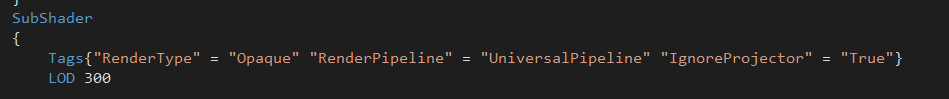

这个文件用来存放一些UnityShader中零散的东西。

### LOD

> Shader Level of Detail (LOD)，翻译过来是什么“着色器的细节层次效果”。听着好高端的样子，这种夸张的翻译也就只能放在那些作者自己都不知道写的是什么的软文里面。对于TA来说，Shader LOD其实就是根据设备性能的不同编译不同版本的Shader。
>
> 这种编译方式最早是为了适应不同时代的显卡而准备的。主机端本来就不存在这个问题，而现在在PC端上想找到上古级别的显卡也不太容易。所以目前这玩意儿最大的用途也就是为了适配高低配置不同的手机(以上为个人意见)。
>
> ...
>
> 在脚本中给Shader.globalMaximumLOD赋值就可以改变Shader。个人推荐最好在初始化的时候做这一步。
>
> [参考链接](https://zhuanlan.zhihu.com/p/21316674)

### [GPU Instancing](https://docs.unity3d.com/cn/current/Manual/gpu-instancing-shader.html)

UNITY_VERTEX_INPUT_INSTANCE_ID

### HLSL中 branch flatten unroll loop关键字

> 查找了些资料，这些关键词是HLSL编译器为了优化代码为if和for语句添加的标签，具体含义如下：
>
> 1. if语句
>
> 2. 1. branch
>         添加了branch标签的if语句shader会根据判断语句只执行当前情况的代码，这样会产生跳转指令。
>     2. flatten
>         添加了flatten标签的if语句shader会执行全部情况的分支代码，然后根据判断语句来决定使用哪个结果。
>
> 3. for语句
>
> 4. 1. unroll
>         添加了unroll标签的for循环是可以展开的，直到循环条件终止，代价是产生更多机器码
>     2. loop
>         添加了loop标签的for循环不能展开，流式控制每次的循环迭代，for默认是loop
>
> 在我理解的话，branch和loop更像是动态的，而flatten和unroll倾向于静态的，从UE4的代码中loop经常搭配branch，而unroll经常搭配flatten也可以看出来。
>
> 还有一个问题是对于一些渐进式的指令，比如tex2D在branch和loop这样标签下的语句中使用会产生错误，因为GPU是对四个像素的Chunk一起着色的，fragment需要通过像素之间的UV差距来判断要使用的mipmap，而动态分支对于不同的像素计算方式无法确定，所以是禁止使用tex2D的，但是可以tex2DGrad或者tex2DLod来指定mipmap，这样是可以使用的，不然则需要通过flatten和unroll来告诉编译器是静态分支可以使用。
>
> [参考链接](https://zhuanlan.zhihu.com/p/115871017)