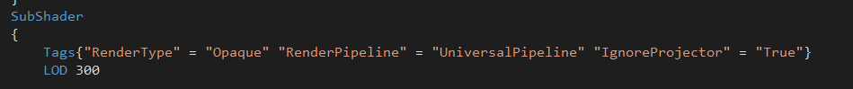

这个文件用来存放一些UnityShader中零散的东西。

### LOD



> Shader Level of Detail (LOD)，翻译过来是什么“着色器的细节层次效果”。听着好高端的样子，这种夸张的翻译也就只能放在那些作者自己都不知道写的是什么的软文里面。对于TA来说，Shader LOD其实就是根据设备性能的不同编译不同版本的Shader。
> 
> 这种编译方式最早是为了适应不同时代的显卡而准备的。主机端本来就不存在这个问题，而现在在PC端上想找到上古级别的显卡也不太容易。所以目前这玩意儿最大的用途也就是为了适配高低配置不同的手机(以上为个人意见)。
> 
> ...
> 
> 在脚本中给Shader.globalMaximumLOD赋值就可以改变Shader。个人推荐最好在初始化的时候做这一步。
> 
> [参考链接](https://zhuanlan.zhihu.com/p/21316674)

### [GPU Instancing](https://docs.unity3d.com/cn/current/Manual/gpu-instancing-shader.html)

UNITY_VERTEX_INPUT_INSTANCE_ID

### HLSL中 branch flatten unroll loop关键字s

> 查找了些资料，这些关键词是HLSL编译器为了优化代码为if和for语句添加的标签，具体含义如下：
> 
> 1. if语句
> 
> 2. 1. branch
>         添加了branch标签的if语句shader会根据判断语句只执行当前情况的代码，这样会产生跳转指令。
>       2. flatten
>          添加了flatten标签的if语句shader会执行全部情况的分支代码，然后根据判断语句来决定使用哪个结果。
> 
> 3. for语句
> 
> 4. 1. unroll
>         添加了unroll标签的for循环是可以展开的，直到循环条件终止，代价是产生更多机器码
>       2. loop
>          添加了loop标签的for循环不能展开，流式控制每次的循环迭代，for默认是loop
> 
> 在我理解的话，branch和loop更像是动态的，而flatten和unroll倾向于静态的，从UE4的代码中loop经常搭配branch，而unroll经常搭配flatten也可以看出来。
> 
> 还有一个问题是对于一些渐进式的指令，比如tex2D在branch和loop这样标签下的语句中使用会产生错误，因为GPU是对四个像素的Chunk一起着色的，fragment需要通过像素之间的UV差距来判断要使用的mipmap，而动态分支对于不同的像素计算方式无法确定，所以是禁止使用tex2D的，但是可以tex2DGrad或者tex2DLod来指定mipmap，这样是可以使用的，不然则需要通过flatten和unroll来告诉编译器是静态分支可以使用。
> 
> [参考链接](https://zhuanlan.zhihu.com/p/115871017)

### UnityUIShader模板 (UV偏移动画)

``` c
Shader "UI/CommonUI_UV"
{
    Properties
    {
        [PerRendererData] _MainTex ("Texture", 2D) = "white" {}
        [HideInInspector] _StencilComp ("Stencil Comparison", Float) = 8
		[HideInInspector] _Stencil ("Stencil ID", Float) = 0
		[HideInInspector] _StencilOp ("Stencil Operation", Float) = 0
		[HideInInspector] _StencilWriteMask ("Stencil Write Mask", Float) = 255
		[HideInInspector] _StencilReadMask ("Stencil Read Mask", Float) = 255
        [HideInInspector] _ColorMask ("Color Mask", Float) = 15
        _Speed ("Speed", Vector) = (0, 0, 0, 0)
    }
    SubShader
    {
		Tags
		{
			"Queue"="Transparent"
			"IgnoreProjector"="True"
			"RenderType"="Transparent"
			"PreviewType"="Plane"
			"CanUseSpriteAtlas"="True"
		}
		Stencil
		{
			Ref [_Stencil]
			Comp [_StencilComp]
			Pass [_StencilOp]
			ReadMask [_StencilReadMask]
			WriteMask [_StencilWriteMask]
		}

        Cull Off
		Lighting Off
		ZWrite Off
		ZTest [unity_GUIZTestMode]
		Blend SrcAlpha OneMinusSrcAlpha
		ColorMask [_ColorMask]

        Pass
        {
            CGPROGRAM
            #pragma vertex vert
            #pragma fragment frag
            #pragma multi_compile _ UNITY_UI_ALPHACLIP
            #include "UnityUI.cginc"
            #include "UnityCG.cginc"

            fixed4 _TextureSampleAdd; // Unity管理：图片格式用Alpha8 
            float4 _ClipRect;// Unity管理：2D剪裁使用
            sampler2D _MainTex;
            float4 _MainTex_ST;
            float4 _Speed;

            struct a2v{
			    float4 vertex       : POSITION;
			    float4 color        : COLOR;
			    float2 texcoord     : TEXCOORD0;
			    UNITY_VERTEX_INPUT_INSTANCE_ID
            };
		    struct v2f{
                float4 vertex       : SV_POSITION;
                float4 color        : COLOR;
               	float2 texcoord     : TEXCOORD0;
                UNITY_VERTEX_OUTPUT_STEREO
            };
            v2f vert(a2v IN){
                v2f OUT;
                UNITY_SETUP_INSTANCE_ID(IN);
			    UNITY_INITIALIZE_VERTEX_OUTPUT_STEREO(OUT);// 实例化处理
                OUT.vertex = UnityObjectToClipPos(IN.vertex);// 模型空间到裁剪空间
                OUT.color = IN.color;
                OUT.texcoord.xy = TRANSFORM_TEX(IN.texcoord, _MainTex) + frac(_Speed.xy * _Time.y); // 正常就直接OUT=IN的顶点
                return OUT;
            }
            fixed4 frag(v2f IN):SV_Target{
                half4 color = tex2D(_MainTex,IN.texcoord) * IN.color;
                return color;
		    }   
            ENDCG
        }
    }
}
```

附Shader属性标签官方解释:

>| [None](https://docs.unity3d.com/cn/2019.4/ScriptReference/Rendering.ShaderPropertyFlags.None.html) | 未设置任何标志。                                             |
>| ------------------------------------------------------------ | ------------------------------------------------------------ |
>| [HideInInspector](https://docs.unity3d.com/cn/2019.4/ScriptReference/Rendering.ShaderPropertyFlags.HideInInspector.html) | 表示 Unity 在默认材质检视面板中隐藏属性。                    |
>| [PerRendererData](https://docs.unity3d.com/cn/2019.4/ScriptReference/Rendering.ShaderPropertyFlags.PerRendererData.html) | Unity 将从渲染器的 MaterialPropertyBlock（而非材质）查询此属性的纹理值。 |
>| [NoScaleOffset](https://docs.unity3d.com/cn/2019.4/ScriptReference/Rendering.ShaderPropertyFlags.NoScaleOffset.html) | 在默认材质检视面板中的纹理旁边不显示 UV 缩放/偏移字段。      |
>| [Normal](https://docs.unity3d.com/cn/2019.4/ScriptReference/Rendering.ShaderPropertyFlags.Normal.html) | 表示此属性的值包含标准（标准化矢量）数据。                   |
>| [HDR](https://docs.unity3d.com/cn/2019.4/ScriptReference/Rendering.ShaderPropertyFlags.HDR.html) | 表示此属性的值包含高动态范围 (HDR) 数据。                    |
>| [Gamma](https://docs.unity3d.com/cn/2019.4/ScriptReference/Rendering.ShaderPropertyFlags.Gamma.html) | 表示此属性的值位于伽马空间。如果活动颜色空间为线性，Unity 将这些值转换为线性空间值。 |
>| [NonModifiableTextureData](https://docs.unity3d.com/cn/2019.4/ScriptReference/Rendering.ShaderPropertyFlags.NonModifiableTextureData.html) | 不能在默认材质检视面板中编辑此纹理属性。                     |
>| [MainTexture](https://docs.unity3d.com/cn/2019.4/ScriptReference/Rendering.ShaderPropertyFlags.MainTexture.html) | 表示此属性的值包含材质的主纹理。                             |
>| [MainColor](https://docs.unity3d.com/cn/2019.4/ScriptReference/Rendering.ShaderPropertyFlags.MainColor.html) | 表示此属性的值包含材质的主色。                               |

### UnityUIShader模板(DefaultUI)

```c
// Unity built-in shader source. Copyright (c) 2016 Unity Technologies. MIT license (see license.txt)

Shader "UI/Default"
{
    Properties
    {
        [PerRendererData] _MainTex ("Sprite Texture", 2D) = "white" {}
        _Color ("Tint", Color) = (1,1,1,1)

        _StencilComp ("Stencil Comparison", Float) = 8
        _Stencil ("Stencil ID", Float) = 0
        _StencilOp ("Stencil Operation", Float) = 0
        _StencilWriteMask ("Stencil Write Mask", Float) = 255
        _StencilReadMask ("Stencil Read Mask", Float) = 255

        _ColorMask ("Color Mask", Float) = 15

        [Toggle(UNITY_UI_ALPHACLIP)] _UseUIAlphaClip ("Use Alpha Clip", Float) = 0
    }

    SubShader
    {
        Tags
        {
            "Queue"="Transparent"
            "IgnoreProjector"="True"
            "RenderType"="Transparent"
            "PreviewType"="Plane"
            "CanUseSpriteAtlas"="True"
        }

        Stencil
        {
            Ref [_Stencil]
            Comp [_StencilComp]
            Pass [_StencilOp]
            ReadMask [_StencilReadMask]
            WriteMask [_StencilWriteMask]
        }

        Cull Off
        Lighting Off
        ZWrite Off
        ZTest [unity_GUIZTestMode]
        Blend SrcAlpha OneMinusSrcAlpha
        ColorMask [_ColorMask]

        Pass
        {
            Name "Default"
        CGPROGRAM
            #pragma vertex vert
            #pragma fragment frag
            #pragma target 2.0

            #include "UnityCG.cginc"
            #include "UnityUI.cginc"

            #pragma multi_compile_local _ UNITY_UI_CLIP_RECT
            #pragma multi_compile_local _ UNITY_UI_ALPHACLIP

            struct appdata_t
            {
                float4 vertex   : POSITION;
                float4 color    : COLOR;
                float2 texcoord : TEXCOORD0;
                UNITY_VERTEX_INPUT_INSTANCE_ID
            };

            struct v2f
            {
                float4 vertex   : SV_POSITION;
                fixed4 color    : COLOR;
                float2 texcoord  : TEXCOORD0;
                float4 worldPosition : TEXCOORD1;
                UNITY_VERTEX_OUTPUT_STEREO
            };

            sampler2D _MainTex;
            fixed4 _Color;
            fixed4 _TextureSampleAdd;
            float4 _ClipRect;
            float4 _MainTex_ST;

            v2f vert(appdata_t v)
            {
                v2f OUT;
                UNITY_SETUP_INSTANCE_ID(v);
                UNITY_INITIALIZE_VERTEX_OUTPUT_STEREO(OUT);
                OUT.worldPosition = v.vertex;
                OUT.vertex = UnityObjectToClipPos(OUT.worldPosition);

                OUT.texcoord = TRANSFORM_TEX(v.texcoord, _MainTex);

                OUT.color = v.color * _Color;
                return OUT;
            }

            fixed4 frag(v2f IN) : SV_Target
            {
                half4 color = (tex2D(_MainTex, IN.texcoord) + _TextureSampleAdd) * IN.color;

                #ifdef UNITY_UI_CLIP_RECT
                color.a *= UnityGet2DClipping(IN.worldPosition.xy, _ClipRect);
                #endif

                #ifdef UNITY_UI_ALPHACLIP
                clip (color.a - 0.001);
                #endif

                return color;
            }
        ENDCG
        }
    }
}
```


### RenderDoc

调试Shader时往shader里加入#pragma enable_d3d11_debug_symbols

### 常用API

k = step(x, y) // if (x <= y) k = 1 else k = 0 

frac(x) // 取小数部分