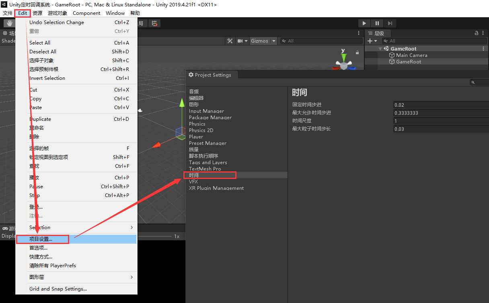
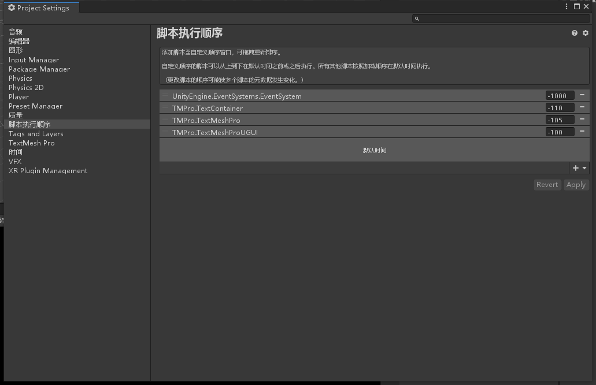

# Unity定时回调系统

## 1. 定时回调系统基础

### 1.1 游戏物体生命周期


先上官方文档的图。

脚本中的重点常用事件函数：

- `Awake`：游戏物体实例化之后并处于激活状态时调用，即使脚本**没有被激活**也会调用，且总是在`Start`之前调用。
- `OnEnable`：在游戏物体处于激活状态，且脚本组件激活时调用，会被重复调用。
- `Start`：在游戏物体处于激活状态，且脚本组件处于激活状态时调用，且总是在`Update`之前调用，只会被调用一次。
- `Update`：每帧调用一次，帧率不固定。
- `FixedUpdate`：根据设定的帧率调用，主要用于物理运算。（帧率相同不代表时间间隔相同）
- `LateUpdate`：每帧调用一次，在`Update`之后调用。
- `OnDisable`：在脚本组件处于激活状态时，禁用物体或脚本组件时被调用。
- `OnDestroy`：当游戏物体被销毁时调用。

`FixedUpdate`的运行帧率设置图如下所示：



最大允许时间步进（**Maximum Allowed Timestep**）的设置可以避免deltaTime值过大带来的不良影响。当某一帧花费的时间非常长时，最大允许时间步进将会把deltaTime限制在设置的值，就好像一旦某一帧时间过长，那么引擎就会把整个世界（指的是物理系统和FixedUpdate）暂停并让帧处理（Update）赶上进度。

### 1.2 脚本执行顺序

当我们需要对脚本执行的顺序进行更改时，我们可以通过项目设置中的脚本执行顺序设置脚本执行的顺序（搁这搁这呢）。



后面的数值越小，脚本执行越早。

但是对于同一个脚本挂载到不同物体上时，脚本执行的顺序将不可控。视频中老师提出的方法是，不让Unity自动执行Awake进行初始化，而是通过一个脚本获取其他脚本组件，并按照我们所希望的执行顺序调用其他脚本的初始化方法进行初始化。

### 1.3 Unity主线程设计思想

所有的脚本代码都是串行运行，都运行在一个线程里，也就是Unity的主线程。（`FixedUpdate`的驱动机制不同，所以可能会出现一个主循环帧多次执行`FixedUpdate`的情况）。

我们以某一个物体为基准，在她第一次执行`Update`为起始时间，第二次执行`Update`前为终止时间，这一时间段就是一个主循环帧，通常我们把游戏的大部分逻辑处理放置`Update`中，所以一个主循环帧也会被叫做逻辑帧。

Unity中是可以使用多线程的，但是为了数据安全，一些关键数据无法在多线程中获取，比如`transform`。Unity底层通过线程池，实现了一些可以用多线程处理的任务，所以效率仍然很高，我们只需要调用一些方法，就可以实现高效的多线程操作（读取资源等）。

```c#
using System.Threading;
using UnityEngine;

public class GameRoot : MonoBehaviour
{
    private void Start()
    {
        ThreadStart threadStart = new ThreadStart(ThreadMain);
        Thread thread = new Thread(threadStart);
        thread.Start();
        Debug.Log("UnityMain线程ID:" + Thread.CurrentThread.ManagedThreadId.ToString());
    }

    void ThreadMain()
    {
        Debug.Log("New线程ID:" + Thread.CurrentThread.ManagedThreadId.ToString());
        // 会报错
        // Debug.Log(transform.position.ToString());
    }
}
```

### 1.4 协程的常规使用

协程：协同程序。开启协程后，主线程将会在每一帧检测她是否满足完成的条件，如果满足条件则执行之前设定好的相关操作。下面写一个简单的协程：

```c#
using System.Collections;
using UnityEngine;

public class GameRoot : MonoBehaviour
{
    private void Start()
    {
        StartCoroutine(FuncA());
        // StartCoroutine("FuncA");
    }

    IEnumerator FuncA()
    {
        Debug.Log("FuncA 1");
        yield return new WaitForSeconds(2.0f);
        Debug.Log("FuncA 2");
    }
}
```

使用协程需要添加`using System.Collections`。

上面的代码在协程开启输出FuncA 1后，使用yield关键字挂起，然后主线程会每帧检测是否满足了等待2秒的条件（`WaitForSeconds(2.0f)`）,当满足条件后，协程会继续运行，输出FuncA 2。

启动协程的方式有三种：

- `StartCoroutine(IEnumerator routine)`
- `StartCoroutine(string methodName)`
- `StartCoroutine(string methodName, object value)`

第三个方法实际上是第二个方法的重载。后两种通过函数名字符串启动协程的开销更大，且只能传递一个参数。

终止协程的方法有四种：

- `StopCoroutine(string methodName)`
- `StopCoroutine(Coroutine routine)`
- `StopAllCoroutines()`
- 在协程内部使用`yield break`终止

停止协程的方法需要与启动协程的方法相匹配，用方法名启动的可以用方法名终止（第一种），用`IEnumerator`启动的需要使用`StartCoroutine`返回的`Coroutine`对象结束（第二种），或者把协程函数的返回的`IEnumerator`引用当作终止协程的参数也是可以的。第三种方式关闭的是由这个脚本开启的所有协程。

当挂载携程的脚本被禁用时，协程将会被注销，所以场景切换时想要保留协程，就不能让脚本被禁用，所以物体不能被禁用。

yield关键字可以返回null、数字、字符串甚至是表达式、函数、协程。当返回的是函数、表达式、协程时，会直接调用这个函数或表达式，并在执行完毕后继续执行该协程。当返回的是数字、字符串、null时，会在下一帧Update之后继续执行。如果返回的是类似WWW的一部资源加载函数，则协程会在资源加载完毕后继续执行。

## 2. Unity定时器

稍稍与视频课不太一样，实现了帧定时任务和普通定时任务的相互替换，虽然不知道这样做好不好。

```c#
// TimeTask.cs
using System;

public class TimeTask
{
    public int taskID;
    public float delay;
    public float destTime;

    public Action callback;
    public int callCount;

    public TimeTask(int taskID, float delay, float destTime, Action callback, int count)
    {
        this.taskID = taskID;
        this.delay = delay;
        this.destTime = destTime;
        this.callback = callback;
        this.callCount = count;
    }
}
public class FrameTask
{
    public int taskID;
    public int delayFrame;
    public int destFrame;

    public Action callback;
    public int callCount;

    public FrameTask(int taskID, int delay, int destTime, Action callback, int count)
    {
        this.taskID = taskID;
        this.delayFrame = delay;
        this.destFrame = destTime;
        this.callback = callback;
        this.callCount = count;
    }
}

public enum TimeUnit
{
    Millisecond,
    Second,
    Minute,
    Hour,
    Day
}
```

```c#
// TimerSystem.cs
using System;
using System.Collections;
using System.Collections.Generic;
using UnityEngine;


public class TimerSystem : MonoBehaviour
{
    public static TimerSystem Instance;
    private readonly object taskIDLock = new object();
    private int taskID = 0;
    private List<int> taskIDList = new List<int>();
    private List<TimeTask> tempTimeTaskList = new List<TimeTask>();
    private List<TimeTask> timeTaskList = new List<TimeTask>();
    private int currentFrame = 0;
    private List<FrameTask> tempFrameTaskList = new List<FrameTask>();
    private List<FrameTask> frameTaskList = new List<FrameTask>();

    public void Init()
    {
        Instance = this;
    }

    private void Update()
    {
        UpdateCurrentFrame();
        CheckFrameTask();
        CheckTimeTask();
    }
    
    private void CheckTimeTask()
    {
        // 取出缓存
        for (int index = 0; index < tempTimeTaskList.Count; index++)
        {
            timeTaskList.Add(tempTimeTaskList[index]);
        }
        tempTimeTaskList.Clear();

        // 需要移除的任务id列表
        List<int> needToRemoveTaskID = new List<int>();
        // 遍历检测任务是否达到条件
        for (int index = 0; index < timeTaskList.Count; index++)
        {
            TimeTask timeTask = timeTaskList[index];
            if (timeTask.destTime > Time.realtimeSinceStartup * 1000)
            {
                continue;
            }
            else
            {
                Action callback = timeTask.callback;
                try
                {
                    if (callback != null)
                    {
                        Debug.Log(string.Format("TimeTask[{0}] is running", timeTask.taskID));
                        // 但是如果callback很费时间怎么办
                        callback();
                    }
                }
                catch (Exception e)
                {
                    Debug.LogError(e.Message + " " + e.StackTrace);
                }
                // 不是无限循环
                if (timeTask.callCount != -1)
                {
                    timeTask.callCount--;
                }
                // 执行一定次数后移除
                if (timeTask.callCount == 0)
                {
                    needToRemoveTaskID.Add(taskID);
                }
                else
                {
                    timeTask.destTime = Time.realtimeSinceStartup * 1000 + timeTask.delay;
                }
            }
        }
        // 统一移除
        for (int index = 0; index < needToRemoveTaskID.Count; index++)
        {
            // 这种用for循环来移除 效率好吗
            RemoveTimeTaskByTaskID(needToRemoveTaskID[index]);
            RemoveTaskID(needToRemoveTaskID[index]);
        }
    }
    private void CheckFrameTask()
    {
        // 取出缓存
        for (int index = 0; index < tempFrameTaskList.Count; index++)
        {
            frameTaskList.Add(tempFrameTaskList[index]);
        }
        tempFrameTaskList.Clear();

        // 需要移除的任务id列表
        List<int> needToRemoveTaskID = new List<int>();
        // 遍历检测任务是否达到条件
        for (int index = 0; index < frameTaskList.Count; index++)
        {
            FrameTask frameTask = frameTaskList[index];
            if (frameTask.destFrame > currentFrame)
            {
                continue;
            }
            else
            {
                Action callback = frameTask.callback;
                try
                {
                    if (callback != null)
                    {
                        Debug.Log(string.Format("FrameTask[{0}] is running", frameTask.taskID));
                        // 但是如果callback很费时间怎么办
                        callback();
                    }
                }
                catch (Exception e)
                {
                    Debug.LogError(e.Message + " " + e.StackTrace);
                }
                // 不是无限循环
                if (frameTask.callCount != -1)
                {
                    frameTask.callCount--;
                }
                // 执行一定次数后移除
                if (frameTask.callCount == 0)
                {
                    needToRemoveTaskID.Add(taskID);
                }
                else
                {
                    frameTask.destFrame += frameTask.delayFrame;
                }
            }
        }
        // 统一移除
        for (int index = 0; index < needToRemoveTaskID.Count; index++)
        {
            // 这种用for循环来移除 效率好吗
            RemoveFrameTaskByTaskID(needToRemoveTaskID[index]);
            RemoveTaskID(needToRemoveTaskID[index]);
        }
    }
    private void UpdateCurrentFrame()
    {
        currentFrame += 1;
        if (currentFrame == int.MaxValue)
        {
            currentFrame = 0;
        }
    }
    
    #region TimeTask
    /// <summary>
    /// 添加一个定时任务
    /// </summary>
    /// <param name="callback">回调函数</param>
    /// <param name="delay">延时时间</param>
    /// <param name="timeUnit">时间单位 默认毫秒</param>
    /// <param name="count">执行次数 默认为1</param>
    public int AddTimeTask(Action callback, float delay, TimeUnit timeUnit = TimeUnit.Millisecond, int count = 1)
    {
        delay = ConvertToMillisecond(timeUnit, delay);
        // 计算什么时候执行任务
        float destTime = GetDestinationTime(delay);
        int taskID = GetID();
        TimeTask timeTask = new TimeTask(taskID, delay, destTime, callback, count);
        // 添加进入任务缓存列表
        // 确保新任务在下一帧才被加入检测列表
        // 保证检测时不会出现某些奇妙的问题
        tempTimeTaskList.Add(timeTask);
        taskIDList.Add(taskID);
        return taskID;
    }
    /// <summary>
    /// 对外开放 通过任务ID移除定时任务
    /// </summary>
    /// <param name="taskID">任务ID</param>
    /// <returns>移除是否成功</returns>
    public bool DeleteTimeTask(int taskID)
    {
        if (!CheckTaskIDIsValid(taskID))
        {
            return RemoveTimeTaskByTaskID(taskID) && RemoveTaskID(taskID);
        }
        return false;
    }
    
    /// <summary>
    /// 替换一个定时任务
    /// </summary>
    /// <param name="taskID">被替换的任务ID</param>
    /// <param name="callback">回调函数</param>
    /// <param name="delay">延时时间</param>
    /// <param name="timeUnit">时间单位 默认毫秒</param>
    /// <param name="count">执行次数 默认为1</param>
    public bool ReplaceTimeTask(int taskID, Action callback, float delay, TimeUnit timeUnit = TimeUnit.Millisecond, int count = 1)
    {
        if (DeleteTimeTask(taskID) || DeleteFrameTask(taskID))
        {
            delay = ConvertToMillisecond(timeUnit, delay);
            float destTime = GetDestinationTime(delay);
            TimeTask timeTask = new TimeTask(taskID, delay, destTime, callback, count);

            tempTimeTaskList.Add(timeTask);
            taskIDList.Add(taskID);
            return true;
        }
        return false;
    }
    #endregion
    
    #region FrameTask
    /// <summary>
    /// 添加一个帧定时任务
    /// </summary>
    /// <param name="callback">回调函数</param>
    /// <param name="delayFrame">延时帧数</param>
    /// <param name="count">执行次数 默认为1</param>
    public int AddFrameTask(Action callback, int delayFrame, int count = 1)
    {
        // 计算什么时候执行任务
        int destFrame = GetDestinationFrame(delayFrame);
        int taskID = GetID();
        FrameTask frameTask = new FrameTask(taskID, delayFrame, destFrame, callback, count);
        // 添加进入任务缓存列表
        // 确保新任务在下一帧才被加入检测列表
        // 保证检测时不会出现某些奇妙的问题
        tempFrameTaskList.Add(frameTask);
        taskIDList.Add(taskID);
        return taskID;
    }
    /// <summary>
    /// 对外开放 通过任务ID移除帧定时任务
    /// </summary>
    /// <param name="taskID">任务ID</param>
    /// <returns>移除是否成功</returns>
    public bool DeleteFrameTask(int taskID)
    {
        if (!CheckTaskIDIsValid(taskID))
        {
            return RemoveFrameTaskByTaskID(taskID) && RemoveTaskID(taskID);
        }
        return false;
    }
    /// <summary>
    /// 替换一个帧定时任务
    /// </summary>
    /// <param name="taskID">被替换的任务ID</param>
    /// <param name="callback">回调函数</param>
    /// <param name="delayFrame">延时帧数</param>
    /// <param name="count">执行次数 默认为1</param>
    public bool ReplaceFrameTask(int taskID, Action callback, int delayFrame, int count = 1)
    {
        if (DeleteTimeTask(taskID) || DeleteFrameTask(taskID))
        {
            // 计算什么时候执行任务
            int destFrame = GetDestinationFrame(delayFrame);
            FrameTask frameTask = new FrameTask(taskID, delayFrame, destFrame, callback, count);
            // 添加进入任务缓存列表
            // 确保新任务在下一帧才被加入检测列表
            // 保证检测时不会出现某些奇妙的问题
            tempFrameTaskList.Add(frameTask);
            taskIDList.Add(taskID);
            return true;
        }
        return false;
    }
    #endregion
    
    #region ToolMethod
    /// <summary>
    /// 生成ID
    /// </summary>
    /// <returns>生成的ID</returns>
    private int GetID()
    {
        lock (taskIDLock)
        {
            taskID += 1;
            while (!CheckTaskIDIsValid(taskID))
            {
                if (taskID == int.MaxValue)
                {
                    taskID = 0;
                }
                taskID += 1;
            }
        }
        return taskID;
    }
    /// <summary> 
    /// 检查一个ID是否可用
    /// </summary>
    /// <param name="taskID"></param>
    /// <returns>ID是否可用</returns>
    private bool CheckTaskIDIsValid(int taskID)
    {
        foreach (int id in taskIDList)
        {
            if (id == taskID)
            {
                return false;
            }
        }
        return true;
    }
    /// <summary>
    /// 通过任务ID移除任务
    /// </summary>
    /// <param name="taskID">任务ID</param>
    /// <returns>移除是否成功</returns>
    private bool RemoveTimeTaskByTaskID(int taskID)
    {
        for (int index = 0; index < timeTaskList.Count; index++)
        {
            TimeTask timeTask = timeTaskList[index];
            if (timeTask.taskID == taskID)
            {
                timeTaskList.RemoveAt(index);
                return true;
            }
        }
        for (int index = 0; index < tempTimeTaskList.Count; index++)
        {
            TimeTask timeTask = tempTimeTaskList[index];
            if (timeTask.taskID == taskID)
            {
                tempTimeTaskList.RemoveAt(index);
                return true;
            }
        }
        return false;
    }
    /// <summary>
    /// 移除任务ID
    /// </summary>
    /// <param name="taskID">任务ID</param>
    /// <returns>移除是否成功</returns>
    private bool RemoveTaskID(int taskID)
    {
        for (int index = 0; index < taskIDList.Count; index++)
        {
            if (taskID == taskIDList[index])
            {
                taskIDList.RemoveAt(index);
                return true;
            }
        }
        return false;
    }
    /// <summary>
    /// 转换时间到毫秒单位
    /// </summary>
    /// <param name="timeUnit">需要转换的时间单位</param>
    /// <param name="time">需要转换的时间</param>
    /// <returns>转换后的时间 单位毫秒</returns>
    private float ConvertToMillisecond(TimeUnit timeUnit, float time)
    {
        // 统一换算成毫秒进行计算
        switch (timeUnit)
        {
            case TimeUnit.Millisecond:
                break;
            case TimeUnit.Second:
                time = time * 1000;
                break;
            case TimeUnit.Minute:
                time = time * 1000 * 60;
                break;
            case TimeUnit.Hour:
                time = time * 1000 * 60 * 60;
                break;
            case TimeUnit.Day:
                time = time * 1000 * 60 * 60 * 24;
                break;
        }
        return time;
    }
    /// <summary>
    /// 输入一个延时时间（毫秒），返回一个最终的实际时间
    /// </summary>
    /// <param name="delay">延时时间 单位毫秒</param>
    /// <returns>目标实际时间</returns>
    private float GetDestinationTime(float delay)
    {
        return Time.realtimeSinceStartup * 1000 + delay;
    }
    /// <summary>
    /// 通过任务ID移除帧任务
    /// </summary>
    /// <param name="taskID">任务ID</param>
    /// <returns>移除是否成功</returns>
    private bool RemoveFrameTaskByTaskID(int taskID)
    {
        for (int index = 0; index < frameTaskList.Count; index++)
        {
            FrameTask frameTask = frameTaskList[index];
            if (frameTask.taskID == taskID)
            {
                frameTaskList.RemoveAt(index);
                return true;
            }
        }
        for (int index = 0; index < tempTimeTaskList.Count; index++)
        {
            FrameTask frameTask = tempFrameTaskList[index];
            if (frameTask.taskID == taskID)
            {
                tempFrameTaskList.RemoveAt(index);
                return true;
            }
        }
        return false;
    }
    /// <summary>
    /// 获取延时一定帧数后的帧数
    /// </summary>
    /// <param name="delayFrame">延时帧数</param>
    /// <returns>实际帧数</returns>
    private int GetDestinationFrame(int delayFrame)
    {
        return (currentFrame + delayFrame) % int.MaxValue;
    }
    #endregion
}
```

我把这个项目放在Samples文件夹下的Unity定时回调系统项目，以便以后参考。

## 3. 服务器环境下的定时器

由于我做前端，所以这一部分就暂时略过，以后有需要再补充。

## A. 参考资料

[siki学院定时回调系统技术专题](http://www.sikiedu.com/my/course/370)

[全栈游戏开发](https://www.zhihu.com/column/c_1358764773279170560)

