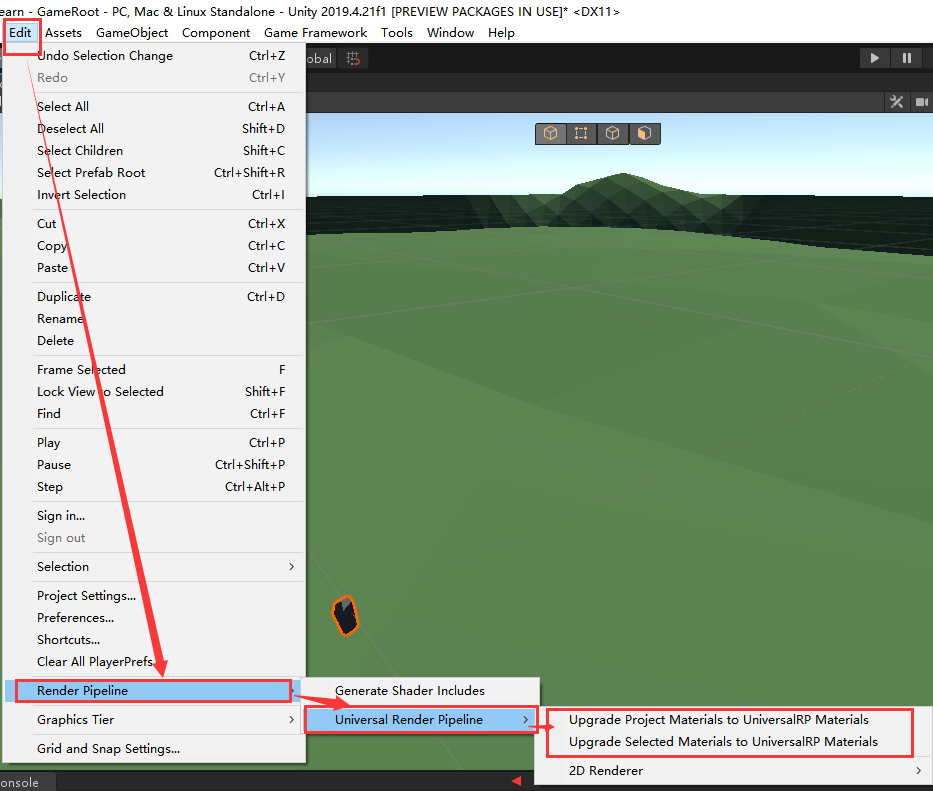

# From Built-in Render Pipeline to Universal Render Pipeline

## 0. 自动升级



## 1. 基础框架

学完CG发现人家不用了，换成URP了，那咋整，那只能学呗。目前打算是照着UnityShader精要入门写一份HLSL版本的Shader。~~（所以这是一本字典~~

首先在包管理器中安装Core RP Library和Universal RP，然后将项目颜色空间搞到线性空间，再然后新建一个URP资产，把资产放到项目设置里的图形设置。

下为原书5.2节根据法线方向改变颜色：

```c
Shader "Custom/SimpleShader"
{
	Properties
	{
		// 声明一个Color类型的属性
		_Color ("Color Hint", Color) = (1.0, 1.0, 1.0, 1.0)
	}

	SubShader
	{
		Tags
		{
			"RenderPipeline"="UniversalPipeline"
		}
		Pass
		{
			HLSLPROGRAM

			#pragma vertex vert
			#pragma fragment frag
			
			#include "Packages/com.unity.render-pipelines.universal/ShaderLibrary/Core.hlsl"

			struct VertexInput
			{
				float4 positionOS : POSITION;
				float3 normalOS : NORMAL;
				float4 uv : TEXCOORD0;
			};

			struct VertexOutput
			{
				float4 positionCS : SV_POSITION;
				half3 color : COLOR0;
			};

			CBUFFER_START(UnityPerMaterial)
			half4 _Color;
			CBUFFER_END

			VertexOutput vert(VertexInput IN)
			{
				VertexOutput OUT;
				OUT.positionCS = TransformObjectToHClip(IN.positionOS.xyz);
				OUT.color = IN.normalOS * 0.5 + half3(0.5, 0.5, 0.5);
				return OUT;
			}

			half4 frag(VertexOutput IN) : SV_TARGET
			{
				return half4(IN.color * _Color.rgb, 1.0);
			}

			ENDHLSL
		}
	}
}
```

第一个发现的就是UnityShader从CG换成了HLSL，所以原本的CGPROGRAM和ENDCG换成了HLSLPROGRAM和ENDHLSL。

第13行，在SubShader的Tags里添加了渲染管线类型为UniversalPipeline，这表示这个Shader是URP的，如果不写这个，那这个Shader还是会被认为成内置管线的。

第22行（没有行号的话在Typora里的代码块设置里把显示行号勾上），在CG时代是短短的`#include ”UnityCG.cginc“`，换成了老长一串的从我们之前安装的Universal RP包里一个URP核心文件，作用和以前的头文件相同。以前还有其他的很多头文件都变了，遇到的时候再写。

结构体定义和之前差不多，语义也是一模一样的。

然后就是37到39行，CBUFFER_START(UnityPerMaterial)和CBUFFER_END包围的区域。里面那个`half4 _Color`和以前的作用一样，和属性里_Color同名然后我们可以通过这个变量获取属性。

（以下是个人理解和看到的参考，不一定正确）CBUFFER_START宏定义在Common.hlsl，用于自动处理不支持cbuffer关键字的平台。cbuffer的目的是为了将一些变量存入GPU缓冲区，减少CPU和GPU的通信时间，提高效率。

还有一个就是，CG的fixed类型不能再用了，很多平台已经不支持这个类型，HLSL里用half代替。

## 2. 基础光照

### 2.1 逐顶点光照

```c
Shader "Custom/DiffuseVertexLevel"
{
    Properties
    {
        _Diffuse ("Diffuse", Color) = (1, 1, 1, 1)
    }

    SubShader
    {
        Tags
        {
            "RenderPipeline"="UniversalPipeline"
        }
        Pass
        {
            Tags
            {
                "LightMode"="UniversalForward"
            }

            HLSLPROGRAM
            
            #pragma vertex vert
            #pragma fragment frag

            #include "Packages/com.unity.render-pipelines.universal/ShaderLibrary/Core.hlsl"
            #include "Packages/com.unity.render-pipelines.universal/ShaderLibrary/Lighting.hlsl"

            CBUFFER_START(UnityPerMaterial)
            half4 _Diffuse;
            CBUFFER_END

            struct VertexInput
            {
                float4 positionOS : POSITION;
                float3 normalOS : NORMAL;
            };

            struct VertexOutput
            {
                float4 positionCS : SV_POSITION;
                half3 color : COLOR;
            };

            VertexOutput vert(VertexInput IN)
            {
                VertexOutput OUT;
                OUT.positionCS = TransformObjectToHClip(IN.positionOS.xyz);

                Light light = GetMainLight();

                half3 normalWS = TransformObjectToWorldDir(IN.normalOS, true);

                half3 L = normalize(light.direction);

                half3 diffuse = light.color * _Diffuse.rgb * saturate(dot(normalWS, L));

                half3 ambient = _GlossyEnvironmentColor.rgb;

                OUT.color = ambient + diffuse;

                return OUT;
            }

            half4 frag(VertexOutput IN) : SV_TARGET
            {
                return half4(IN.color, 1.0);
            }
            ENDHLSL

        }
    }
}
```

1. 18行，LightMode标签从ForwardBase换成UniversalForward，ForwardAdd在URP中被移除了，所有光照用一个Pass处理。
2. 27行，Lighting.cginc换成Lighting.hlsl。
3. 48行，坐标变换，包含在Core/SpaceTransforms中，输入float3输出float4。
4. 50行，主光源获取，方法和结构体都定义在Lighting.hlsl中。
5. 52行，向量变换，输入float3和是否标准化，输出标准/非标准向量。
6. 54行，光源方向，在Light结构体中定义，获取主光源时一起获取。
7. 58行，环境光，从UNITY_LIGHTMODEL_AMBIENT换成_GlossyEnvironmentColor

### 2.2 逐像素光照

并没有添加什么新东西，参照2.1改一改就可以。

### 2.3 半兰伯特

除了计算漫反射的公式不一样以外，没有添加新东西。

### 2.4 Blinn-Phong

```c
Shader "Custom/BlinnPhong"
{
    Properties
    {
        _Diffuse ("漫反射颜色", Color) = (1, 1, 1, 1)
        _Specular ("高光反射颜色", Color) = (1, 1, 1, 1)
        _Gloss ("高光次幂 控制光斑大小", Range(0.1, 256)) = 20.0
    }

    SubShader
    {
        Tags
        {
            "RenderPipeline"="UniversalPipeline"
        }
        Pass
        {
            Tags
            {
                "LightMode" = "UniversalForward"
            }

            HLSLPROGRAM
            #pragma vertex vert
            #pragma fragment frag

            #include "Packages/com.unity.render-pipelines.universal/ShaderLibrary/Core.hlsl"
            #include "Packages/com.unity.render-pipelines.universal/ShaderLibrary/Lighting.hlsl"

            CBUFFER_START(UnityPerMaterial)
            half4 _Diffuse;
            half4 _Specular;
            half _Gloss;
            CBUFFER_END

            struct VertexInput
            {
                float4 positionOS : POSITION;
                float3 normalOS : NORMAL;
            };

            struct VertexOutput
            {
                float4 positionCS : SV_POSITION;
                float3 normalWS : TEXCOORD0;
                float3 positionWS : TEXCOORD1;
            };

            VertexOutput vert(VertexInput IN)
            {
                VertexOutput OUT;
                OUT.positionCS = TransformObjectToHClip(IN.positionOS.xyz);
                OUT.normalWS = TransformObjectToWorldDir(IN.normalOS, true);
                OUT.positionWS = TransformObjectToWorld(IN.positionOS.xyz);
                return OUT;
            }

            half4 frag(VertexOutput IN) : SV_TARGET
            {
                Light light = GetMainLight();
                half3 L = normalize(light.direction);

                // 漫反射
                half halfLambert = dot(IN.normalWS, L) * 0.5 + 0.5;
                half3 diffuse = light.color * _Diffuse.rgb * halfLambert;
                // 高光
                half3 V = normalize(GetCameraPositionWS() - IN.positionWS);
                half3 H = normalize(L + V);
                half3 specular = light.color * _Specular.rgb * pow(max(0, dot(IN.normalWS, H)), _Gloss);
                // 环境光
                half3 ambient = _GlossyEnvironmentColor.rgb;

                return half4(ambient + diffuse + specular, 1.0);
            }
            ENDHLSL
        }
    }
}
```

1. 第67行，原本计算视角方向的方法UnityWorldSpaceViewDir不能再用了，但我还没找到代替的方法，所以使用相机世界坐标减模型世界坐标代替。
2. 之前一直忘了写，不知道看的人有没有注意到Fallback不见了。

## 3. 基础纹理

### 3.1 单张纹理

```c
Shader "Custom/SingleTexture"
{
    Properties
    {
        _MainTex ("主纹理", 2D) = "white" {}
        _Specular ("高光颜色", Color) = (1, 1, 1, 1)
        _Gloss ("高光次幂", Range(8.0, 256)) = 20
        _Color ("染色", Color) = (1, 1, 1, 1)
    }

    SubShader
    {
        Tags
        {
            "RenderPipeline"="UniversalPipeline"
        }
        Pass
        {
            Tags {"LightMode" = "UniversalForward"}

            HLSLPROGRAM
            #pragma vertex vert
            #pragma fragment frag

            #include "Packages/com.unity.render-pipelines.universal/ShaderLibrary/Core.hlsl"
            #include "Packages/com.unity.render-pipelines.universal/ShaderLibrary/Lighting.hlsl"

            TEXTURE2D(_MainTex);
            SAMPLER(sampler_MainTex);

            CBUFFER_START(UnityPerMaterial)
            float4 _MainTex_ST;
            half4 _Specular;
            float _Gloss;
            half4 _Color;
            CBUFFER_END

            struct VertexInput
            {
                float3 positionOS : POSITION;
                float3 normalOS : NORMAL;
                float4 texcoord : TEXCOORD0;
            };

            struct VertexOutput
            {
                float4 positionCS : SV_POSITION;
                float3 normalWS : TEXCOORD0;
                float3 positionWS : TEXCOORD1;
                float2 uv : TEXCOORD2;
            };

            VertexOutput vert(VertexInput IN)
            {
                VertexOutput OUT;
                OUT.positionCS = TransformObjectToHClip(IN.positionOS);
                OUT.normalWS = TransformObjectToWorldDir(IN.normalOS, true);
                OUT.positionWS = TransformObjectToWorld(IN.positionOS);
                OUT.uv = TRANSFORM_TEX(IN.texcoord, _MainTex);
                return OUT;
            }

            half4 frag(VertexOutput IN) : SV_TARGET
            {
                Light light = GetMainLight();
                half3 L = normalize(light.direction);
                // 贴图
                half3 albedo = SAMPLE_TEXTURE2D(_MainTex, sampler_MainTex, IN.uv).rgb * _Color.rgb;
                // 漫反射
                half halfLambert = dot(IN.normalWS, L) * 0.5 + 0.5;
                half3 diffuse = light.color * albedo * halfLambert;
                // 高光
                half3 V = normalize(GetCameraPositionWS() - IN.positionWS);
                half3 H = normalize(L + V);
                half3 specular = light.color * _Specular.rgb * pow(max(0, dot(IN.normalWS, H)), _Gloss);
                // 环境光
                half3 ambient = _GlossyEnvironmentColor.rgb;

                return half4(ambient + diffuse + specular, 1.0);
            }
            ENDHLSL
        }
    }
}
```

1. 第28行，原本的声明为`sampler2D _MainTex`，现在将其拆成纹理和采样器两个部分，`TEXTURE2D(_MainTex)`和`SAMPLER(sampler_MainTex)`，采样器名字必须是sampler[纹理名]，而之前存储缩放和偏移的`_MainTex_ST`就放在CBUFFER里。
2. 第68行，采样的宏从`tex2D(_MainTex, IN.uv)`换成`SAMPLE_TEXTURE2D(_MainTex, sampler_MainTex, IN.uv)`，这个宏的作用是根据不同平台去选择调用不同的方法进行采样，D3D9还是使用tex2D，D3D11和D3D12定义为`#define SAMPLE_TEXTURE2D(textureName, samplerName, coord2) textureName.Sample(samplerName, coord2)`。

### 3.2 凹凸映射

```c
Shader "Custom/NormalMapTangentSpace"
{
    Properties
    {
        _Color ("染色", Color) = (1, 1, 1, 1)

        [Space(5)]
        _MainTex ("主纹理", 2D) = "white" {}
        _NormalTex ("法线纹理", 2D) = "white" {}

        [Space(5)]
        _Bump ("凹凸程度", Float) = 1.0

        [Space(5)]
        _Specular ("高光颜色", Color) = (1, 1, 1, 1)
        _Gloss ("高光次幂", Range(1.0, 256.0)) = 8.0
    }
    SubShader
    {
        Tags
        {
            "RenderPipeline"="UniversalPipeline"
        }
        Pass
        {
            Tags
            {
                "RenderType"="Opaque"
                "LightMode"="UniversalForward"
            }

            HLSLPROGRAM

            #include "Packages/com.unity.render-pipelines.universal/ShaderLibrary/Core.hlsl"
            #include "Packages/com.unity.render-pipelines.universal/ShaderLibrary/Lighting.hlsl"
            #include "Packages/com.unity.render-pipelines.core/ShaderLibrary/SpaceTransforms.hlsl"
            #include "Packages/com.unity.render-pipelines.core/ShaderLibrary/Packing.hlsl"

            #pragma vertex vert
            #pragma fragment frag

            struct VertexInput
            {
                float3 positionOS : POSITION;
                float3 normalOS : NORMAL;
                float4 tangentOS : TANGENT;
                float2 uv : TEXCOORD0;
            };

            struct VertexOutput
            {
                float4 positionCS : SV_POSITION;
                float2 uv : TEXCOORD0;
                float4 TtoW1 : TEXCOORD2;
                float4 TtoW2 : TEXCOORD3;
                float4 TtoW3 : TEXCOORD4;
            };

            TEXTURE2D(_MainTex);
            SAMPLER(sampler_MainTex);
            TEXTURE2D(_NormalTex);
            SAMPLER(sampler_NormalTex);
            
            CBUFFER_START(UnityPerMaterial)
            float4 _MainTex_ST;
            float4 _NormalTex_ST;
            half _Bump;
            half4 _Specular;
            float _Gloss;
            half4 _Color;
            CBUFFER_END

            VertexOutput vert(VertexInput IN)
            {
                VertexOutput OUT;
                OUT.positionCS = TransformObjectToHClip(IN.positionOS);
                OUT.uv = TRANSFORM_TEX(IN.uv, _MainTex);

                float3 positionWS = TransformObjectToWorld(IN.positionOS);
                float3 normalWS = TransformObjectToWorldNormal(IN.normalOS);
                float3 tangentWS = TransformObjectToWorldDir(IN.tangentOS.xyz);
                float3 bitangentWS = normalize(cross(normalWS, tangentWS)) * IN.tangentOS.w;

                OUT.TtoW1 = float4(tangentWS.x, bitangentWS.x, normalWS.x, positionWS.x);
                OUT.TtoW2 = float4(tangentWS.y, bitangentWS.y, normalWS.y, positionWS.y);
                OUT.TtoW3 = float4(tangentWS.z, bitangentWS.z, normalWS.z, positionWS.z);
                return OUT;
            }

            half4 frag(VertexOutput IN) : SV_TARGET
            {
                // 光照
                Light light = GetMainLight();
                half3 L = normalize(light.direction);
                // 切线空间转世界空间
                float3x3 TtoW = float3x3(IN.TtoW1.xyz, IN.TtoW2.xyz, IN.TtoW3.xyz);
                float3 positionWS = float3(IN.TtoW1.w, IN.TtoW2.w, IN.TtoW3.w);
                // 法线纹理
                float4 normalTex = SAMPLE_TEXTURE2D(_NormalTex, sampler_NormalTex, IN.uv);
                float3 bump = UnpackNormal(normalTex); // [0,1]->[-1,1]
                bump.xy *= _Bump;
                bump.z = sqrt(1.0 - saturate(dot(bump.xy, bump.xy)));
                bump = mul(TtoW, bump);
                // 贴图
                half3 albedo = SAMPLE_TEXTURE2D(_MainTex, sampler_MainTex, IN.uv).rgb * _Color.rgb;
                // 漫反射
                half halfLambert = dot(bump, L) * 0.5 + 0.5;
                half3 diffuse = light.color * albedo * halfLambert;
                // 高光
                half3 V = normalize(GetCameraPositionWS() - positionWS);
                half3 H = normalize(L + V);
                half3 specular = light.color * _Specular.rgb * pow(max(0, dot(bump, H)), _Gloss);
                // 环境光
                half3 ambient = _GlossyEnvironmentColor.rgb;

                return half4(ambient + diffuse + specular, 1.0);
            }
            ENDHLSL
        }
    }
}
```

